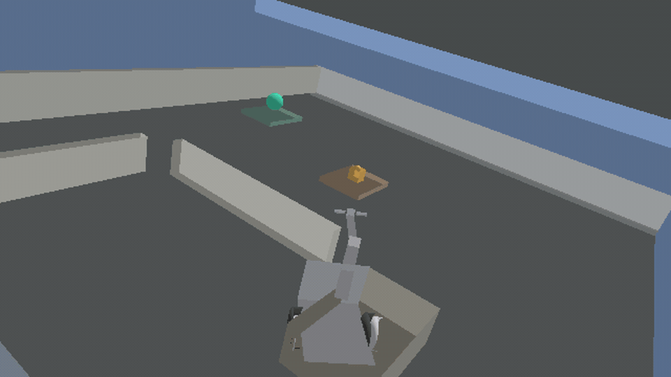

<p align="center">
  <picture>
    <source media="(prefers-reduced-motion: reduce)" srcset="docs/media/rne-hero.png">
    
  </picture>
  <br>
  <sub>Captured from <code>mesh_diff_drive</code> via wgpu (<code>examples/18_readme_hero</code>)</sub>
</p>

# Robot Native Engine

[](https://github.com/rsasaki0109/RoboSim/releases)
[](https://github.com/rsasaki0109/RoboSim/actions/workflows/ci.yml)

Robots are not plugins.

RNE is a Rust-based, robot-native, AI-native game engine for robotics simulation,
embodied AI, synthetic sensor data, and policy evaluation.

- ROS2 is supported as an adapter, not required as the engine core.
- Run headless in CI or render interactively with wgpu.
- Build robots from Robot/Sensor/Actuator entities.
- Record and replay deterministic simulation episodes.

## Demo (60 seconds)

```bash
git clone https://github.com/rsasaki0109/RoboSim.git
cd RoboSim
cargo run -p xtask -- ci
cargo run -p diff_drive_lidar --example 01_diff_drive_lidar
```

Example output:

```
step 60:  base=(0.60, 0.25, 0.00) m, lidar points=46, imu ay=-9.81 m/s²
step 120: base=(1.20, 0.25, 0.00) m, lidar points=46, imu ay=-9.81 m/s²
step 180: base=(1.80, 0.25, 0.00) m, lidar points=45, imu ay=-9.81 m/s²
final forward travel = 1.80 m
```

## Quickstart

```bash
cargo run -p hello_world --example 00_hello_world
cargo run -p falling_cube --example 01_falling_cube
cargo run -p diff_drive_lidar --example 01_diff_drive_lidar
cargo run -p render_clear --example 02_render_clear
cargo run -p urdf_import --example 03_urdf_import
cargo run -p episode_diff_drive --example 05_episode_diff_drive
cargo run -p scene_load --example 06_scene_load
cargo run -p render_primitives --example 07_render_primitives
cargo run -p scene_episode --example 08_scene_episode
cargo run -p urdf_mesh_render --example 09_urdf_mesh_render
cargo run -p vectorized_episode --example 10_vectorized_episode
cargo run -p agent_policy --example 11_agent_policy
cargo run -p shared_world_agent --example 12_shared_world_agent
cargo run -p multi_robot_agent --example 13_multi_robot_agent
cargo run -p interactive_viewer --example 14_interactive_viewer
cargo run -p asset_hot_reload --example 15_asset_hot_reload -- --smoke
cargo run -p rne_asset_cli -- validate assets/scenes/episode_diff_drive.rne.scene.toml --spawn
```

See [examples/README.md](examples/README.md) for the full list.

**Highlights in v0.4:** goal-conditioned agents, multi-robot collision, ROS 2 sim-control parity, URDF render fixes, sim-captured README hero.

Architecture docs live under [docs/architecture/](docs/architecture/000_overview.md).

### Python policy example

```bash
python3 -m venv .venv
.venv/bin/pip install maturin
.venv/bin/maturin develop -m crates/rne_py/Cargo.toml
.venv/bin/python examples/04_python_policy/run.py
```

### ROS 2 bridge (optional)

```bash
source /opt/ros/jazzy/setup.bash
./adapters/ros2/rne_ros2_bridge/smoke_test.sh
cargo run -p xtask -- ci-ros2-bridge
```

See [adapters/ros2/rne_ros2_bridge/README.md](adapters/ros2/rne_ros2_bridge/README.md).

Native Rust node (`rclrs`): [adapters/ros2/rne_ros2_node/README.md](adapters/ros2/rne_ros2_node/README.md).

```bash
source /opt/ros/jazzy/setup.bash
cargo run -p xtask -- ci-ros2
cargo run -p xtask -- ci-ros2-bridge
```

Release notes: [CHANGELOG.md](CHANGELOG.md) · [v0.4.0](https://github.com/rsasaki0109/RoboSim/releases/tag/v0.4.0) · [v0.3.0](https://github.com/rsasaki0109/RoboSim/releases/tag/v0.3.0) · [v0.2.0](https://github.com/rsasaki0109/RoboSim/releases/tag/v0.2.0) · [v0.1.0](https://github.com/rsasaki0109/RoboSim/releases/tag/v0.1.0)

## Development

```bash
cargo run -p xtask -- ci
```

With ROS 2 Jazzy or Humble installed:

```bash
cargo run -p xtask -- ci-ros2
```

Or, if [just](https://github.com/casey/just) is installed:

```bash
just ci
```

## License

Licensed under either of:

- Apache License, Version 2.0 ([LICENSE-APACHE](LICENSE-APACHE))
- MIT license ([LICENSE-MIT](LICENSE-MIT))

at your option.
