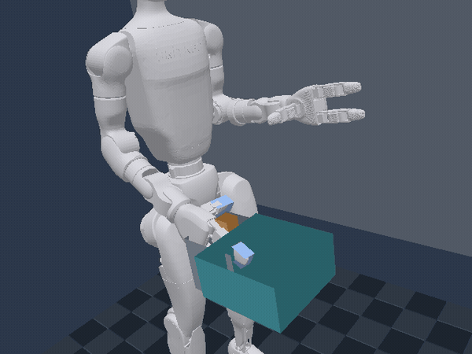
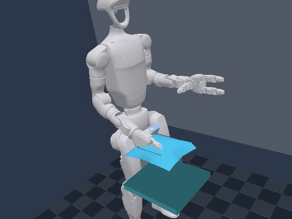

# Robot Native Engine

**Robots are not plugins.** A Rust robot-native game engine for deterministic simulation,
headless CI, and real wgpu rendering.

[](https://github.com/rsasaki0109/RoboSim/releases)
[](https://github.com/rsasaki0109/RoboSim/actions/workflows/ci.yml)

<p align="center">
  <picture>
    <source media="(prefers-reduced-motion: reduce)" srcset="docs/media/rne-hero.png">
    
  </picture>
  <br>
  <sub>Real capture: the detailed <code>mm_mobile</code> URDF robot drives, grasps a physics cube with its two-finger gripper, carries it ~2.5&nbsp;m, and drops it on the tray — one deterministic wgpu run, no keyframes, no object teleports. (<a href="docs/media/rne-hero.json">how it's made</a> · <a href="docs/media/generate-hero.sh">regenerate</a>)</sub>
</p>

RNE is a Rust-based, robot-native, AI-native game engine for robotics simulation,
embodied AI, synthetic sensor data, and policy evaluation.

## Official Unitree Go2 URDF

The official Unitree Go2 URDF and meshes load through RNE's generic articulation
pipeline. Its dynamic multibody scene includes self-collision filtering, 12
force-limited joints, primitive foot contacts, and a headless four-foot standing
test. `UnitreeGo2Episode` exposes stride and lift actions, four-foot loads, gait
phase, and a locomotion/upright reward. Model source:
[Unitree Robotics unitree_ros](https://github.com/unitreerobotics/unitree_ros)
(BSD-3-Clause).

## Official Unitree G1 URDF

<p align="center">
  <picture>
    <source media="(prefers-reduced-motion: reduce)" srcset="docs/media/unitree-g1.png">
    
  </picture>
  <br>
  <sub>Official Unitree G1 23-DoF URDF and 29 STL meshes loaded through the same generic pipeline. After a standing settle, its dynamic multibody follows a three-checkpoint factory route past a scene-relative OBJ parts rack, stopping for a point-and-confirm inspection gesture at the parts area, safety barrier, and equipment panel. Floor rings show completed (green), active (cyan), and queued (dark) task markers. The deterministic task is rendered offscreen with wgpu. Model source: <a href="https://github.com/unitreerobotics/unitree_ros">Unitree Robotics unitree_ros</a> (BSD-3-Clause).</sub>
</p>

```bash
cargo run -p unitree_g1_gif --example 39_unitree_g1_gif
```

### G1 29-DoF + Dex3-1 two-sided contact grasp

<p align="center">
  <picture>
    <source media="(prefers-reduced-motion: reduce)" srcset="docs/media/unitree-g1-dex3.png">
    
  </picture>
  <br>
  <sub>The official G1 29-DoF + two Dex3-1 hands load as one 43-joint URDF articulation. The close-up inset tracks the working hand: orange and blue mark the independent thumb/index points, and the cyan border turns green only after three consecutive qualifying contact steps. The gate also checks finger closure, pinch width, payload speed, contact separation, centering, and opposing geometry; a one-sided touch or transient overlap is rejected. Confirmation creates a real palm-to-payload fixed joint at the current relative pose without snapping the part. The arm lifts and carries it, then opening removes the joint and returns the dynamic body to physics so it settles on the cyan tray. The separate randomized acquisition mode uses seeded payload offsets, live horizontal Jacobian tracking, and automatic retries. Model source: <a href="https://github.com/unitreerobotics/unitree_ros">Unitree Robotics unitree_ros</a> (BSD-3-Clause).</sub>
</p>

```bash
# Deterministic, headless two-contact Episode
cargo run -p unitree_g1_dex3_pick_place --example 42_unitree_g1_dex3_pick_place
# Seeded payload offset + live Cartesian IK + retry
cargo run -p unitree_g1_dex3_pick_place --example 42_unitree_g1_dex3_pick_place -- --randomized
# Regenerate the real wgpu GIF and reduced-motion PNG
cargo run -p unitree_g1_dex3_pick_place --example 42_unitree_g1_dex3_pick_place -- --gif
```

`UnitreeG1Dex3Episode` reports each fingertip contact, simultaneous dual contact, stable-contact
count, current and historical fixed-joint state, pinch gap, contact span/centering/opposition,
payload offset/pose/speed, attempt number, maximum lift height, place-zone distance, phase, and
completion. `UnitreeG1Dex3EpisodeConfig::randomized(seed)` samples reproducible X/Z offsets,
enables damped-least-squares tracking projected onto the stable shoulder roll/yaw subspace, and
allows three attempts. That mode is an acquisition benchmark and terminates on a confirmed grasp;
the fixed task continues through lift, release, and settling inside `dex3_place_zone` at no more
than 0.05 m/s. Regression tests reject one-sided, interrupted, coincident, off-center, and
invalidly configured grasps; verify capture without a pose snap; replay seeded resets; exercise
retry; and acquire payloads across ten seeded positions in the guaranteed horizontal workspace.

The earlier passive-hand example is still available as
`cargo run -p unitree_g1_parts_pick_place --example 41_unitree_g1_parts_pick_place` for users of
the official 23-DoF URDF, whose rubber-hand meshes do not contain actuated finger joints.

The G1 integration also includes a headless dynamic balance episode with
primitive foot contacts, deterministic reset/replay, observations, actions,
and reward through `UnitreeG1Episode`. Its 23-DoF dynamic scene uses Rapier's
reduced-coordinate multibody solver while existing robots retain impulse joints.
`UnitreeG1GaitEpisode` adds stride/lift/yaw actions, gait-phase and contact
observations, and a forward/upright reward with exact deterministic replay.

- ROS2 is supported as an adapter, not required as the engine core.
- Run headless in CI or render interactively with wgpu.
- Build robots from Robot/Sensor/Actuator entities.
- Record and replay deterministic simulation episodes.

## Demo (60 seconds)

```bash
git clone https://github.com/rsasaki0109/RoboSim.git
cd RoboSim
cargo run -p xtask -- ci
cargo run -p diff_drive_lidar --example 01_diff_drive_lidar
```

Example output:

```
step 60:  base=(0.60, 0.25, 0.00) m, lidar points=46, imu ay=-9.81 m/s²
step 120: base=(1.20, 0.25, 0.00) m, lidar points=46, imu ay=-9.81 m/s²
step 180: base=(1.80, 0.25, 0.00) m, lidar points=45, imu ay=-9.81 m/s²
final forward travel = 1.80 m
```

## Quickstart

```bash
cargo run -p hello_world --example 00_hello_world
cargo run -p falling_cube --example 01_falling_cube
cargo run -p diff_drive_lidar --example 01_diff_drive_lidar
cargo run -p render_clear --example 02_render_clear
cargo run -p urdf_import --example 03_urdf_import
```

See [examples/README.md](examples/README.md) for the full list.

### Deterministic deformable cables and cloth

RNE includes a backend-neutral XPBD solver for cable and cloth entities. It uses
fixed substeps and stable sequential constraint ordering, supports structural,
shear, bending, and pin constraints, and projects particles against fixed or
kinematic plane, box, sphere, and capsule colliders with positional friction.
Non-adjacent particle self-collision can be enabled per material for folded
cloth and coiled cable scenes. Cloth also resolves non-adjacent vertex-triangle
contacts to separate folded vertices from nearby cloth faces.
The same state is headless-testable through stable hashes and renderable through
wgpu as dynamic cable segments or a per-frame cloth triangle mesh with generated
smooth normals.

```bash
# Headless deterministic rollouts
cargo run -p deformable_cable --example 43_deformable_cable
cargo run -p deformable_cloth --example 44_deformable_cloth

# Exercise the real wgpu dynamic-geometry paths
cargo run -p deformable_cable --example 43_deformable_cable -- --render
cargo run -p deformable_cloth --example 44_deformable_cloth -- --render
```

### G1 Dex3 cloth handling

<p align="center">
  <picture>
    <source media="(prefers-reduced-motion: reduce)" srcset="docs/media/unitree-g1-cloth.png">
    
  </picture>
  <br>
  <sub>Real wgpu capture of the official G1 + Dex3 articulation handling a live XPBD cloth. Cloth particles collide with the sampled moving finger geometry, and the orange/green fingertip volumes must simultaneously overlap two distinct particles before acquisition stores palm-local anchors. The inactive left arm is fixed before physics initialization, so only the working arm moves. Opening removes the attachment so gravity and contact take over again. Two headless simulations compare cloth state after every tick before media capture.</sub>
</p>

```bash
# Deterministic two-world replay (release is strongly recommended for the 29-DoF model)
cargo run --release -p unitree_g1_cloth_handling --example 45_unitree_g1_cloth_handling
# Regenerate the real wgpu GIF and reduced-motion PNG
cargo run --release -p unitree_g1_cloth_handling --example 45_unitree_g1_cloth_handling -- --gif
```

The MVP intentionally uses one-way rigid coupling. Sampled robot attachments
can carry and release selected particles, but tearing, deformable-to-deformable
collision, and two-way rigid reaction forces remain explicit follow-up work.

**Highlights:** 3D pick-and-place on a lift-equipped arm (top-down claw + vertical lift),
position-controlled joints, goal-conditioned RL agents, reach curricula, multi-robot
collision, ROS 2 sim-control parity (incl. `/lift_command`), and sim-captured README media.

Architecture docs live under [docs/architecture/](docs/architecture/000_overview.md).

### World assets

Scene TOML can load named environment objects independently from robots. Visuals may be
boxes, spheres, cylinders, or scene-relative STL/OBJ meshes; collision can use a separate box,
sphere, or Y-axis capsule.
Objects also carry transforms, fixed/dynamic body type, mass, friction, and restitution.

```toml
[[objects]]
name = "inspection_station"
translation_m = [1.0, 0.59, -0.3]
visual = { shape = "mesh", path = "world/station.stl", scale = [1.0, 1.0, 1.0] }
collision = { shape = "box", size_m = [0.22, 1.18, 0.22] }
body_type = "fixed"
friction = 0.7
```

Rounded safety posts and rails can use a cylinder visual with a capsule collision shape:

```toml
[[objects]]
name = "safety_post"
visual = { shape = "cylinder", radius_m = 0.08, length_m = 0.9 }
collision = { shape = "capsule", half_height_m = 0.37, radius_m = 0.08 }
```

Environment mesh files are validated, included in hot-reload dependency tracking, and
resolved relative to the `.rne.scene.toml` file. The G1 inspection station above is loaded
from `assets/scenes/unitree_g1_factory.rne.scene.toml` using this schema.

Wavefront OBJ files may contain multiple named objects or groups. RNE triangulates and merges
them in file order, preserves supplied vertex normals, and deterministically generates normals
when the source omits them.

Scene validation rejects duplicate object/obstacle/marker names, empty semantic marker kinds,
non-finite transforms, non-positive visual or collision dimensions, invalid interaction radii,
and non-positive dynamic-body masses before spawning or hot-reloading a World.

Named task locations are loaded into the ECS as `TaskMarker` components so policies and
episodes can discover goals without hard-coded coordinates:

```toml
[[task_markers]]
name = "inspection_panel_check"
kind = "inspection"
translation_m = [0.72, 0.0, -0.30]
radius_m = 0.45
```

`assets/scenes/unitree_g1_factory.rne.scene.toml` demonstrates a complete factory cell
with a shelf, safety barrier, back wall, inspection equipment, and three ordered semantic
inspection goals. `UnitreeG1InspectionEpisode` walks and performs a point-and-confirm gesture
at each named marker, exposing the current route index, completed-marker count, distance,
interaction radius, gesture progress, success termination, and a deterministic task reward.

```bash
cargo run -p unitree_g1_factory_inspection --example 40_unitree_g1_factory_inspection
# Inspect any URDF World interactively; press M to toggle TaskMarker rings.
cargo run -p interactive_viewer --example 14_interactive_viewer -- --urdf assets/scenes/unitree_g1_factory.rne.scene.toml
```

The viewer watches the scene, referenced robot/URDF files, and environment meshes. Saving any
dependency rebuilds the complete simulation World, clears resolved mesh caches, and preserves the
camera workflow for live factory-layout iteration. Invalid intermediate saves keep the last valid
World running; the viewer reports the error once and automatically recovers after a corrected save.

### Python policy example

```bash
python3 -m venv .venv
.venv/bin/pip install maturin
.venv/bin/maturin develop -m crates/rne_py/Cargo.toml
.venv/bin/python examples/04_python_policy/run.py
```

### ROS 2 bridge (optional)

```bash
source /opt/ros/jazzy/setup.bash
./adapters/ros2/rne_ros2_bridge/smoke_test.sh
cargo run -p xtask -- ci-ros2-bridge
```

See [adapters/ros2/rne_ros2_bridge/README.md](adapters/ros2/rne_ros2_bridge/README.md).

Native Rust node (`rclrs`): [adapters/ros2/rne_ros2_node/README.md](adapters/ros2/rne_ros2_node/README.md).

```bash
source /opt/ros/jazzy/setup.bash
cargo run -p xtask -- ci-ros2
cargo run -p xtask -- ci-ros2-bridge
```

Release notes: [CHANGELOG.md](CHANGELOG.md) · [v0.4.0](https://github.com/rsasaki0109/RoboSim/releases/tag/v0.4.0) · [v0.3.0](https://github.com/rsasaki0109/RoboSim/releases/tag/v0.3.0) · [v0.2.0](https://github.com/rsasaki0109/RoboSim/releases/tag/v0.2.0) · [v0.1.0](https://github.com/rsasaki0109/RoboSim/releases/tag/v0.1.0)

## Development

```bash
cargo run -p xtask -- ci
```

This includes the no-renderer house GIF smoke and README hero metadata verification.

Regenerate the README hero GIF from the real 3D simulation (GPU + ffmpeg required):

```bash
bash docs/media/generate-hero.sh
```

With ROS 2 Jazzy or Humble installed:

```bash
cargo run -p xtask -- ci-ros2
```

Or, if [just](https://github.com/casey/just) is installed:

```bash
just ci
```

## License

Licensed under either of:

- Apache License, Version 2.0 ([LICENSE-APACHE](LICENSE-APACHE))
- MIT license ([LICENSE-MIT](LICENSE-MIT))

at your option.
