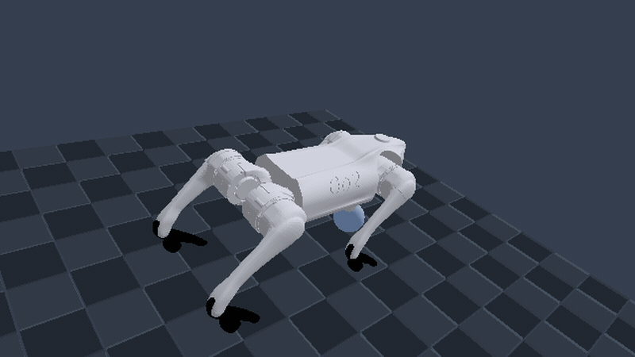
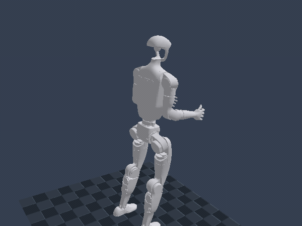
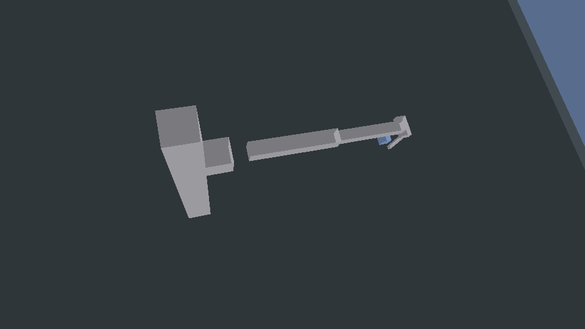

# Robot Native Engine

**Robots are not plugins.** A Rust robot-native game engine for deterministic simulation,
headless CI, and real wgpu rendering.

[](https://github.com/rsasaki0109/RoboSim/releases)
[](https://github.com/rsasaki0109/RoboSim/actions/workflows/ci.yml)

<p align="center">
  <picture>
    <source media="(prefers-reduced-motion: reduce)" srcset="docs/media/rne-hero.png">
    
  </picture>
  <br>
  <sub>Real capture: the <code>mm_mobile</code> robot drives, grasps a physics cube with its two-finger gripper, carries it ~2.5&nbsp;m, and drops it on the tray — one deterministic wgpu run, no keyframes, no object teleports. (<a href="docs/media/rne-hero.json">how it's made</a> · <a href="docs/media/generate-hero.sh">regenerate</a>)</sub>
</p>

RNE is a Rust-based, robot-native, AI-native game engine for robotics simulation,
embodied AI, synthetic sensor data, and policy evaluation.

## Official Unitree Go2 URDF

<p align="center">
  <picture>
    <source media="(prefers-reduced-motion: reduce)" srcset="docs/media/unitree-go2.png">
    
  </picture>
  <br>
  <sub>Official Unitree Go2 URDF and meshes loaded through RNE's generic URDF articulation pipeline, with 12 force-limited joint motors stepped by Rapier and rendered offscreen by wgpu. Model source: <a href="https://github.com/unitreerobotics/unitree_ros">Unitree Robotics unitree_ros</a> (BSD-3-Clause).</sub>
</p>

```bash
cargo run -p unitree_go2_gif --example 38_unitree_go2_gif
```

## Official Unitree G1 URDF

<p align="center">
  <picture>
    <source media="(prefers-reduced-motion: reduce)" srcset="docs/media/unitree-g1.png">
    
  </picture>
  <br>
  <sub>Official Unitree G1 23-DoF URDF and 29 STL meshes loaded through the same generic pipeline. Its articulated, fixed-base showcase drives all 23 force-limited joint motors through Rapier and renders offscreen with wgpu. Model source: <a href="https://github.com/unitreerobotics/unitree_ros">Unitree Robotics unitree_ros</a> (BSD-3-Clause).</sub>
</p>

```bash
cargo run -p unitree_g1_gif --example 39_unitree_g1_gif
```

The G1 integration also includes a headless dynamic balance episode with
primitive foot contacts, deterministic reset/replay, observations, actions,
and reward through `UnitreeG1Episode`. Its 23-DoF dynamic scene uses Rapier's
reduced-coordinate multibody solver while existing robots retain impulse joints.

- ROS2 is supported as an adapter, not required as the engine core.
- Run headless in CI or render interactively with wgpu.
- Build robots from Robot/Sensor/Actuator entities.
- Record and replay deterministic simulation episodes.
- Manipulate: a lift-equipped arm does real 3D pick-and-place.

## 3D pick-and-place

<p align="center">
  
  <br>
  <sub>The hero above shows the mobile platform navigating a house context; here is the <code>mm_lift</code> arm doing vertical pick-and-place up close.</sub>
</p>

The `mm_lift` manipulator performs a full vertical pick-and-place: a column-mounted lift
lowers a top-down claw over a cube on the ground, grasps it (contact-triggered weld), raises
it, swings the arm to a new spot, and opens to release it. Position-controlled joints hold the
commanded arm pose and a higher constraint-solver iteration count keeps the tall jointed chain
stable — all deterministic and headless-testable.

```bash
# Scripted pick → lift → carry → place (headless)
cargo run -p mobile_manipulator_lift_pick_place --example 31_mobile_manipulator_lift_pick_place
# Teleoperate it with wgpu — R / F drive the lift, Q/E/Z/X the arm, C/V the claw
cargo run -p interactive_viewer --example 14_interactive_viewer -- --manipulator-lift
```

## Demo (60 seconds)

```bash
git clone https://github.com/rsasaki0109/RoboSim.git
cd RoboSim
cargo run -p xtask -- ci
cargo run -p diff_drive_lidar --example 01_diff_drive_lidar
```

Example output:

```
step 60:  base=(0.60, 0.25, 0.00) m, lidar points=46, imu ay=-9.81 m/s²
step 120: base=(1.20, 0.25, 0.00) m, lidar points=46, imu ay=-9.81 m/s²
step 180: base=(1.80, 0.25, 0.00) m, lidar points=45, imu ay=-9.81 m/s²
final forward travel = 1.80 m
```

## Quickstart

```bash
cargo run -p hello_world --example 00_hello_world
cargo run -p falling_cube --example 01_falling_cube
cargo run -p diff_drive_lidar --example 01_diff_drive_lidar
cargo run -p render_clear --example 02_render_clear
cargo run -p urdf_import --example 03_urdf_import
```

See [examples/README.md](examples/README.md) for the full list.

**Highlights:** 3D pick-and-place on a lift-equipped arm (top-down claw + vertical lift),
position-controlled joints, goal-conditioned RL agents, reach curricula, multi-robot
collision, ROS 2 sim-control parity (incl. `/lift_command`), and sim-captured README media.

Architecture docs live under [docs/architecture/](docs/architecture/000_overview.md).

### Python policy example

```bash
python3 -m venv .venv
.venv/bin/pip install maturin
.venv/bin/maturin develop -m crates/rne_py/Cargo.toml
.venv/bin/python examples/04_python_policy/run.py
```

### ROS 2 bridge (optional)

```bash
source /opt/ros/jazzy/setup.bash
./adapters/ros2/rne_ros2_bridge/smoke_test.sh
cargo run -p xtask -- ci-ros2-bridge
```

See [adapters/ros2/rne_ros2_bridge/README.md](adapters/ros2/rne_ros2_bridge/README.md).

Native Rust node (`rclrs`): [adapters/ros2/rne_ros2_node/README.md](adapters/ros2/rne_ros2_node/README.md).

```bash
source /opt/ros/jazzy/setup.bash
cargo run -p xtask -- ci-ros2
cargo run -p xtask -- ci-ros2-bridge
```

Release notes: [CHANGELOG.md](CHANGELOG.md) · [v0.4.0](https://github.com/rsasaki0109/RoboSim/releases/tag/v0.4.0) · [v0.3.0](https://github.com/rsasaki0109/RoboSim/releases/tag/v0.3.0) · [v0.2.0](https://github.com/rsasaki0109/RoboSim/releases/tag/v0.2.0) · [v0.1.0](https://github.com/rsasaki0109/RoboSim/releases/tag/v0.1.0)

## Development

```bash
cargo run -p xtask -- ci
```

This includes the no-renderer house GIF smoke and README hero metadata verification.

Regenerate the README hero GIF from the real 3D simulation (GPU + ffmpeg required):

```bash
bash docs/media/generate-hero.sh
```

With ROS 2 Jazzy or Humble installed:

```bash
cargo run -p xtask -- ci-ros2
```

Or, if [just](https://github.com/casey/just) is installed:

```bash
just ci
```

## License

Licensed under either of:

- Apache License, Version 2.0 ([LICENSE-APACHE](LICENSE-APACHE))
- MIT license ([LICENSE-MIT](LICENSE-MIT))

at your option.
