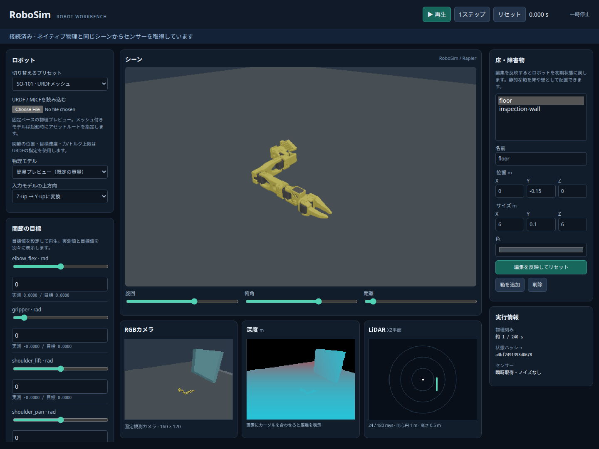
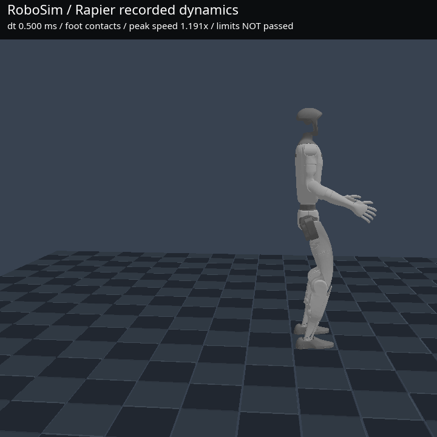

# Robot Native Engine

**Robots are not plugins.** RNE is a Rust robot-native game engine for deterministic
simulation, embodied AI, synthetic sensors, and policy evaluation.

[](https://github.com/rsasaki0109/RoboSim/releases)
[](https://github.com/rsasaki0109/RoboSim/actions/workflows/ci.yml)

RNE combines a headless, replayable simulation core with real wgpu rendering.
Worlds hold robot, sensor, actuator, agent, and episode entities; simulation
needs no renderer, and ROS 2 is an optional adapter, not a core dependency.

## Real simulation showcase

Hands-on joint sliders, scene editing, and RGB/depth/LiDAR views: start the
[Robot workbench](docs/ROBOT_WORKBENCH.md) with
`cargo run --release --locked -p robot_workbench`.

[](docs/ROBOT_WORKBENCH.md)

Every frame below is rendered by wgpu from deterministic simulation or pinned
camera state; gates and regeneration commands are in
[README showcase acceptance](docs/README_SHOWCASE.md).

<table>
  <tr>
    <td colspan="2" align="center">
      <picture>
        <source media="(prefers-reduced-motion: reduce)" srcset="docs/media/house-mobile-manipulation.png">
        
      </picture>
      <br><b>Real indoor 3DGS · mobile manipulation</b><br>
      <sub>A real photo-derived interior (Voxel51 Dr Johnson 3DGS) bound to real cameras and landmarks by a fail-closed validation fixture. The 10-link PBR robot completes a floor-level friction grasp, 0.401 m lift, 1.559 m transport, and placement within 0.049 m; live wrist RGB-D self-masks the robot and drives the final approach without payload truth. <a href="docs/media/house-mobile-manipulation.json">metadata</a> · <a href="examples/89_house_mobile_lift_hero/main.rs">source</a></sub>
    </td>
  </tr>
  <tr>
    <td width="50%" align="center">
      <picture>
        <source media="(prefers-reduced-motion: reduce)" srcset="docs/media/showcase-openarm.png">
        
      </picture>
      <br><b>OpenArm v2 · bimanual control</b><br>
      <sub>18-axis typed feedback, an IK-solved pick / handoff / place cycle gated on real fingertip contact, and exact Rapier replay over 1,400 steps. <a href="docs/media/showcase-openarm.json">metadata</a> · <a href="examples/90_showcase_captures/openarm.rs">source</a></sub>
    </td>
    <td width="50%" align="center">
      <picture>
        <source media="(prefers-reduced-motion: reduce)" srcset="docs/media/showcase-factory.png">
        
      </picture>
      <br><b>Factory inspection</b><br>
      <sub>Official G1 link meshes, three inspection markers, upright completion, and deterministic replay. <a href="docs/media/showcase-factory.json">metadata</a></sub>
    </td>
  </tr>
  <tr>
    <td width="50%" align="center">
      <picture>
        <source media="(prefers-reduced-motion: reduce)" srcset="docs/media/showcase-office.png">
        
      </picture>
      <br><b>Office AGV</b><br>
      <sub>Shared-aisle yield, dock pickup, cargo transport, and desk placement without contact or early drop. <a href="docs/media/showcase-office.json">metadata</a></sub>
    </td>
    <td width="50%" align="center">
      <picture>
        <source media="(prefers-reduced-motion: reduce)" srcset="docs/media/showcase-uav.png">
        
      </picture>
      <br><b>PLATEAU UAV · RGB-D flight</b><br>
      <sub>A visible multirotor flies 76.6 m over imported city geometry with 12.21 m building clearance, zero collisions, and synchronized onboard RGB-D. <a href="docs/media/showcase-uav.json">metadata</a> · <a href="examples/46_plateau_drone_gif/main.rs">source</a></sub>
    </td>
  </tr>
</table>

## Highlights

| Area | Included | Docs |
| --- | --- | --- |
| City simulation | PLATEAU import, traffic, LiDAR, RGB-D, OSM HUD | [docs](docs/PLATEAU_IMPORT.md), ex. 46–47 |
| Vehicle dynamics | Bicycle/Ackermann, tire saturation, suspension, road excitation | [docs](docs/VEHICLE_DYNAMICS.md), ex. 49–51 |
| Quadruped locomotion | Official Go2, torque control, disturbances, steering | [docs](docs/GO2_LOCOMOTION.md), ex. 52–65 |
| Humanoid locomotion | Official G1 23-DoF, balance, learned stride, CEM eval | [docs](docs/G1_LOCOMOTION.md), ex. 39, 63, 67, 68 |
| Manipulation | PBR/3DGS mobile manipulator, friction grasp, Dex3 hands | [docs](docs/README_SHOWCASE.md), ex. 32, 40–42, 89 |
| Deformables | XPBD cable and cloth, deterministic headless replay | ex. 43–45 |
| More demos | Localization, native planning/dynamics/legged/WBC/OC, Go2 jump | [docs](docs/DEMOS.md) |

## Independent validation wanted

RNE remains below 1.0 until outside projects reproduce tasks and pass the
shipped conformance kits (native bundles include the tools; no source
checkout needed).

Only [v0.4.0 official
assets](https://github.com/rsasaki0109/RoboSim/releases/tag/v0.4.0) qualify;
if that page lacks the native archives and `SHA256SUMS` yet, prepare the
checklist but do not open an evidence issue (v0.1.0 does not qualify).

- [External project reproduction + Failure Capsule](https://github.com/rsasaki0109/RoboSim/issues/new?template=external-project-evidence.yml)
- [Installed flagship reproduction](https://github.com/rsasaki0109/RoboSim/issues/new?template=installed-flagship-reproduction.yml)
- [Third-party plugin conformance](https://github.com/rsasaki0109/RoboSim/issues/new?template=third-party-plugin-evidence.yml)
- [External physics/simulator/hardware/accelerator conformance](https://github.com/rsasaki0109/RoboSim/issues/new?template=external-system-evidence.yml)

See the [external evidence intake guide](docs/EXTERNAL_EVIDENCE_INTAKE.md).
Opening an issue is only the start of review: it does not imply acceptance;
in-repo reference implementations do not count as independent evidence.

## Vehicle dynamics at the grip limit


*Same controller, two plants: the dynamic car's trail turns red once the front axle saturates.* No-slip follows the line; the dynamic car runs wide past tire grip. [Vehicle dynamics](docs/VEHICLE_DYNAMICS.md).

## Navigation, SLAM, and multi-robot


*The magenta route is what `plan_path` returned over the corridor's own
collision geometry, and the amber band is the costmap inflation that pushed it
off the centre line: the dock and the desk stand in a 2.3 m corridor, so the
6.63 m plan swings 0.82 m wide where a straight line would be 5.95 m and
impassable.*

`rne_nav`/`rne_slam`: deterministic, ROS-free costmaps, a transform tree,
A*/DWA/pure-pursuit, multi-robot avoidance, an EKF, 3D ICP, and online 2D
SLAM with loop closure and AMCL (a ROS 2 adapter maps to Nav2). Details:
[Navigation](docs/NAVIGATION.md), [SLAM](docs/SLAM.md).

## G1 locomotion



*A full backflip in native RoboSim/Rapier: 62.5 µs step, 21 convex body colliders with self-collision, bounded joint effort and gravity only — no imposed base trajectory, no root wrench, no RL. It lands on its feet and is still standing 15 s later. Peak joint speed is 1.039x the URDF rating, under the unchanged 1.05 gate.*

The GIF replays a recorded native rollout — the renderer applies the recorded
poses and takes zero physics ticks, and the model and recording hashes are
checked before the first frame. The controller comes from a parameter search,
not a learned policy. This is a simulator result; hardware is unvalidated.
Details and the full evidence trail:
[docs/G1_CONTACT_BACKFLIP.md](docs/G1_CONTACT_BACKFLIP.md).

Walking is a separate and much weaker claim: example 67 evaluates typed
commands headlessly and example 68 holds the [v0.3 sustained
envelope](docs/media/unitree-g1-sustained-walk.gif) for 3000 ticks / 50 s. A
gait-schedule search found **no** upright sustained turn on the official
contact schedule, so v0.3 is a stability claim, not a turning claim. Details:
[docs/G1_LOCOMOTION.md](docs/G1_LOCOMOTION.md).

## Quickstart

```bash
git clone https://github.com/rsasaki0109/RoboSim.git
cd RoboSim
cargo run -p hello_world --example 00_hello_world
cargo run -p falling_cube --example 01_falling_cube
```

For a complete local validation, run `cargo run -p xtask -- ci` (the long
smoke gate splits into `manipulator`/`locomotion`/`assets`/`media`
partitions, e.g. `cargo run -p xtask -- ci-smoke media`). The headless asset
CLI, replay, and determinism-check commands, and the full example index, are
in [examples/README.md](examples/README.md).

## Independent integrations

The native release archive includes a one-command installed product proof:

```bash
./bin/rne-flagship-proof flagship-proof --cross-backend \
  --measure-on "lab-workstation-a" --verify-installed-bundle .
```

It runs the same indoor TaskSpec through Rapier and bundled MuJoCo, verifies
both replays plus the Failure Capsule against `SHA256SUMS`, and writes a
SHA-256-bound report with no source checkout, renderer, or network needed.
Details: [flagship validation](docs/FLAGSHIP_VALIDATION_WORKFLOW.md).

Third-party plugins, physics backends, adapters, and external task
reproductions go through the fixed
[external evidence intake](docs/EXTERNAL_EVIDENCE_INTAKE.md); submission
never implies acceptance.

## Architecture

The workspace is split by responsibility:

- `rne_core`/`rne_math`/`rne_ecs`/`rne_world`/`rne_robot`/`rne_sensor`/`rne_ai`/`rne_data`: schedules, ECS, spatial math, entity/robot control, sensors, learning interfaces, typed data streams.
- `rne_planning`/`rne_dynamics`/`rne_legged`/`rne_wbc`: backend-neutral joint-space planning, articulated dynamics, legged templates, whole-body control.
- `rne_physics`/`rne_physics_rapier` and `rne_render`/`rne_render_wgpu`: backend-neutral traits plus the Rapier and wgpu implementations.
- `rne_asset`/`rne_plugin`/`rne_traffic`: assets, plugin interfaces, backend-neutral traffic.
- `adapters/ros2`: ROS 2 integration; core crates remain ROS 2-free.

## Determinism and testing

Simulation uses `SimClock`, explicit seeds, stable entity ordering, and
replay digests; headless examples/tests never initialize a renderer; public
APIs use explicit units (`_m`, `_rad`, `_s`, `_hz`); physics backends never
leak engine-specific handles through core traits.

Standard checks:

```bash
cargo fmt --all
cargo clippy --workspace --all-targets -- -D warnings
cargo test --workspace
cargo run -p xtask -- ci-headless
cargo run --locked -p xtask -- flagship
cargo run -p xtask -- ci
```

## Python and ROS 2 adapters

The Python adapter exposes native environments for policy experiments:

```bash
python3 -m venv .venv
.venv/bin/pip install maturin
.venv/bin/maturin develop -m crates/rne_py/Cargo.toml
.venv/bin/python examples/04_python_policy/run.py
```

ROS 2 is optional, isolated under [adapters/ros2](adapters/ros2); see the
[bridge README](adapters/ros2/rne_ros2_bridge/README.md) for setup.

## Documentation

- [Architecture](docs/architecture/000_overview.md) · [Roadmap](docs/ROADMAP.md) · [OSS parity](docs/OSS_PARITY.md) · [Plugin SDK](docs/PLUGIN_SDK.md) · [Browser viewer](web/rne_web_viewer/README.md)
- Conformance/readiness: [physics](docs/EXTERNAL_PHYSICS_BACKEND_CONFORMANCE.md) · [hardware](docs/HARDWARE_ADAPTER_CONFORMANCE.md) · [simulator](docs/EXTERNAL_SIMULATOR_ADAPTER_CONFORMANCE.md) · [OpenArm cross-sim](docs/OPENARM_CROSS_SIM_PROOF.md) · [compat corpus](docs/COMPATIBILITY_CORPUS.md) · [support](docs/SUPPORT.md) · [1.0 readiness](docs/ONE_ZERO_READINESS.md) · [flagship validation](docs/FLAGSHIP_VALIDATION_WORKFLOW.md)
- Physics: [height field terrain](docs/HEIGHT_FIELD_TERRAIN.md) · [collision bake](docs/COLLISION_BAKE.md) · [arm position control](docs/ARM_POSITION_CONTROL.md)
- Locomotion: [G1](docs/G1_LOCOMOTION.md)/[workbench](docs/G1_WORKBENCH_MISSION.md)/[splat bg](docs/G1_HEAD_SPLAT_BACKGROUND.md) · [Go2](docs/GO2_LOCOMOTION.md) · [frontier plan](docs/PLAN_LEGGED_LOCOMOTION_FRONTIER.md) · [sensors](docs/IMU_SIMULATION.md)
- Case studies: [Tsukuba](docs/TSUKUBA_CONFIRMATION_RUN.md)/[full](docs/TSUKUBA_FULL_RUN.md)/[3DGS bg](docs/TSUKUBA_3DGS_BACKGROUND.md) · [SSL 2v2](docs/SSL_SMALL_PITCH.md)/[adapter](docs/SSL_ADAPTER.md)
- [More demos](docs/DEMOS.md) · [Examples](examples/README.md) · [Changelog](CHANGELOG.md)

## License

Licensed under either the [Apache License 2.0](LICENSE-APACHE) or the [MIT license](LICENSE-MIT), at your option.
