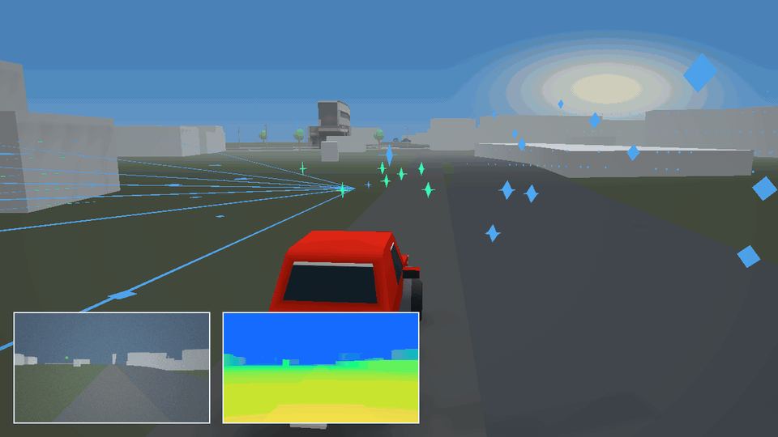
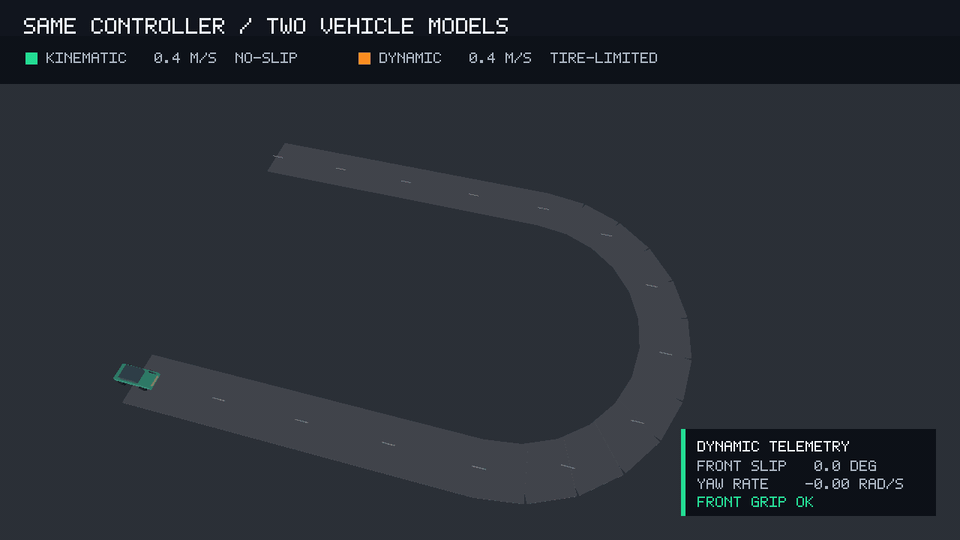
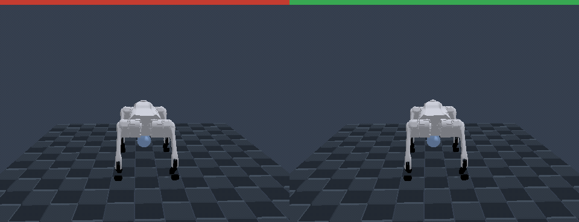
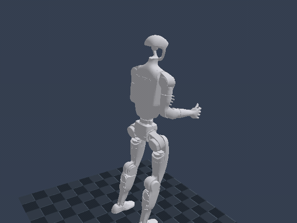

# Robot Native Engine

**Robots are not plugins.** A Rust robot-native game engine for deterministic simulation,
headless CI, and real wgpu rendering.

[](https://github.com/rsasaki0109/RoboSim/releases)
[](https://github.com/rsasaki0109/RoboSim/actions/workflows/ci.yml)

<p align="center">
  <picture>
    <source media="(prefers-reduced-motion: reduce)" srcset="docs/media/plateau-lidar.png">
    
  </picture>
  <br>
  <sub>Physics-aware sensing over official PLATEAU Sanjo City data: a 16-channel spinning LiDAR paints its concentric elevation rings across ground, buildings, and 99 deterministic traffic vehicles — inverse-square radiometry, material response, multi-returns, and retroreflective saturation, 1,092,806 returns in one 12-second wgpu capture (stable hash <code>16814780024698753365</code>). The insets are the same vehicle's RGB-D camera with lens distortion, rolling shutter, auto exposure, and sensor noise. The mount rides a dynamic-bicycle chassis; everything replays bit-identically from one seed.</sub>
</p>

RNE is a Rust-based, robot-native, AI-native game engine for robotics simulation,
embodied AI, synthetic sensor data, and policy evaluation.

<p align="center">
  <picture>
    <source media="(prefers-reduced-motion: reduce)" srcset="docs/media/rne-hero.png">
    
  </picture>
  <br>
  <sub>Real capture: the detailed <code>mm_mobile</code> URDF robot drives, grasps a physics cube with its two-finger gripper, carries it ~2.5&nbsp;m, and drops it on the tray — one deterministic wgpu run, no keyframes, no object teleports. (<a href="docs/media/rne-hero.json">how it's made</a> · <a href="docs/media/generate-hero.sh">regenerate</a>)</sub>
</p>

## PLATEAU city tiles

RNE can convert bounded PLATEAU CityGML building LOD1/LOD2 and road LOD1 data
into deterministic OBJ/MTL meshes, Appearance PNG/JPEG textures, a normal
`.rne.scene.toml`, stable `gml:id` metadata, fixed building collision boxes,
and derived two-way lane centerlines. The
conversion stays outside simulation core crates. Example 46 imports the
official Project PLATEAU Sanjo City 2025 mesh around Kita-Sanjo Station:
213 buildings, 59 road surfaces, and the station's real LOD2 Appearance
textures. Its generated traffic asset contains 84 directed lanes; deterministic
endpoint topology produces 26 junctions, 137 connections, and 128 conflict
pairs. Shortest routing selects a 15-lane, 752 m path through multiple
intersections as the first of eight diverse, reachable origin/destination
routes. One hundred textured CC0 Kenney compact cars, sedans, vans, and buses
are distributed across those routes using an explicit `WorldRandom` seed.
Their desired speeds, departure times, and initial gaps vary reproducibly.
They run for twelve seconds using explicit `SimClock` steps, deterministic car
following, 24 red/green stop-line controls, and connection-conflict junction
reservations.
The tracked sedan's four wheel meshes rotate independently, the front pair
follows its steering angle, and rear lamps respond to braking. The daylight scene
adds directional sunlight, PCF-filtered building and vehicle shadow maps,
approximate lane markings, and a stable world-up follow camera. A deterministic
CC0 procedural streetscape adds shadow-receiving grass, concrete sidewalks,
curbs, street trees, streetlights, and guardrails along the selected road.
Furniture candidates that overlap imported building collision footprints are
discarded in stable order. The
presentation is rendered at 1280×720 before a deterministic depth-aware
atmospheric pass and high-quality 960×540 GIF downsample.

<p align="center">
  <picture>
    <source media="(prefers-reduced-motion: reduce)" srcset="docs/media/plateau-car.png">
    
  </picture>
  <br>
  <sub>Twelve seconds and 144 frames of real wgpu output over official PLATEAU Sanjo City 2025 data: 100 seeded vehicles use eight shortest-path OD routes, 24 fixed-time signals, deterministic junction reservations, and car following with zero red-light violations and zero collisions.</sub>
</p>

The same official scenario now drives a deterministic physics-aware 905&nbsp;nm
16-channel spinning LiDAR. Non-visual concrete, glass, asphalt, painted-metal,
and retroreflective properties control an inverse-square radiometric intensity,
transmitted multiple returns, and detector saturation with bloom; the beam
footprint is integrated so silhouettes produce mixed pixels; fog, rain, dust, and
snow attenuate, backscatter, and occlude; and the scanner sweeps a full
revolution per frame, so each azimuth column is cast from the moving vehicle's
interpolated pose and every point carries its own emission time. All
randomization derives from `WorldRandom`. The cloud is colored with the turbo
intensity colormap real point-cloud viewers use: deep blue for dim grazing
returns through green and orange to red for saturated retroreflective hits.

The same vehicle carries a forward RGB-D camera that is modeled to the same
standard. Brown-Conrady barrel distortion resamples both color and depth, an
eight-band rolling shutter is swept across the platform motion so the frame skews
as the car drives, auto exposure tracks mean luminance, and signal-dependent shot
noise, a read-noise floor and cos&#8308; vignetting are applied on top — all
deterministic from the same `WorldRandom` stream. The two insets are that sensor's
real output, not a clean render, and the depth ramp reuses the LiDAR intensity
legend.

The capture is shown at the top of this page: 1,092,806 returns over 144 frames
(125,734 later returns, 1,064 saturated retroreflective hits; stable scan hash
<code>16814780024698753365</code>), with the onboard RGB-D camera composited as the
two insets (stable hash <code>10455576295794772416</code>). The sensors ride a
dynamic-bicycle chassis chasing its kinematic traffic ghost (max deviation
0.19 m), while the other 99 deterministic vehicles keep the untouched traffic
contract.

```bash
cargo run -p rne_plateau_import -- path/to/tile.gml \
  --output target/plateau/tile --tile-name tile
cargo run -p plateau_drone_gif --example 46_plateau_drone_gif
cargo run -p traffic_city_replay --example 47_traffic_city_replay

# Optional comma-separated debug layers: lanes,route,signals,connections,conflicts
RNE_TRAFFIC_DEBUG=all cargo run -p plateau_drone_gif --example 46_plateau_drone_gif
```

The checked-in sample is the single official `56383756` mesh needed to
reproduce the capture. Its source and CC BY 4.0 attribution are recorded
[beside the example](examples/46_plateau_drone_gif/assets/sanjo_2025/README.md).
The reproducible vehicle subset and its original CC0 notice are documented in
the [Kenney asset directory](examples/46_plateau_drone_gif/assets/kenney_car/README.md).
The example-authored street furniture and ground designs are released under
[CC0-1.0](examples/46_plateau_drone_gif/STREETSCAPE_LICENSE.txt).

See [PLATEAU import](docs/PLATEAU_IMPORT.md) for supported geometry, coordinate
mapping, outputs, and current limits. The same traffic runtime has a headless
acceptance replay of 100 vehicles for 720 deterministic fixed steps on the
official tile; it checks spawn-order-identical hashes, zero signal violations,
zero collisions, a two-meter minimum gap, exercised reservations, traffic-flow
KPIs, and at least 60 Hz. See
[deterministic traffic runtime](docs/TRAFFIC_RUNTIME.md).
The LiDAR equations, timestamp and failure behavior, deterministic weather
randomization, payload attributes, and Sanjo acceptance hash are documented in
[physics-aware LiDAR](docs/LIDAR_SIMULATION.md). The camera pipeline, distortion
and noise equations, rolling-shutter contract, and its Sanjo settings are
documented in [physics-aware camera](docs/CAMERA_SIMULATION.md).

## Physics-aware IMU

A gyroscope reports body-frame angular rate and an accelerometer reports **specific
force**, so a device at rest reads `+9.81 m/s²` along its up axis rather than zero.
On top of that truth, RNE models the error terms an Allan-variance datasheet
describes: angle and velocity random walk, bias instability as a first-order
Gauss-Markov process, rate random walk, turn-on bias, scale factor, axis
misalignment, saturation, and quantization. Every draw is seeded from
`WorldRandom`, so a replayed run drifts identically.

Example 48 makes that concrete. A vehicle drives a 20 m arc at 8 m/s for twelve
seconds while its IMU is integrated with a textbook strapdown update and nothing
corrects the result — the gap that opens up is exactly what the sensor model
produces.

**[Watch the drift GIF](docs/media/imu-dead-reckoning.gif)** — green is ground
truth, orange the unaided estimate, red the live error: `5.54 m` over 96.0 m
(5.8 % of distance) for the modeled MEMS IMU, `0.160 m` for the ideal one.

```bash
cargo run --release -p imu_dead_reckoning --example 48_imu_dead_reckoning
RNE_SKIP_GPU=1 cargo run -p imu_dead_reckoning --example 48_imu_dead_reckoning
```

The measurement equations, Allan-variance term table, determinism scheme, and
acceptance numbers are documented in
[physics-aware IMU](docs/IMU_SIMULATION.md).

## Dynamic vehicle model

The no-slip kinematic bicycle makes every controller look perfect: the vehicle goes
exactly where the steering points it. Adding a `VehicleDynamics` component opts a
vehicle into a planar dynamic bicycle model instead — front and rear slip angles, a
linear tire that saturates at the friction limit `mu Fz`, and longitudinal weight
transfer — so understeer emerges from the force balance. Below a configurable speed
the model blends into the kinematic solution, avoiding the low-speed slip-angle
singularity, and `ackermann_kinematics` automatically skips dynamic vehicles so the
two models coexist in one schedule.

Example 49 runs the same pure-pursuit controller through the same course at the same
14 m/s on both plants. The corner demands ~10.9 m/s² of lateral acceleration; the
tires can deliver 8.8.

<p align="center">
  <picture>
    <source media="(prefers-reduced-motion: reduce)" srcset="docs/media/vehicle-dynamics.png">
    
  </picture>
  <br>
  <sub>Same controller, same commands, different plants. The kinematic car (green) tracks the sweeper within <code>0.78 m</code>; the dynamic car saturates its front axle for 92 steps (trail turns red), runs up to <code>17.1 m</code> wide, and rejoins on the exit. On the entry straight the two trails are identical — the divergence is entirely the vehicle model.</sub>
</p>

```bash
cargo run --release -p vehicle_dynamics_compare --example 49_vehicle_dynamics
RNE_SKIP_GPU=1 cargo run -p vehicle_dynamics_compare --example 49_vehicle_dynamics
```

The tire equations, load transfer, the low-speed blend, and the acceptance numbers
are documented in [vehicle dynamics](docs/VEHICLE_DYNAMICS.md).

## Controller evaluation

`rne_ai::control_eval` computes the standard tracking metrics — RMS and maximum
error, settling time, overshoot, steady-state error, control effort, smoothness,
saturation exposure, constraint violations — from plain logged samples, and
aggregates them across seeds into means and spreads. Example 50 runs one
pure-pursuit controller through ten seeds that randomize tire friction (0.72–0.95),
initial offset (±1.5 m), and steering actuator lag (50–180 ms), on both plants:

| plant | RMS error | saturated | unsettled |
| --- | --- | --- | --- |
| kinematic | 0.507 ± 0.066 m | 0 % | 0 / 10 |
| dynamic | 5.03 ± 2.29 m | 59 % | 7 / 10 |

**[Watch the ten-seed fan GIF](docs/media/control-eval.gif)** — every trail
overlaps on the entry straight; friction and actuator-lag differences fan them
out through the corner. The `±2.29 m` spread is why multi-seed evaluation exists.

```bash
cargo run --release -p control_eval_demo --example 50_control_eval
RNE_SKIP_GPU=1 cargo run -p control_eval_demo --example 50_control_eval
```

Metric definitions, the lag model, and the acceptance numbers are documented in
[controller evaluation](docs/CONTROL_EVALUATION.md).

## Sensor latency in the loop

Every frame on the DataBus carries an `available_time`; the new
`DataBus::latest_available(stream, now)` is the read a real system performs — the
newest frame that has actually arrived. Example 51 closes the loop through it: a
localization source publishes the vehicle pose with transport latency, and the
pure-pursuit controller steers the present vehicle from a pose of the past. The
result has the shape feedback delay really has — a threshold, not a linear tax:

| latency | RMS error | settles |
| --- | --- | --- |
| 0 ms | 0.468 m | yes |
| 120 ms | 0.460 m | yes |
| 240 ms | 2.05 m | **never** |

**[Watch the latency GIF](docs/media/latency-loop.gif)** — green (0 ms) and
amber (120 ms) overlap inside the phase margin; red (240 ms) covers most of the
5 m lookahead before its feedback arrives and weaves across the line all run.

```bash
cargo run --release -p latency_in_the_loop --example 51_latency_in_the_loop
RNE_SKIP_GPU=1 cargo run -p latency_in_the_loop --example 51_latency_in_the_loop
```

The reading contract and the threshold analysis are documented in
[sensor latency in the loop](docs/LATENCY_IN_THE_LOOP.md).

## Official Unitree Go2 URDF

<p align="center">
  <picture>
    <source media="(prefers-reduced-motion: reduce)" srcset="docs/media/go2-fall-vs-save.png">
    
  </picture>
  <br>
  <sub>Fall versus save: both Go2s trot on 8 N·m torque-limited motors and take the identical sustained 1.8 rad flank push. The open-loop robot (red) capsizes flat onto its side; the robot feeding its measured lean back through two channels — hip abduction plus "push up with the downhill legs" differential leg extension (green) — rides the push out standing. The boundary is measured, not staged: instantaneous shoves cannot topple this plant, hip correction alone saturates into a deep brace, and only the stacked channels keep the peak lean inside the capture region (see <a href="docs/DISTURBANCE_INJECTION.md">disturbance injection</a>).</sub>
</p>

```bash
cargo run --release -p go2_fall_vs_save --example 52_go2_fall_vs_save
```

**[Watch the motion-is-stability GIF](docs/media/go2-walk-vs-stand-push.gif)** —
the same push with no controller on either side: the slow trot capsizes while
the fast walking trot shrugs it off, because cyclic foot replanting is itself a
stabilizer. [GO2_LOCOMOTION.md](docs/GO2_LOCOMOTION.md) holds the full
measurement campaign: speed maps, nine hand-designed steering nulls across two
actuation regimes, three position-space searches that plateau at ~0.02 rad/s —
and the torque-level actuation pathway that finally breaks that plateau: a
low-bandwidth torque PD walks the trot, and a contact-gated feed-forward torque
search sustains 0.034 rad/s where no joint-space control could.

The official Unitree Go2 URDF and meshes load through RNE's generic articulation
pipeline. Its dynamic multibody scene includes self-collision filtering, 12
force-limited joints, primitive foot contacts, and a headless four-foot standing
test. `UnitreeGo2Episode` exposes stride, lift, and posture-correction actions,
deterministic sustained-push disturbances, four-foot loads, gait phase, and a
locomotion/upright reward. Model source:
[Unitree Robotics unitree_ros](https://github.com/unitreerobotics/unitree_ros)
(BSD-3-Clause).

## Official Unitree G1 URDF

<p align="center">
  <picture>
    <source media="(prefers-reduced-motion: reduce)" srcset="docs/media/unitree-g1.png">
    
  </picture>
  <br>
  <sub>Official Unitree G1 23-DoF URDF and 29 STL meshes loaded through the same generic pipeline. After a standing settle, its dynamic multibody follows a three-checkpoint factory route past a scene-relative OBJ parts rack, stopping for a point-and-confirm inspection gesture at the parts area, safety barrier, and equipment panel. Floor rings show completed (green), active (cyan), and queued (dark) task markers. The deterministic task is rendered offscreen with wgpu. Model source: <a href="https://github.com/unitreerobotics/unitree_ros">Unitree Robotics unitree_ros</a> (BSD-3-Clause).</sub>
</p>

```bash
cargo run -p unitree_g1_gif --example 39_unitree_g1_gif
```

### G1 29-DoF + Dex3-1 two-sided contact grasp

<p align="center">
  <picture>
    <source media="(prefers-reduced-motion: reduce)" srcset="docs/media/unitree-g1-dex3.png">
    
  </picture>
  <br>
  <sub>The official G1 29-DoF + two Dex3-1 hands load as one 43-joint URDF articulation. The close-up inset tracks the working hand: orange and blue mark the independent thumb/index points, and the cyan border turns green only after three consecutive qualifying contact steps. The gate also checks finger closure, pinch width, payload speed, contact separation, centering, and opposing geometry; a one-sided touch or transient overlap is rejected. Confirmation creates a real palm-to-payload fixed joint at the current relative pose without snapping the part. The arm lifts and carries it, then opening removes the joint and returns the dynamic body to physics so it settles on the cyan tray. The separate randomized acquisition mode uses seeded payload offsets, live horizontal Jacobian tracking, and automatic retries. Model source: <a href="https://github.com/unitreerobotics/unitree_ros">Unitree Robotics unitree_ros</a> (BSD-3-Clause).</sub>
</p>

```bash
# Deterministic, headless two-contact Episode
cargo run -p unitree_g1_dex3_pick_place --example 42_unitree_g1_dex3_pick_place
# Seeded payload offset + live Cartesian IK + retry
cargo run -p unitree_g1_dex3_pick_place --example 42_unitree_g1_dex3_pick_place -- --randomized
# Regenerate the real wgpu GIF and reduced-motion PNG
cargo run -p unitree_g1_dex3_pick_place --example 42_unitree_g1_dex3_pick_place -- --gif
```

`UnitreeG1Dex3Episode` reports each fingertip contact, simultaneous dual contact, stable-contact
count, current and historical fixed-joint state, pinch gap, contact span/centering/opposition,
payload offset/pose/speed, attempt number, maximum lift height, place-zone distance, phase, and
completion. `UnitreeG1Dex3EpisodeConfig::randomized(seed)` samples reproducible X/Z offsets,
enables damped-least-squares tracking projected onto the stable shoulder roll/yaw subspace, and
allows three attempts. That mode is an acquisition benchmark and terminates on a confirmed grasp;
the fixed task continues through lift, release, and settling inside `dex3_place_zone` at no more
than 0.05 m/s. Regression tests reject one-sided, interrupted, coincident, off-center, and
invalidly configured grasps; verify capture without a pose snap; replay seeded resets; exercise
retry; and acquire payloads across ten seeded positions in the guaranteed horizontal workspace.

The earlier passive-hand example is still available as
`cargo run -p unitree_g1_parts_pick_place --example 41_unitree_g1_parts_pick_place` for users of
the official 23-DoF URDF, whose rubber-hand meshes do not contain actuated finger joints.

The G1 integration also includes a headless dynamic balance episode with
primitive foot contacts, deterministic reset/replay, observations, actions,
and reward through `UnitreeG1Episode`. Its 23-DoF dynamic scene uses Rapier's
reduced-coordinate multibody solver while existing robots retain impulse joints.
`UnitreeG1GaitEpisode` adds stride/lift/yaw actions, gait-phase and contact
observations, and a forward/upright reward with exact deterministic replay.

- ROS2 is supported as an adapter, not required as the engine core.
- Run headless in CI or render interactively with wgpu.
- Build robots from Robot/Sensor/Actuator entities.
- Record and replay deterministic simulation episodes.

## Demo (60 seconds)

```bash
git clone https://github.com/rsasaki0109/RoboSim.git
cd RoboSim
cargo run -p xtask -- ci
cargo run -p diff_drive_lidar --example 01_diff_drive_lidar
```

Example output:

```
step 60:  base=(0.60, 0.25, 0.00) m, lidar points=46, imu ay=-9.81 m/s²
step 120: base=(1.20, 0.25, 0.00) m, lidar points=46, imu ay=-9.81 m/s²
step 180: base=(1.80, 0.25, 0.00) m, lidar points=45, imu ay=-9.81 m/s²
final forward travel = 1.80 m
```

## Quickstart

```bash
cargo run -p hello_world --example 00_hello_world
cargo run -p falling_cube --example 01_falling_cube
cargo run -p diff_drive_lidar --example 01_diff_drive_lidar
cargo run -p render_clear --example 02_render_clear
cargo run -p urdf_import --example 03_urdf_import
```

See [examples/README.md](examples/README.md) for the full list.

### Deterministic deformable cables and cloth

RNE includes a backend-neutral XPBD solver for cable and cloth entities. It uses
fixed substeps and stable sequential constraint ordering, supports structural,
shear, bending, and pin constraints, and projects particles against fixed or
kinematic plane, box, sphere, and capsule colliders with positional friction.
Non-adjacent particle self-collision can be enabled per material for folded
cloth and coiled cable scenes. Cloth also resolves non-adjacent vertex-triangle
contacts to separate folded vertices from nearby cloth faces.
The same state is headless-testable through stable hashes and renderable through
wgpu as dynamic cable segments or a per-frame cloth triangle mesh with generated
smooth normals.

```bash
# Headless deterministic rollouts
cargo run -p deformable_cable --example 43_deformable_cable
cargo run -p deformable_cloth --example 44_deformable_cloth

# Exercise the real wgpu dynamic-geometry paths
cargo run -p deformable_cable --example 43_deformable_cable -- --render
cargo run -p deformable_cloth --example 44_deformable_cloth -- --render
```

### G1 Dex3 cloth handling

<p align="center">
  <picture>
    <source media="(prefers-reduced-motion: reduce)" srcset="docs/media/unitree-g1-cloth.png">
    
  </picture>
  <br>
  <sub>Real wgpu capture of the official G1 + Dex3 articulation handling a live XPBD cloth. Cloth particles collide with the sampled moving finger geometry, and the orange/green fingertip volumes must simultaneously overlap two distinct particles before acquisition stores palm-local anchors. The inactive left arm is fixed before physics initialization, so only the working arm moves. Opening removes the attachment so gravity and contact take over again. Two headless simulations compare cloth state after every tick before media capture.</sub>
</p>

```bash
# Deterministic two-world replay (release is strongly recommended for the 29-DoF model)
cargo run --release -p unitree_g1_cloth_handling --example 45_unitree_g1_cloth_handling
# Regenerate the real wgpu GIF and reduced-motion PNG
cargo run --release -p unitree_g1_cloth_handling --example 45_unitree_g1_cloth_handling -- --gif
```

The MVP intentionally uses one-way rigid coupling. Sampled robot attachments
can carry and release selected particles, but tearing, deformable-to-deformable
collision, and two-way rigid reaction forces remain explicit follow-up work.

**Highlights:** 3D pick-and-place on a lift-equipped arm (top-down claw + vertical lift),
position-controlled joints, goal-conditioned RL agents, reach curricula, multi-robot
collision, ROS 2 sim-control parity (incl. `/lift_command`), and sim-captured README media.

Architecture docs live under [docs/architecture/](docs/architecture/000_overview.md).

### World assets

Scene TOML can load named environment objects independently from robots. Visuals may be
boxes, spheres, cylinders, or scene-relative STL/OBJ meshes; collision can use a separate box,
sphere, or Y-axis capsule.
Objects also carry transforms, fixed/dynamic body type, mass, friction, and restitution.

```toml
[[objects]]
name = "inspection_station"
translation_m = [1.0, 0.59, -0.3]
visual = { shape = "mesh", path = "world/station.stl", scale = [1.0, 1.0, 1.0] }
collision = { shape = "box", size_m = [0.22, 1.18, 0.22] }
body_type = "fixed"
friction = 0.7
```

Rounded safety posts and rails can use a cylinder visual with a capsule collision shape:

```toml
[[objects]]
name = "safety_post"
visual = { shape = "cylinder", radius_m = 0.08, length_m = 0.9 }
collision = { shape = "capsule", half_height_m = 0.37, radius_m = 0.08 }
```

Environment mesh files are validated, included in hot-reload dependency tracking, and
resolved relative to the `.rne.scene.toml` file. The G1 inspection station above is loaded
from `assets/scenes/unitree_g1_factory.rne.scene.toml` using this schema.

Wavefront OBJ files may contain multiple named objects or groups. RNE triangulates and merges
them in file order, preserves supplied vertex normals, and deterministically generates normals
when the source omits them.

Scene validation rejects duplicate object/obstacle/marker names, empty semantic marker kinds,
non-finite transforms, non-positive visual or collision dimensions, invalid interaction radii,
and non-positive dynamic-body masses before spawning or hot-reloading a World.

Named task locations are loaded into the ECS as `TaskMarker` components so policies and
episodes can discover goals without hard-coded coordinates:

```toml
[[task_markers]]
name = "inspection_panel_check"
kind = "inspection"
translation_m = [0.72, 0.0, -0.30]
radius_m = 0.45
```

`assets/scenes/unitree_g1_factory.rne.scene.toml` demonstrates a complete factory cell
with a shelf, safety barrier, back wall, inspection equipment, and three ordered semantic
inspection goals. `UnitreeG1InspectionEpisode` walks and performs a point-and-confirm gesture
at each named marker, exposing the current route index, completed-marker count, distance,
interaction radius, gesture progress, success termination, and a deterministic task reward.

```bash
cargo run -p unitree_g1_factory_inspection --example 40_unitree_g1_factory_inspection
# Inspect any URDF World interactively; press M to toggle TaskMarker rings.
cargo run -p interactive_viewer --example 14_interactive_viewer -- --urdf assets/scenes/unitree_g1_factory.rne.scene.toml
```

The viewer watches the scene, referenced robot/URDF files, and environment meshes. Saving any
dependency rebuilds the complete simulation World, clears resolved mesh caches, and preserves the
camera workflow for live factory-layout iteration. Invalid intermediate saves keep the last valid
World running; the viewer reports the error once and automatically recovers after a corrected save.

### Python policy example

```bash
python3 -m venv .venv
.venv/bin/pip install maturin
.venv/bin/maturin develop -m crates/rne_py/Cargo.toml
.venv/bin/python examples/04_python_policy/run.py
```

### ROS 2 bridge (optional)

```bash
source /opt/ros/jazzy/setup.bash
./adapters/ros2/rne_ros2_bridge/smoke_test.sh
cargo run -p xtask -- ci-ros2-bridge
```

See [adapters/ros2/rne_ros2_bridge/README.md](adapters/ros2/rne_ros2_bridge/README.md).

Native Rust node (`rclrs`): [adapters/ros2/rne_ros2_node/README.md](adapters/ros2/rne_ros2_node/README.md).

```bash
source /opt/ros/jazzy/setup.bash
cargo run -p xtask -- ci-ros2
cargo run -p xtask -- ci-ros2-bridge
```

Release notes: [CHANGELOG.md](CHANGELOG.md) · [v0.4.0](https://github.com/rsasaki0109/RoboSim/releases/tag/v0.4.0) · [v0.3.0](https://github.com/rsasaki0109/RoboSim/releases/tag/v0.3.0) · [v0.2.0](https://github.com/rsasaki0109/RoboSim/releases/tag/v0.2.0) · [v0.1.0](https://github.com/rsasaki0109/RoboSim/releases/tag/v0.1.0)

## Development

```bash
cargo run -p xtask -- ci
```

This includes the no-renderer house GIF smoke and README hero metadata verification.

Regenerate the README hero GIF from the real 3D simulation (GPU + ffmpeg required):

```bash
bash docs/media/generate-hero.sh
```

With ROS 2 Jazzy or Humble installed:

```bash
cargo run -p xtask -- ci-ros2
```

Or, if [just](https://github.com/casey/just) is installed:

```bash
just ci
```

## License

Licensed under either of:

- Apache License, Version 2.0 ([LICENSE-APACHE](LICENSE-APACHE))
- MIT license ([LICENSE-MIT](LICENSE-MIT))

at your option.
