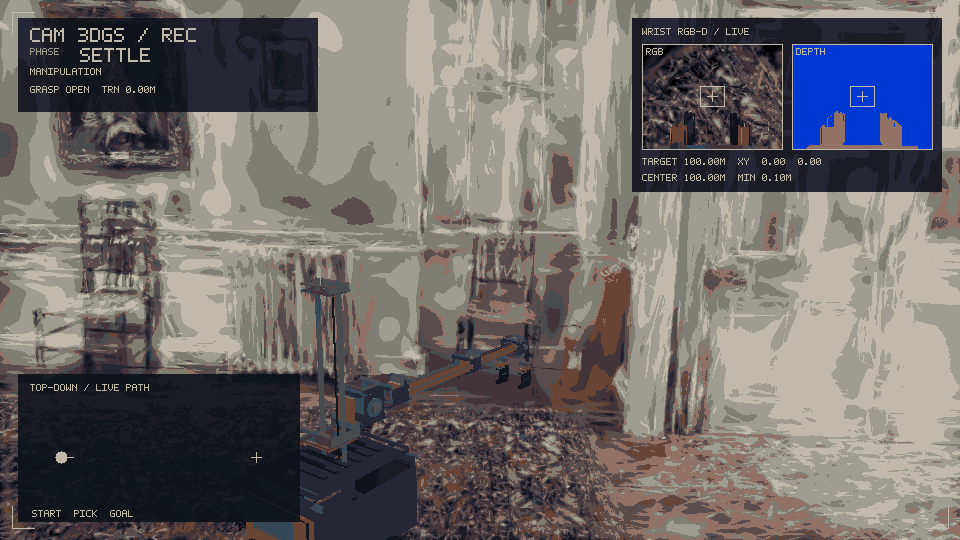
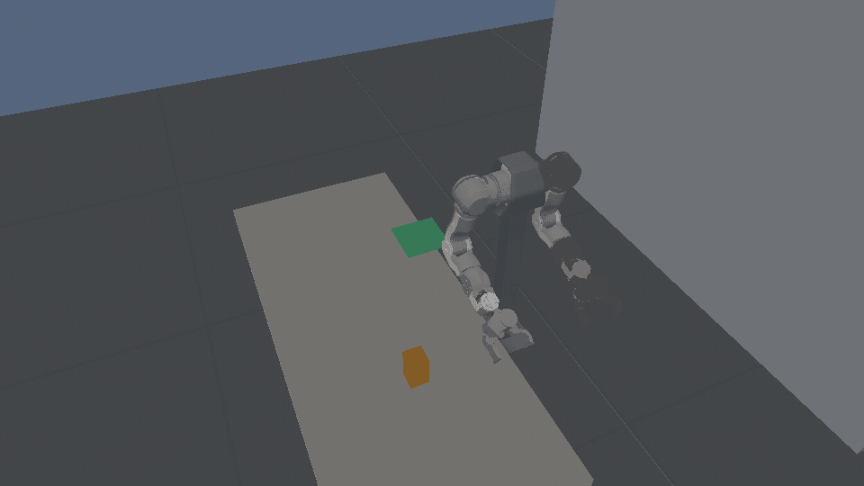
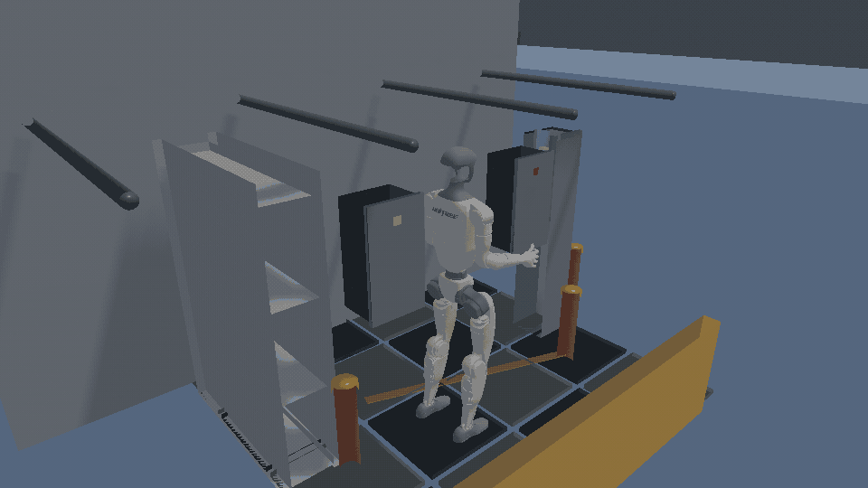
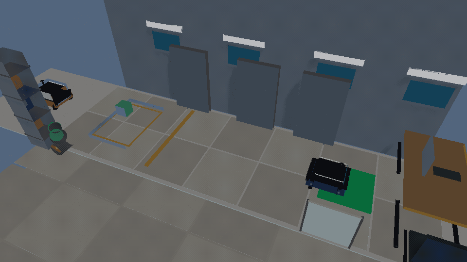
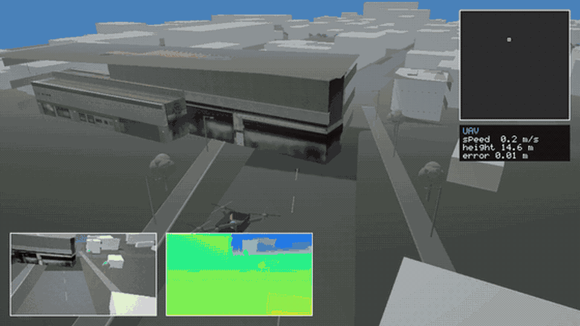
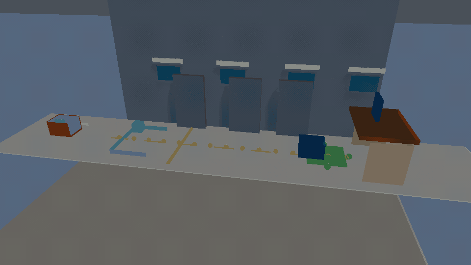
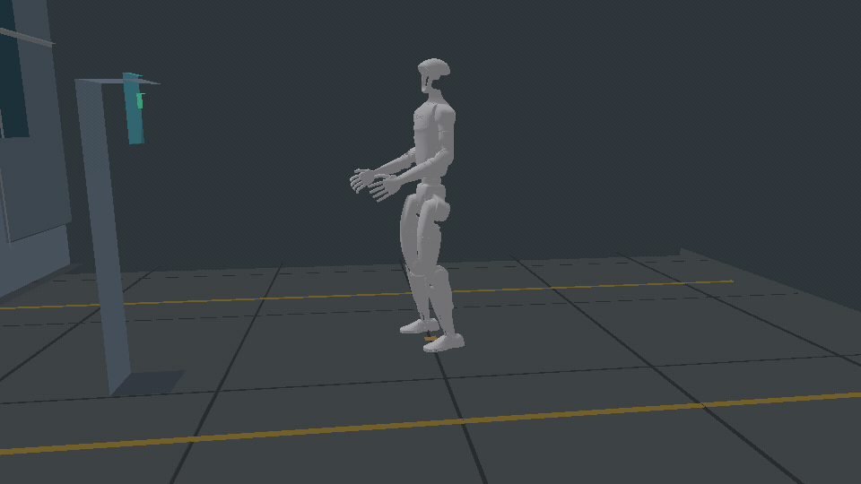
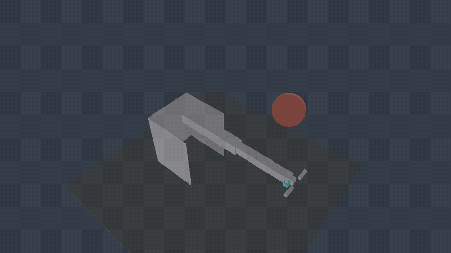

# Robot Native Engine

**Robots are not plugins.** RNE is a Rust robot-native game engine for deterministic
simulation, embodied AI, synthetic sensors, and policy evaluation.

[](https://github.com/rsasaki0109/RoboSim/releases)
[](https://github.com/rsasaki0109/RoboSim/actions/workflows/ci.yml)

RNE combines a headless, replayable simulation core with real wgpu rendering.
Worlds contain robot, sensor, actuator, agent, and episode entities. Simulation
does not require a renderer, and ROS 2 is an optional adapter rather than a core
dependency.

## Real simulation showcase

Every frame below is rendered by wgpu from deterministic simulation or pinned
dataset/camera state. Reduced-motion clients receive the matching poster PNG.
The quantitative gates and exact regeneration commands are in
[README showcase acceptance](docs/README_SHOWCASE.md).

<table>
  <tr>
    <td colspan="2" align="center">
      <picture>
        <source media="(prefers-reduced-motion: reduce)" srcset="docs/media/house-mobile-manipulation.png">
        
      </picture>
      <br><b>Real indoor 3DGS · mobile manipulation</b><br>
      <sub>Voxel51 Dr Johnson is a real photo-derived interior 3DGS. A fail-closed fixture binds two real frames, COLMAP cameras, six registered landmarks, the floor plane, the pickup collision proxy, a same-camera real-versus-RNE RGB observation, and deterministic single-/multi-view depth evidence; the proxy projects onto the captured rug instead of arbitrary room space. The detailed 10-link PBR robot completes a floor-level friction grasp, 0.401 m lift, 1.559 m transport, and placement within 0.049 m. The fixture passes 7/8 geometric-sensor contracts. Its RGB observation records 13.05 dB raw PSNR, 0.927 luminance correlation, and 0.688 gradient correlation; alpha-composited source-unit depth matches 6/6 semantic landmarks at 0.148 mean absolute error, and 40/42 two-camera tracks at 0.0353 depth-delta MAE with 0/80 false occlusions. It remains explicitly non-qualifying—and does not call reconstruction-unit depths metres—until an independent physical scale anchor is retained. During final pickup alignment, rendered wrist RGB-D segments the payload, self-masks the known robot, back-projects depth, and drives analytic IK without payload truth; the live RGB/depth inset shows the detected reticle and the 2D task trace exposes base motion. <a href="assets/environments/voxel51_drjohnson_3dgs/drjohnson.validation.json">validation fixture</a> · <a href="assets/environments/voxel51_drjohnson_3dgs/IMG_6292-IMG_6293.multiview-depth.json">multi-view depth evidence</a> · <a href="docs/media/house-mobile-manipulation.json">metadata</a> · <a href="examples/89_house_mobile_lift_hero/main.rs">source</a></sub>
    </td>
  </tr>
  <tr>
    <td width="50%" align="center">
      <picture>
        <source media="(prefers-reduced-motion: reduce)" srcset="docs/media/showcase-openarm.png">
        
      </picture>
      <br><b>OpenArm v2 · bimanual control</b><br>
      <sub>18-axis typed feedback with one-cycle latency, explicit PD effort limits, synchronized pinch grippers, live error/effort telemetry, and exact Rapier replay over 1,400 fixed steps. <a href="docs/media/showcase-openarm.json">metadata</a> · <a href="examples/90_showcase_captures/openarm.rs">source</a></sub>
    </td>
    <td width="50%" align="center">
      <picture>
        <source media="(prefers-reduced-motion: reduce)" srcset="docs/media/showcase-factory.png">
        
      </picture>
      <br><b>Factory inspection</b><br>
      <sub>Official G1 link meshes, three inspection markers, upright completion, and deterministic replay. <a href="docs/media/showcase-factory.json">metadata</a></sub>
    </td>
  </tr>
  <tr>
    <td width="50%" align="center">
      <picture>
        <source media="(prefers-reduced-motion: reduce)" srcset="docs/media/showcase-office.png">
        
      </picture>
      <br><b>Office AGV</b><br>
      <sub>Shared-aisle yield, dock pickup, cargo transport, and desk placement without contact or early drop. <a href="docs/media/showcase-office.json">metadata</a></sub>
    </td>
    <td width="50%" align="center">
      <picture>
        <source media="(prefers-reduced-motion: reduce)" srcset="docs/media/showcase-uav.png">
        
      </picture>
      <br><b>PLATEAU UAV · RGB-D flight</b><br>
      <sub>A visible multirotor flies 76.6 m over imported city geometry with bounded control, 12.21 m building clearance, zero collisions, and synchronized onboard RGB-D. <a href="docs/media/showcase-uav.json">metadata</a> · <a href="examples/46_plateau_drone_gif/main.rs">source</a></sub>
    </td>
  </tr>
</table>

## Highlights

| Area | What is included | Start here |
| --- | --- | --- |
| City simulation | Official PLATEAU import, traffic routing/signals, dynamic vehicles, LiDAR, RGB-D camera, and OSM HUD | [PLATEAU import](docs/PLATEAU_IMPORT.md), examples 46–47 |
| Vehicle dynamics | Dynamic bicycle model, tire saturation, explicit differential-drive caster and four-wheel Ackermann suspension dynamics, metric grade/roughness/curb/drop excitation, deterministic suspension/tire-log identification with direct Rapier/MuJoCo parameter application, sensor-only Ackermann speed/yaw control, deterministic Mobility domain-randomization reference batches, cross-backend contact/load evidence, sensor latency, and deterministic evaluation | [Vehicle dynamics](docs/VEHICLE_DYNAMICS.md), [caster benchmark](docs/MOBILITY_DIFFERENTIAL_CASTER_V1.md), [Ackermann dynamics](docs/MOBILITY_ACKERMANN_SUSPENSION_V1.md), [road excitation](docs/MOBILITY_ROAD_EXCITATION_V1.md), [suspension identification](docs/MOBILITY_SUSPENSION_IDENTIFICATION_V1.md), [tire identification](docs/MOBILITY_TIRE_IDENTIFICATION_V1.md), [domain randomization](docs/MOBILITY_DOMAIN_RANDOMIZATION_V1.md), [Ackermann sensor loop](docs/MOBILITY_ACKERMANN_SENSOR_CLOSED_LOOP_V1.md), examples 49–51 |
| Quadruped locomotion | Official Unitree Go2, torque control, disturbances, steering, velocity/terrain policy, and replay tests | [GO2_LOCOMOTION.md](docs/GO2_LOCOMOTION.md), examples 52–65 |
| Humanoid locomotion | Official Unitree G1 23-DoF articulation, balance, learned stride, typed commands, bounded heading-yaw, and CEM evaluation | [G1_LOCOMOTION.md](docs/G1_LOCOMOTION.md), examples 39, 63, 67, 68 |
| Manipulation | Authored PBR mobile manipulator, real-capture indoor 3DGS hybrid rendering, friction grasp/release episodes, articulated Dex3 hands, and task markers | [Showcase contract](docs/README_SHOWCASE.md), examples 32, 40–42, 89 |
| Deformables | Backend-neutral XPBD cable and cloth with deterministic headless replay | examples 43–45 |


## Independent validation wanted

RNE remains below 1.0 until real projects outside this repository reproduce
tasks and independently maintained extensions pass the shipped conformance
kits. Native release bundles include the required tools; cloning the RNE
source tree is not required to submit evidence.

The current campaign accepts only [v0.3.0 official
assets](https://github.com/rsasaki0109/RoboSim/releases/tag/v0.3.0). If that
release page does not yet contain the native archives and `SHA256SUMS`, prepare
the repository and checklist but do not open an evidence issue. The published
v0.1.0 prerelease does not qualify for this campaign.

- [Reproduce an external project task and Failure Capsule](https://github.com/rsasaki0109/RoboSim/issues/new?template=external-project-evidence.yml)
- [Measure the installed flagship from an official release archive](https://github.com/rsasaki0109/RoboSim/issues/new?template=installed-flagship-reproduction.yml)
- [Conform a third-party controller plugin](https://github.com/rsasaki0109/RoboSim/issues/new?template=third-party-plugin-evidence.yml)
- [Conform an external physics backend, simulator adapter, hardware adapter, or accelerator adapter](https://github.com/rsasaki0109/RoboSim/issues/new?template=external-system-evidence.yml)

Read the [external evidence intake guide](docs/EXTERNAL_EVIDENCE_INTAKE.md)
before running a qualifying test. Opening an issue is only the start of review:
it does not imply acceptance, and in-repository reference implementations do
not count as independent evidence. Tagged releases retain a release-level
`SHA256SUMS`, platform attestation bundles, and attested install reports beside
the native archives so another machine can audit the exact operator input.

## Vehicle dynamics at the grip limit

<p align="center">
  <picture>
    <source media="(prefers-reduced-motion: reduce)" srcset="docs/media/vehicle-dynamics.png">
    
  </picture>
  <br>
  <sub>One controller, two plants: the dynamic car's trail turns red when the front axle saturates.</sub>
</p>

Example 49 runs both cars from the same commands at 240 Hz, records their pose and
tire telemetry deterministically, then renders the 12-second comparison and a
reduced-motion poster. The no-slip car follows the requested line; the dynamic car
runs wide once the 18 m corner asks for more lateral force than its tires can supply.

```bash
cargo run --release -p vehicle_dynamics_compare --example 49_vehicle_dynamics
RNE_SKIP_GPU=1 cargo run -p vehicle_dynamics_compare --example 49_vehicle_dynamics
```

Model equations, measured errors, and acceptance tests are in
[Vehicle dynamics](docs/VEHICLE_DYNAMICS.md).

## Navigation, SLAM, and multi-robot

<p align="center">
  <picture>
    <source media="(prefers-reduced-motion: reduce)" srcset="docs/media/showcase-nav.png">
    
  </picture>
  <br>
  <sub>Office AGV navigation in the PBR office scene: the planned route (amber), the driven trajectory (cyan), and the docking goal (green).</sub>
</p>

`rne_nav` and `rne_slam` are the deterministic, ROS-free navigation core: occupancy
grids and costmaps, a timestamped transform tree, A*/Dijkstra planning, pure-pursuit
and DWA control, multi-robot sense-and-avoid, drive actuators with limits, an
odometry/IMU/GPS EKF, 2.5D elevation and terrain layering, 3D ICP, and online 2D SLAM
with pose-graph loop closure and AMCL. A ROS 2 adapter maps the same types to
`nav_msgs`/`sensor_msgs`/`tf2` and exposes Nav2 action servers, so the algorithms stay
independent of the transport. Every scenario replays bit-for-bit.

```bash
# Capture the office navigation showcase (shared GPU showcase pipeline)
WGPU_BACKEND=vulkan cargo run --release -p showcase_captures --example 90_showcase_captures -- --capture --environment nav

cargo run -p nav_slam_mapping --example 97_nav_slam_mapping
cargo run -p nav_slam_physics --example 98_nav_slam_physics
cargo run -p multi_robot_avoidance --example 99_multi_robot_avoidance
cargo run -p nav_elevation_icp --example 100_nav_elevation_icp
```

Data structures, algorithms, and limits are in
[Navigation](docs/NAVIGATION.md) and [SLAM](docs/SLAM.md).

## G1 locomotion

<p align="center">
  <picture>
    <source media="(prefers-reduced-motion: reduce)" srcset="docs/media/unitree-g1-sustained-walk.png">
    
  </picture>
  <br>
  <sub>v0.3 long-horizon walk: the official G1 holds its feet for 50 s (six times the v0.2.1 horizon) under a forward+turn command, upright the whole way, with the walked curve drawn as a floor trail.</sub>
</p>

Example 67 evaluates typed forward, stop, and differential-steering commands
without a renderer. Example 68 adds a bounded 240-tick true body-heading
candidate and the v0.3 sustained envelope: the same validated heading candidate
walks 3000 ticks (50 s) without falling (pelvis > 0.784 m, tilt < 0.13 rad) with
the correct mean yaw-rate sign. The integrated yaw stays bounded by the clamped
target — an eight-dimension gait-schedule search found **no** upright sustained
turn on this official contact schedule, so sustained turning remains open and
v0.3 is a stability claim rather than a sustained-turn claim.

```bash
cargo run --release -p g1_commanded_locomotion --example 67_g1_commanded_locomotion
cargo run --release -p g1_commanded_locomotion --example 67_g1_commanded_locomotion -- --train
cargo run --release -p g1_heading_turn --example 68_g1_heading_turn
cargo run --release -p g1_heading_turn --example 68_g1_heading_turn -- --train

# Regenerate the wgpu hero GIFs and reduced-motion PNGs
cargo run --release -p g1_stride_gif --example 63_g1_stride_gif
cargo run --release -p g1_sustained_walk_gif --example 92_g1_sustained_walk_gif
```

The full measurements and limitations are in [docs/G1_LOCOMOTION.md](docs/G1_LOCOMOTION.md).

## Quickstart

```bash
git clone https://github.com/rsasaki0109/RoboSim.git
cd RoboSim
cargo run -p hello_world --example 00_hello_world
cargo run -p falling_cube --example 01_falling_cube
cargo run -p diff_drive_lidar --example 01_diff_drive_lidar

# Run an asset scene headlessly with a fixed-step physics replay
cargo run --release -p rne_asset_cli -- simulate assets/scenes/mesh_diff_drive.rne.scene.toml --steps 600 --hz 60 --wheel-velocity-rad-s 6 --determinism-check --replay-out target/runs/mesh_diff_drive.rne-replay
cargo run --release -p rne_asset_cli -- replay target/runs/mesh_diff_drive.rne-replay

# Run a named URDF joint and record joint/sensor observations
cargo run --release -p rne_asset_cli -- run assets/runs/mm_minimal_joint_velocity.rne.run.toml

# Run the same experiment from a versioned manifest
cargo run --release -p rne_asset_cli -- run assets/runs/mesh_diff_drive.rne.run.toml

# Record full typed sensor payloads through a manifest [[sensors]] subscription
cargo run --release -p rne_asset_cli -- run assets/runs/mesh_diff_drive_lidar_payload.rne.run.toml
cargo run --release -p rne_asset_cli -- replay target/runs/mesh_diff_drive_lidar_payload.rne-replay

# Run an OpenSCENARIO speed scenario over the traffic runtime
cargo run --release -p rne_asset_cli -- run assets/runs/scenario_speed.rne.run.toml

# Drive a named joint through a multi-joint position trajectory
cargo run --release -p rne_asset_cli -- run assets/runs/mm_minimal_joint_trajectory.rne.run.toml

# Run on the deterministic analytic physics backend
cargo run --release -p rne_asset_cli -- run assets/runs/cart_analytic.rne.run.toml
```

For a complete local validation:

```bash
cargo run -p xtask -- ci
```

The long example smoke gate is split for CI into `manipulator`, `locomotion`,
`assets`, and `media` partitions; run one locally with, for example,
`cargo run -p xtask -- ci-smoke media`.

See [examples/README.md](examples/README.md) for the complete example index.

## Independent integrations

The native release archive includes a one-command installed product proof:

```bash
./bin/rne-flagship-proof flagship-proof --cross-backend \
  --measure-on "lab-workstation-a" --verify-installed-bundle .
```

It runs the unchanged indoor mobile-manipulation TaskSpec and controller through
Rapier and the bundled MuJoCo runtime for both a successful episode and the same
deterministic perception blackout. It compares named SI-unit tolerances and the
first violation, verifies both replays and the Failure Capsule, and writes a
self-contained browser inspector plus a SHA-256-bound
`installed-proof-report.json`. The report also binds the exact packaged
`rne-flagship-proof` executable that produced it. Before creating output, the
same command verifies the exact regular-file graph declared by the extracted
bundle's `SHA256SUMS` and binds that result into the proof and Failure Capsule.
No source checkout, renderer,
ROS 2, separate MuJoCo installation, or network connection is required after
extraction.
The explicit hardware label also writes a separate
`time-to-proof-report.json`; it measures full installed-bundle verification
through verified capsule and bound proof report against the 15-minute target without contaminating
deterministic correctness evidence.
An independent operator can bind those outputs to the exact clean tagged
archive with `xtask external-flagship-check`; CI and placeholder machine labels
are rejected as external evidence.

Third-party controller plugins, physics backends, simulator adapters, hardware adapters, and real
external task reproductions can be submitted through the fixed
[external evidence intake](docs/EXTERNAL_EVIDENCE_INTAKE.md). The repository
validates all required issue-form fields with `xtask external-intake-check`;
submission never implies acceptance or 1.0 readiness. Native bundles expose
`rne-asset failure-capsule create|verify`, so an independent project can retain
its required replay evidence from the extracted release without cloning the
RNE source tree. Maintainers use `xtask external-project-check` to rebind the
clean external Git revision, official release archive, TaskSpec, every Capsule
member, and committed command logs before either adoption slot can count.

## Selected demos

### PLATEAU city and sensors

<p align="center">
  <picture>
    <source media="(prefers-reduced-motion: reduce)" srcset="docs/media/plateau-car.png">
    
  </picture>
  <br>
  <sub>PLATEAU city import: official tile, traffic signals, kinematic vehicles, and sensor overlay.</sub>
</p>

Example 46 imports a bounded official PLATEAU Sanjo City tile once, then renders
both the deterministic 100-actor traffic capture and a bounded, controlled
quadrotor flight through the same detailed streetscape. Example 47 replays the
traffic runtime headlessly. The hero vehicle carries physics-aware LiDAR and
RGB-D sensors with seeded noise, material response, timing, and replayable output.

```bash
cargo run -p plateau_drone_gif --example 46_plateau_drone_gif
cargo run -p traffic_city_replay --example 47_traffic_city_replay
```

Details: [PLATEAU import](docs/PLATEAU_IMPORT.md),
[traffic runtime](docs/TRAFFIC_RUNTIME.md),
[LiDAR](docs/LIDAR_SIMULATION.md), and [camera](docs/CAMERA_SIMULATION.md).

### Go2 learning boundary

The shared `LocomotionPolicy` contract supports seeded Go2/G1 batches,
checkpoints, replay digests, CEM smoke tests, and a Python PPO smoke path.

```bash
cargo run --release -p go2_pure_torque --example 64_go2_pure_torque
cargo run --release -p go2_velocity_terrain --example 65_go2_velocity_terrain
cargo run --release -p locomotion_vectorized --example 66_locomotion_vectorized
```

See [docs/GO2_LOCOMOTION.md](docs/GO2_LOCOMOTION.md) and
[docs/ROADMAP.md](docs/ROADMAP.md).

### G1 manipulation and deformables

<p align="center">
  <picture>
    <source media="(prefers-reduced-motion: reduce)" srcset="docs/media/unitree-g1-dex3.png">
    
  </picture>
  <picture>
    <source media="(prefers-reduced-motion: reduce)" srcset="docs/media/unitree-g1-cloth.png">
    
  </picture>
</p>

```bash
# Two-contact Dex3 grasp, lift, carry, and release
cargo run -p unitree_g1_dex3_pick_place --example 42_unitree_g1_dex3_pick_place

# G1 hand handling live XPBD cloth
cargo run --release -p unitree_g1_cloth_handling --example 45_unitree_g1_cloth_handling

# Deterministic cable and cloth rollouts
cargo run -p deformable_cable --example 43_deformable_cable
cargo run -p deformable_cloth --example 44_deformable_cloth
```

### Native motion planning

`rne_planning` is a deterministic, MoveIt-inspired joint-space planning layer
built on the generic `rne_robot` kinematic model and collision checker: planning
scene and SRDF groups, goal and path constraints, a planner registry and
pipeline, PTP/LIN/CIRC motions, RRT-Connect, RRT*, informed RRT*, PRM,
BIT\*-style, CHOMP and STOMP trajectory optimization, hybrid planning, and
request adapters with velocity- and acceleration-limited time parameterization.
No MoveIt or ROS dependency is added to core.

<p align="center">
  <picture>
    <source media="(prefers-reduced-motion: reduce)" srcset="docs/media/motion-planning.png">
    
  </picture>
  <br>
  <sub>The checked-in RNE-converted <b>OpenArm v2 left arm</b> (7-DOF, GLB meshes), planned by RRT-Connect and rendered by the real wgpu renderer. A collision object blocks straight joint interpolation; the cyan trail traces the collision-free end-effector detour. <a href="examples/102_motion_planning_media/main.rs">capture source</a> · <a href="docs/architecture/011_joint_motion_planning.md">architecture</a></sub>
</p>

```bash
cargo run -p motion_planning --example 101_motion_planning
cargo run --release -p motion_planning_media --example 102_motion_planning_media
cargo run -p motion_planning_media --example 102_motion_planning_media -- --smoke
```

See [joint-space motion planning](docs/architecture/011_joint_motion_planning.md).

### Native articulated dynamics

`rne_dynamics` is the backend-neutral, deterministic articulated-body dynamics
layer that model-based legged and mobile-manipulation control builds on: spatial
algebra, the composite-rigid-body mass matrix, recursive Newton-Euler inverse
dynamics with gravity and velocity bias, deterministic forward dynamics, the
center of mass, and the center-of-mass Jacobian. Fixed- and floating-base trees
are supported, and the Go2 diagnostics example checks the equation of motion on
a real 18-DoF quadruped.

```bash
cargo run -p dynamics_diagnostics --example 103_dynamics_diagnostics
```

See [articulated-body dynamics](docs/architecture/012_dynamics.md).

### Native legged walking templates

`rne_legged` is the deterministic, backend-free template layer for legged
walking: the Linear Inverted Pendulum Model, Divergent Component of Motion and
capture point, closed-form capture-point foot placement, Kajita-style ZMP
preview control, footstep plans with smooth double-support transitions, and a
full center-of-mass walking pattern. It turns a footstep request into a
replayable trajectory without a physics backend or renderer.

```bash
cargo run -p legged_pattern --example 104_legged_pattern
```

See [legged walking templates](docs/architecture/013_legged_templates.md).

The same crate adds a classical **centroidal layer** for dynamic maneuvers: a
single-rigid-body contact-force distribution with a Coulomb friction cone,
Raibert foot placement, and a minimal-jerk swing trajectory, following the
open-source `cajun` and `go2-convex-mpc` centroidal controllers. This is the
reduced-order abstraction a push-off / flight / landing controller needs.

### Native whole-body control

`rne_wbc` realizes task-space objectives as joint torques on a floating-base
articulated model: a deterministic weighted inverse-dynamics solve over joint
accelerations and contact wrenches, with the floating-base equations of motion
and contact no-slip rows, friction-cone projection, and torque recovery from
`rne_dynamics`. The Go2 example supports the exact body weight through four foot
contacts with a base-residual below `1e-8`.

```bash
cargo run -p whole_body_control --example 105_whole_body_control
```

See [whole-body control](docs/architecture/014_whole_body_control.md).

### Native optimal control

`rne_oc` is the native Crocoddyl-style layer for generating agile maneuvers:
a discrete shooting problem solved by **DDP** with Levenberg-Marquardt
regularization and a backtracking line search, central-difference dynamics
derivatives, quadratic running/terminal costs, and an `ArticulatedDynamics`
adapter that integrates `rne_dynamics` forward dynamics. A pendulum swings up
from hanging to upright under the solver, deterministically and without any
external optimal-control library.

See [native optimal control](docs/architecture/015_native_optimal_control.md).

## Architecture

The workspace is split by responsibility:

- `rne_core`, `rne_math`, `rne_ecs`: schedules, time, events, diagnostics, ECS, and spatial math.
- `rne_world`, `rne_robot`, `rne_sensor`, `rne_ai`, `rne_data`: world/entity conventions, robot control, sensors, learning interfaces, and typed data streams.
- `rne_planning`: backend-neutral joint-space planning scene, goal constraints, planners, and pipeline.
- `rne_dynamics`: backend-neutral articulated-body dynamics: mass matrix, inverse dynamics, center of mass, and Jacobians.
- `rne_legged`: backend-neutral legged walking templates: LIPM/DCM, capture-point foot placement, ZMP preview control, and footstep plans.
- `rne_wbc`: backend-neutral whole-body control: weighted inverse dynamics, contact and friction handling, and joint torque recovery.
- `rne_physics` and `rne_physics_rapier`: backend-neutral traits and the Rapier implementation.
- `rne_render` and `rne_render_wgpu`: renderer traits and the optional wgpu backend.
- `rne_asset`, `rne_plugin`, `rne_traffic`: assets, plugin interfaces, and backend-neutral traffic.
- `adapters/ros2`: ROS 2 integration. Core crates remain ROS 2-free.

Important boundaries are recorded in [docs/architecture](docs/architecture/000_overview.md).

## Determinism and testing

- Simulation uses `SimClock`, explicit seeds, stable entity ordering, and replay digests.
- Headless examples and tests do not initialize a renderer.
- Public APIs use explicit units such as `_m`, `_rad`, `_s`, and `_hz`.
- Physics backends do not leak engine-specific handles through public core traits.

Run the standard checks:

```bash
cargo fmt --all
cargo clippy --workspace --all-targets -- -D warnings
cargo test --workspace
cargo run -p xtask -- ci-headless
cargo run --locked -p xtask -- flagship
cargo run -p xtask -- ci
```

## Python and ROS 2 adapters

The Python adapter exposes native environments for policy experiments:

```bash
python3 -m venv .venv
.venv/bin/pip install maturin
.venv/bin/maturin develop -m crates/rne_py/Cargo.toml
.venv/bin/python examples/04_python_policy/run.py
```

ROS 2 is optional and isolated under [adapters/ros2](adapters/ros2). See the
[ROS 2 bridge README](adapters/ros2/rne_ros2_bridge/README.md) for setup.

## Documentation

- [Architecture overview](docs/architecture/000_overview.md)
- [Roadmap](docs/ROADMAP.md)
- [OSS parity baseline](docs/OSS_PARITY.md)
- [Controller plugin SDK](docs/PLUGIN_SDK.md)
- [External physics backend conformance](docs/EXTERNAL_PHYSICS_BACKEND_CONFORMANCE.md)
- [External hardware adapter conformance](docs/HARDWARE_ADAPTER_CONFORMANCE.md)
- [External simulator adapter conformance](docs/EXTERNAL_SIMULATOR_ADAPTER_CONFORMANCE.md)
- [OpenArm Rapier / native MuJoCo / Gazebo proof](docs/OPENARM_CROSS_SIM_PROOF.md), including official arm-only versus pinch-gripper coupled-inertia evidence, seven-joint held-out MIMO identification, and typed-sensor dropout, stale-age, recovery, repeated-burst re-arm, position-quantization, position-saturation, and stuck-value boundaries
- [Compatibility fixture corpus](docs/COMPATIBILITY_CORPUS.md)
- [Support policy and 1.0 commitment](docs/SUPPORT.md)
- [Evidence-backed 1.0 readiness](docs/ONE_ZERO_READINESS.md)
- [Browser viewer and replay inspector](web/rne_web_viewer/README.md)
- [Flagship validation workflow](docs/FLAGSHIP_VALIDATION_WORKFLOW.md)
- [Tsukuba confirmation run](docs/TSUKUBA_CONFIRMATION_RUN.md)
- [Tsukuba full run](docs/TSUKUBA_FULL_RUN.md)
- [SSL small-pitch 2v2](docs/SSL_SMALL_PITCH.md)
- [SSL simulation-protocol adapter](docs/SSL_ADAPTER.md)
- [G1 workbench mission](docs/G1_WORKBENCH_MISSION.md)
- [Tsukuba 3DGS background](docs/TSUKUBA_3DGS_BACKGROUND.md)
- [G1 head × splat background](docs/G1_HEAD_SPLAT_BACKGROUND.md)
- [G1 locomotion](docs/G1_LOCOMOTION.md)
- [Go2 locomotion](docs/GO2_LOCOMOTION.md)
- [Legged locomotion frontier plan](docs/PLAN_LEGGED_LOCOMOTION_FRONTIER.md)
- [Sensor simulation](docs/IMU_SIMULATION.md)
- [Examples](examples/README.md)
- [Changelog](CHANGELOG.md)

## License

Licensed under either the [Apache License 2.0](LICENSE-APACHE) or the [MIT license](LICENSE-MIT), at your option.
