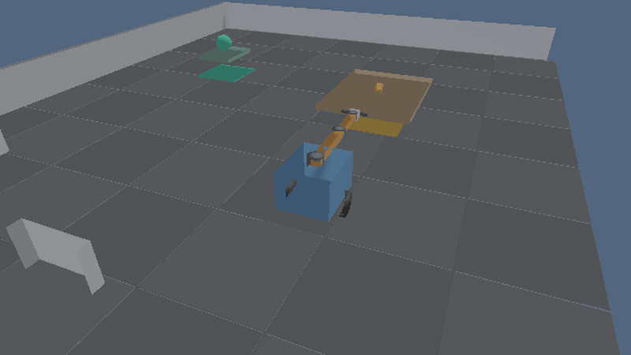
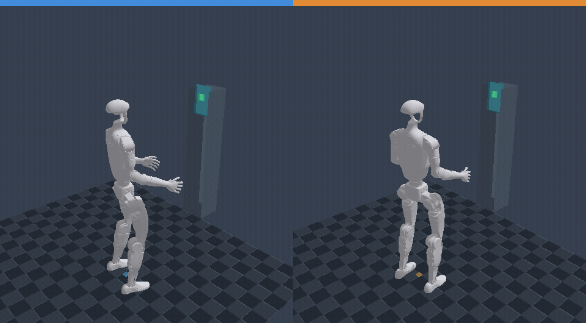
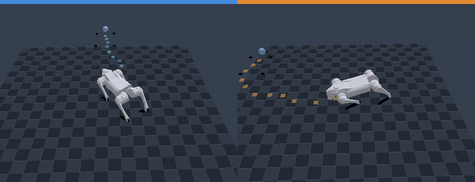
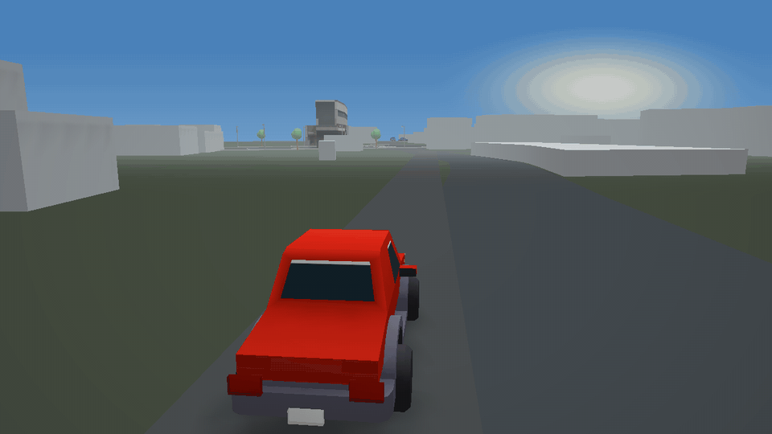
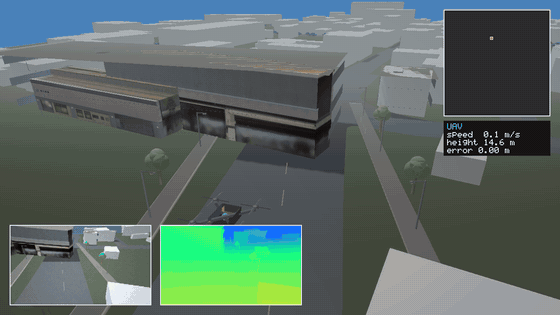
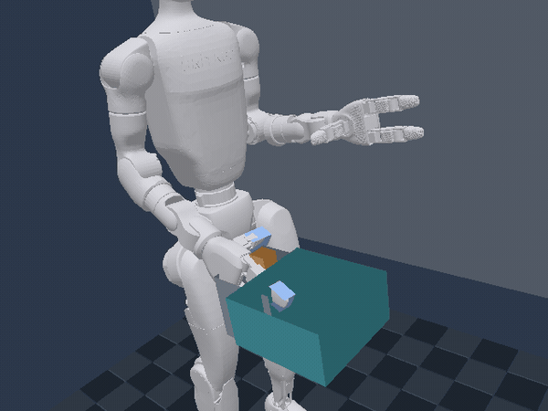
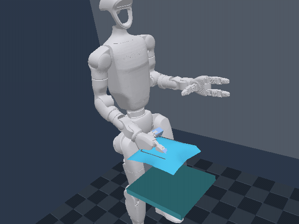

# Robot Native Engine

**Robots are not plugins.** RNE is a Rust robot-native game engine for deterministic
simulation, embodied AI, synthetic sensors, and policy evaluation.

[](https://github.com/rsasaki0109/RoboSim/releases)
[](https://github.com/rsasaki0109/RoboSim/actions/workflows/ci.yml)

RNE combines a headless, replayable simulation core with real wgpu rendering.
Worlds contain robot, sensor, actuator, agent, and episode entities. Simulation
does not require a renderer, and ROS 2 is an optional adapter rather than a core
dependency.

## Real simulation showcase

Every frame below comes from the simulator state rendered by wgpu. Reduced-motion
clients receive the matching poster PNG. The quantitative gates and exact
regeneration commands are in [README showcase acceptance](docs/README_SHOWCASE.md).

<table>
  <tr>
    <td width="50%" align="center">
      <picture>
        <source media="(prefers-reduced-motion: reduce)" srcset="docs/media/rne-hero.png">
        
      </picture>
      <br><b>Mobile manipulation</b><br>
      <sub>Real capture: physics contact grasp, 2.42 m payload transport, release, and 0.091 m placement error. <a href="docs/media/rne-hero.json">metadata</a> · <a href="docs/media/generate-hero.sh">regenerate</a></sub>
    </td>
    <td width="50%" align="center">
      <picture>
        <source media="(prefers-reduced-motion: reduce)" srcset="docs/media/unitree-g1-learned-stride.png">
        
      </picture>
      <br><b>G1 biped locomotion</b><br>
      <sub>Official 23-DoF model; two measured command windows, upright and limit checked.</sub>
    </td>
  </tr>
  <tr>
    <td width="50%" align="center">
      <picture>
        <source media="(prefers-reduced-motion: reduce)" srcset="docs/media/go2-torque-turn.png">
        
      </picture>
      <br><b>Go2 quadruped locomotion</b><br>
      <sub>All-joint torque walk; the contact-gated overlay turns while preserving transport.</sub>
    </td>
    <td width="50%" align="center">
      <picture>
        <source media="(prefers-reduced-motion: reduce)" srcset="docs/media/plateau-car.png">
        
      </picture>
      <br><b>Urban vehicle simulation</b><br>
      <sub>100 routed actors, live signals, onboard LiDAR/RGB-D, and zero ownership or double-integration violations.</sub>
    </td>
  </tr>
  <tr>
    <td colspan="2" align="center">
      <picture>
        <source media="(prefers-reduced-motion: reduce)" srcset="docs/media/plateau-uav.png">
        
      </picture>
      <br><b>Urban UAV simulation</b><br>
      <sub>A rendered quadrotor—not a free camera—with bounded acceleration, speed, yaw, tilt, building clearance, and exact replay checks.</sub>
    </td>
  </tr>
</table>

## Highlights

| Area | What is included | Start here |
| --- | --- | --- |
| City simulation | Official PLATEAU import, traffic routing/signals, dynamic vehicles, LiDAR, RGB-D camera, and OSM HUD | [PLATEAU import](docs/PLATEAU_IMPORT.md), examples 46–47 |
| Vehicle dynamics | Dynamic bicycle model, tire saturation, controller metrics, sensor latency, and deterministic multi-seed evaluation | [Vehicle dynamics](docs/VEHICLE_DYNAMICS.md), examples 49–51 |
| Quadruped locomotion | Official Unitree Go2, torque control, disturbances, steering, velocity/terrain policy, and replay tests | [GO2_LOCOMOTION.md](docs/GO2_LOCOMOTION.md), examples 52–65 |
| Humanoid locomotion | Official Unitree G1 23-DoF articulation, balance, learned stride, typed commands, bounded heading-yaw, and CEM evaluation | [G1_LOCOMOTION.md](docs/G1_LOCOMOTION.md), examples 39, 63, 67, 68 |
| Manipulation | URDF arms, grasp/release episodes, articulated Dex3 hands, and task markers | examples 32, 40–42 |
| Deformables | Backend-neutral XPBD cable and cloth with deterministic headless replay | examples 43–45 |

## G1 locomotion

Example 67 evaluates typed forward, stop, and differential-steering commands
without a renderer. Example 68 adds a bounded 240-tick true body-heading
candidate with heading, yaw-rate, turn-radius, height, torque, and exact-replay
checks. Sustained long-horizon heading tracking remains a follow-up milestone.

```bash
cargo run --release -p g1_commanded_locomotion --example 67_g1_commanded_locomotion
cargo run --release -p g1_commanded_locomotion --example 67_g1_commanded_locomotion -- --train
cargo run --release -p g1_heading_turn --example 68_g1_heading_turn
cargo run --release -p g1_heading_turn --example 68_g1_heading_turn -- --train

# Regenerate the wgpu hero GIF and reduced-motion PNG
cargo run --release -p g1_stride_gif --example 63_g1_stride_gif
```

The full measurements and limitations are in [docs/G1_LOCOMOTION.md](docs/G1_LOCOMOTION.md).

## Quickstart

```bash
git clone https://github.com/rsasaki0109/RoboSim.git
cd RoboSim
cargo run -p hello_world --example 00_hello_world
cargo run -p falling_cube --example 01_falling_cube
cargo run -p diff_drive_lidar --example 01_diff_drive_lidar

# Run an asset scene headlessly with a fixed-step physics replay
cargo run --release -p rne_asset_cli -- simulate assets/scenes/mesh_diff_drive.rne.scene.toml --steps 600 --hz 60 --wheel-velocity-rad-s 6 --determinism-check --replay-out target/runs/mesh_diff_drive.rne-replay
cargo run --release -p rne_asset_cli -- replay target/runs/mesh_diff_drive.rne-replay

# Run a named URDF joint and record joint/sensor observations
cargo run --release -p rne_asset_cli -- run assets/runs/mm_minimal_joint_velocity.rne.run.toml

# Run the same experiment from a versioned manifest
cargo run --release -p rne_asset_cli -- run assets/runs/mesh_diff_drive.rne.run.toml

# Record full typed sensor payloads through a manifest [[sensors]] subscription
cargo run --release -p rne_asset_cli -- run assets/runs/mesh_diff_drive_lidar_payload.rne.run.toml
cargo run --release -p rne_asset_cli -- replay target/runs/mesh_diff_drive_lidar_payload.rne-replay

# Run an OpenSCENARIO speed scenario over the traffic runtime
cargo run --release -p rne_asset_cli -- run assets/runs/scenario_speed.rne.run.toml

# Drive a named joint through a multi-joint position trajectory
cargo run --release -p rne_asset_cli -- run assets/runs/mm_minimal_joint_trajectory.rne.run.toml

# Run on the deterministic analytic physics backend
cargo run --release -p rne_asset_cli -- run assets/runs/cart_analytic.rne.run.toml
```

For a complete local validation:

```bash
cargo run -p xtask -- ci
```

The long example smoke gate is split for CI into `manipulator`, `locomotion`,
`assets`, and `media` partitions; run one locally with, for example,
`cargo run -p xtask -- ci-smoke media`.

See [examples/README.md](examples/README.md) for the complete example index.

## Selected demos

### PLATEAU city and sensors

Example 46 imports a bounded official PLATEAU Sanjo City tile once, then renders
both the deterministic 100-actor traffic capture and a bounded, controlled
quadrotor flight through the same detailed streetscape. Example 47 replays the
traffic runtime headlessly. The hero vehicle carries physics-aware LiDAR and
RGB-D sensors with seeded noise, material response, timing, and replayable output.

```bash
cargo run -p plateau_drone_gif --example 46_plateau_drone_gif
cargo run -p traffic_city_replay --example 47_traffic_city_replay
```

Details: [PLATEAU import](docs/PLATEAU_IMPORT.md),
[traffic runtime](docs/TRAFFIC_RUNTIME.md),
[LiDAR](docs/LIDAR_SIMULATION.md), and [camera](docs/CAMERA_SIMULATION.md).

### Go2 learning boundary

The shared `LocomotionPolicy` contract supports seeded Go2/G1 batches,
checkpoints, replay digests, CEM smoke tests, and a Python PPO smoke path.

```bash
cargo run --release -p go2_pure_torque --example 64_go2_pure_torque
cargo run --release -p go2_velocity_terrain --example 65_go2_velocity_terrain
cargo run --release -p locomotion_vectorized --example 66_locomotion_vectorized
```

See [docs/GO2_LOCOMOTION.md](docs/GO2_LOCOMOTION.md) and
[docs/ROADMAP.md](docs/ROADMAP.md).

### G1 manipulation and deformables

<p align="center">
  <picture>
    <source media="(prefers-reduced-motion: reduce)" srcset="docs/media/unitree-g1-dex3.png">
    
  </picture>
  <picture>
    <source media="(prefers-reduced-motion: reduce)" srcset="docs/media/unitree-g1-cloth.png">
    
  </picture>
</p>

```bash
# Two-contact Dex3 grasp, lift, carry, and release
cargo run -p unitree_g1_dex3_pick_place --example 42_unitree_g1_dex3_pick_place

# G1 hand handling live XPBD cloth
cargo run --release -p unitree_g1_cloth_handling --example 45_unitree_g1_cloth_handling

# Deterministic cable and cloth rollouts
cargo run -p deformable_cable --example 43_deformable_cable
cargo run -p deformable_cloth --example 44_deformable_cloth
```

## Architecture

The workspace is split by responsibility:

- `rne_core`, `rne_math`, `rne_ecs`: schedules, time, events, diagnostics, ECS, and spatial math.
- `rne_world`, `rne_robot`, `rne_sensor`, `rne_ai`, `rne_data`: world/entity conventions, robot control, sensors, learning interfaces, and typed data streams.
- `rne_physics` and `rne_physics_rapier`: backend-neutral traits and the Rapier implementation.
- `rne_render` and `rne_render_wgpu`: renderer traits and the optional wgpu backend.
- `rne_asset`, `rne_plugin`, `rne_traffic`: assets, plugin interfaces, and backend-neutral traffic.
- `adapters/ros2`: ROS 2 integration. Core crates remain ROS 2-free.

Important boundaries are recorded in [docs/architecture](docs/architecture/000_overview.md).

## Determinism and testing

- Simulation uses `SimClock`, explicit seeds, stable entity ordering, and replay digests.
- Headless examples and tests do not initialize a renderer.
- Public APIs use explicit units such as `_m`, `_rad`, `_s`, and `_hz`.
- Physics backends do not leak engine-specific handles through public core traits.

Run the standard checks:

```bash
cargo fmt --all
cargo clippy --workspace --all-targets -- -D warnings
cargo test --workspace
cargo run -p xtask -- ci-headless
cargo run -p xtask -- ci
```

## Python and ROS 2 adapters

The Python adapter exposes native environments for policy experiments:

```bash
python3 -m venv .venv
.venv/bin/pip install maturin
.venv/bin/maturin develop -m crates/rne_py/Cargo.toml
.venv/bin/python examples/04_python_policy/run.py
```

ROS 2 is optional and isolated under [adapters/ros2](adapters/ros2). See the
[ROS 2 bridge README](adapters/ros2/rne_ros2_bridge/README.md) for setup.

## Documentation

- [Architecture overview](docs/architecture/000_overview.md)
- [Roadmap](docs/ROADMAP.md)
- [OSS parity baseline](docs/OSS_PARITY.md)
- [Browser viewer and replay inspector](web/rne_web_viewer/README.md)
- [G1 locomotion](docs/G1_LOCOMOTION.md)
- [Go2 locomotion](docs/GO2_LOCOMOTION.md)
- [Sensor simulation](docs/IMU_SIMULATION.md)
- [Examples](examples/README.md)
- [Changelog](CHANGELOG.md)

## License

Licensed under either the [Apache License 2.0](LICENSE-APACHE) or the [MIT license](LICENSE-MIT), at your option.
