# Robot Native Engine

**Robots are not plugins.** RNE is a Rust robot-native game engine for deterministic
simulation, embodied AI, synthetic sensors, and policy evaluation.

[](https://github.com/rsasaki0109/RoboSim/releases)
[](https://github.com/rsasaki0109/RoboSim/actions/workflows/ci.yml)

RNE combines a headless, replayable simulation core with real wgpu rendering.
Worlds hold robot, sensor, actuator, agent, and episode entities; simulation
needs no renderer, and ROS 2 is an optional adapter, not a core dependency.

## Real simulation showcase

Hands-on joint sliders, scene editing, and RGB/depth/LiDAR views: start the
[Robot workbench](docs/ROBOT_WORKBENCH.md) with
`cargo run --release --locked -p robot_workbench`.

[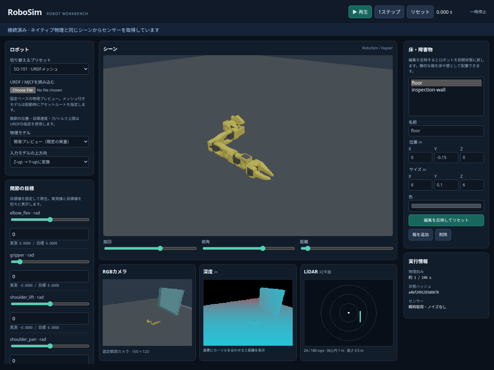](docs/ROBOT_WORKBENCH.md)

Every frame below is rendered by wgpu from deterministic simulation or pinned
camera state; gates and regeneration commands are in
[README showcase acceptance](docs/README_SHOWCASE.md).

<table>
  <tr>
    <td colspan="2" align="center">
      <picture>
        <source media="(prefers-reduced-motion: reduce)" srcset="docs/media/house-mobile-manipulation.png">
        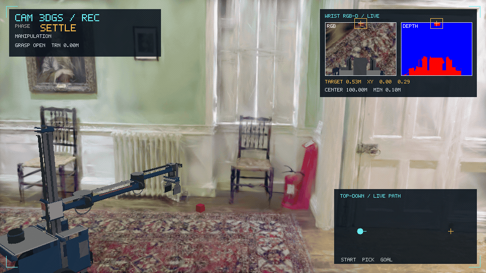
      </picture>
      <br><b>Real indoor 3DGS · mobile manipulation</b><br>
      <sub>A real photo-derived interior (Voxel51 Dr Johnson 3DGS) bound to real cameras and landmarks by a fail-closed validation fixture. The 10-link PBR robot completes a floor-level friction grasp, 0.401 m lift, 1.559 m transport, and placement within 0.049 m; live wrist RGB-D self-masks the robot and drives the final approach without payload truth. <a href="docs/media/house-mobile-manipulation.json">metadata</a> · <a href="examples/89_house_mobile_lift_hero/main.rs">source</a></sub>
    </td>
  </tr>
  <tr>
    <td width="50%" align="center">
      <picture>
        <source media="(prefers-reduced-motion: reduce)" srcset="docs/media/showcase-openarm.png">
        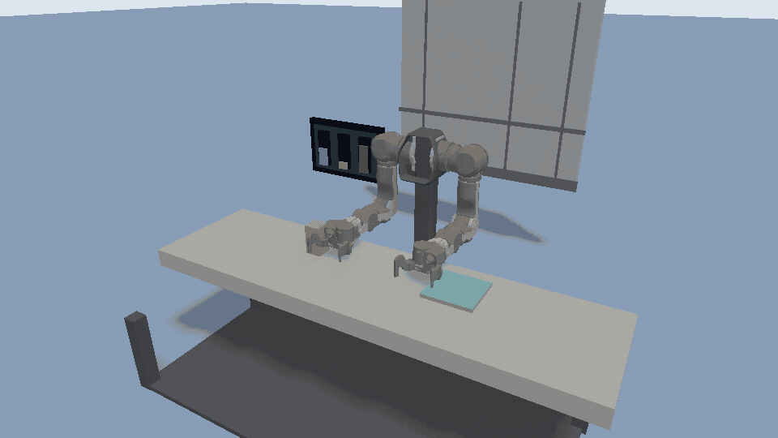
      </picture>
      <br><b>OpenArm v2 · bimanual control</b><br>
      <sub>18-axis typed feedback, an IK-solved pick / handoff / place cycle gated on real fingertip contact, and exact Rapier replay over 1,400 steps. <a href="docs/media/showcase-openarm.json">metadata</a> · <a href="examples/90_showcase_captures/openarm.rs">source</a></sub>
    </td>
    <td width="50%" align="center">
      <picture>
        <source media="(prefers-reduced-motion: reduce)" srcset="docs/media/showcase-factory.png">
        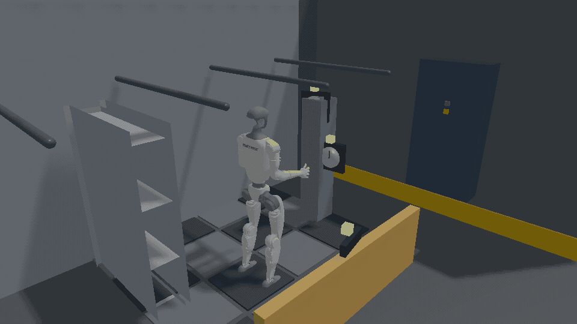
      </picture>
      <br><b>Factory inspection</b><br>
      <sub>Official G1 link meshes, point-and-confirm gestures and deterministic replay. The robot does not walk: it stays within 6.4 cm of where it starts, and all three markers are placed within reach of that spot. <a href="docs/media/showcase-factory.json">metadata</a></sub>
    </td>
  </tr>
  <tr>
    <td width="50%" align="center">
      <picture>
        <source media="(prefers-reduced-motion: reduce)" srcset="docs/media/showcase-office.png">
        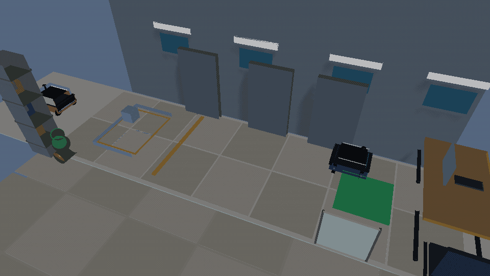
      </picture>
      <br><b>Office AGV</b><br>
      <sub>Shared-aisle yield, dock pickup, cargo transport, and desk placement without contact or early drop. <a href="docs/media/showcase-office.json">metadata</a></sub>
    </td>
    <td width="50%" align="center">
      <picture>
        <source media="(prefers-reduced-motion: reduce)" srcset="docs/media/showcase-uav.png">
        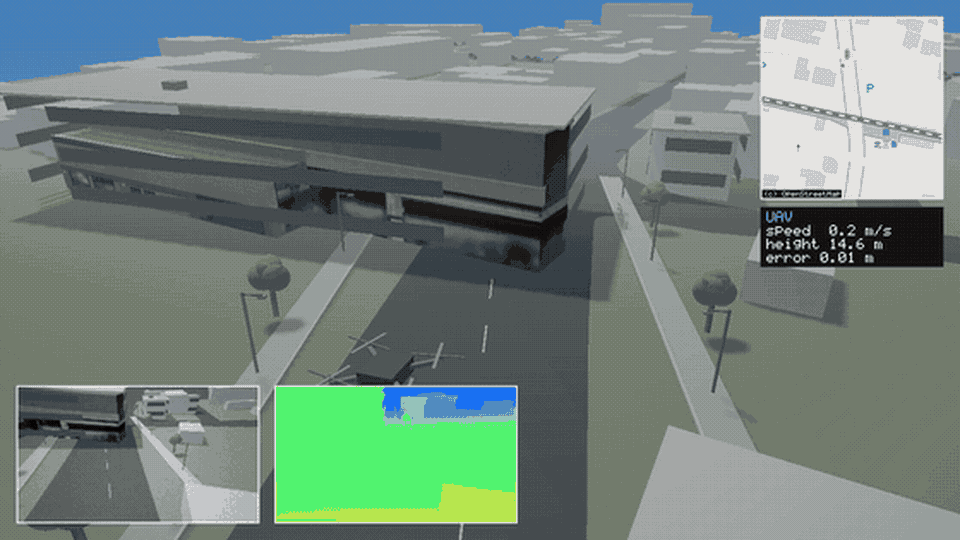
      </picture>
      <br><b>PLATEAU UAV · RGB-D flight</b><br>
      <sub>A visible multirotor flies 76.6 m over imported city geometry with 12.21 m building clearance, zero collisions, and synchronized onboard RGB-D. <a href="docs/media/showcase-uav.json">metadata</a> · <a href="examples/46_plateau_drone_gif/main.rs">source</a></sub>
    </td>
  </tr>
</table>

## Highlights

| Area | Included | Docs |
| --- | --- | --- |
| City simulation | PLATEAU import, traffic, LiDAR, RGB-D, OSM HUD | [docs](docs/PLATEAU_IMPORT.md), ex. 46–47 |
| Vehicle dynamics | Bicycle/Ackermann, tire saturation, suspension, road excitation | [docs](docs/VEHICLE_DYNAMICS.md), ex. 49–51 |
| Quadruped locomotion | Official Go2, model-based trot and heading control, torque control, disturbances | [docs](docs/GO2_LOCOMOTION.md), ex. 52–65, 126 |
| Humanoid locomotion | Official G1 23-DoF, balance, learned stride, CEM eval | [docs](docs/G1_LOCOMOTION.md), ex. 39, 63, 67, 68 |
| Manipulation | PBR/3DGS mobile manipulator, friction grasp, Dex3 hands | [docs](docs/README_SHOWCASE.md), ex. 32, 40–42, 89 |
| Deformables | XPBD cable and cloth, deterministic headless replay | ex. 43–45 |
| More demos | Localization, native planning/dynamics/legged/WBC/OC, Go2 jump | [docs](docs/DEMOS.md) |

## Independent validation wanted

RNE remains below 1.0 until outside projects reproduce tasks and pass the
shipped conformance kits (native bundles include the tools; no source
checkout needed).

Only [v0.4.0 official
assets](https://github.com/rsasaki0109/RoboSim/releases/tag/v0.4.0) qualify;
if that page lacks the native archives and `SHA256SUMS` yet, prepare the
checklist but do not open an evidence issue (v0.1.0 does not qualify).

- [External project reproduction + Failure Capsule](https://github.com/rsasaki0109/RoboSim/issues/new?template=external-project-evidence.yml)
- [Installed flagship reproduction](https://github.com/rsasaki0109/RoboSim/issues/new?template=installed-flagship-reproduction.yml)
- [Third-party plugin conformance](https://github.com/rsasaki0109/RoboSim/issues/new?template=third-party-plugin-evidence.yml)
- [External physics/simulator/hardware/accelerator conformance](https://github.com/rsasaki0109/RoboSim/issues/new?template=external-system-evidence.yml)

See the [external evidence intake guide](docs/EXTERNAL_EVIDENCE_INTAKE.md).
Opening an issue is only the start of review: it does not imply acceptance;
in-repo reference implementations do not count as independent evidence.

## Vehicle dynamics at the grip limit

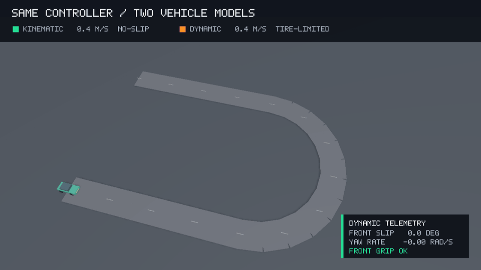

*Same controller, two plants: the dynamic car's trail turns red once the front axle saturates.* No-slip follows the line; the dynamic car runs wide past tire grip. [Vehicle dynamics](docs/VEHICLE_DYNAMICS.md).

## Navigation, SLAM, and multi-robot

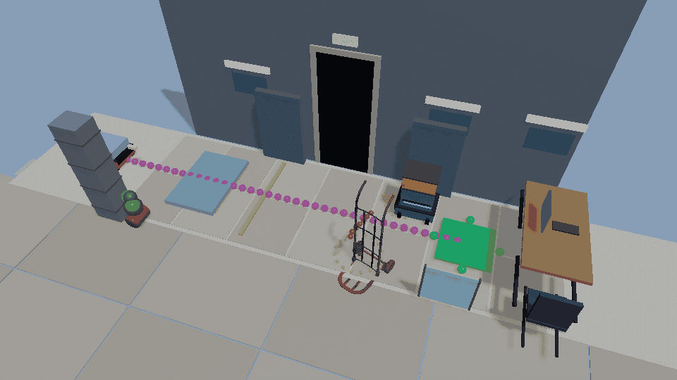

*Nothing but the walls and the desk is on the orange AGV's map. The second AGV,
the pedestrian and the hand truck are bodies in the physics world, so its LiDAR
hits them: red dots are the returns the map does not explain, and yellow rings
are the tracks `ObstacleTracker` makes of them. The route (magenta) is
`plan_path` over a costmap with each track written in, moving ones swept 2 s
ahead, and replanned five times a second. Pure pursuit drives the wheels, and
`avoid_velocities` gives way to the moving tracks. The AGV swings out past the
second AGV (footprints at least 0.32 m apart), stops for 2.2 s while the
pedestrian crosses (0.23 m clear), and docks 0.05 m from the goal. The second
AGV keeps its lane and never needs to brake. It has no simulated sensors: it
gets the orange AGV's pose over the fleet link and the pedestrian's true
position.*

`rne_nav`/`rne_slam`: deterministic, ROS-free costmaps, a transform tree,
A*/DWA/pure-pursuit, multi-robot avoidance, an EKF, 3D ICP, and online 2D
SLAM with loop closure and AMCL (a ROS 2 adapter maps to Nav2). Details:
[Navigation](docs/NAVIGATION.md), [SLAM](docs/SLAM.md).

## Logistics across floors

<table>
  <tr>
    <td width="50%" align="center">
      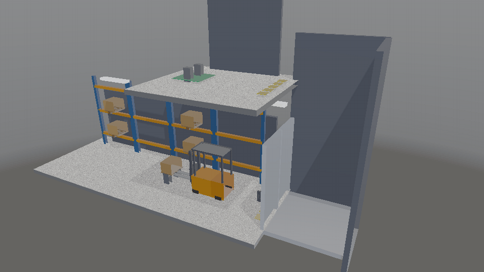
      <br><b>Goods-in to delivery</b><br>
      <sub>A forklift AGV takes a case off a stand, calls the lift, rides up with the load and sets it down on the floor above. The mast is a prismatic joint with a position servo and the case is an ordinary dynamic body throughout: it moves 0.038 m on the tines across the whole carry. <a href="examples/123_warehouse_logistics/main.rs">source</a></sub>
    </td>
    <td width="50%" align="center">
      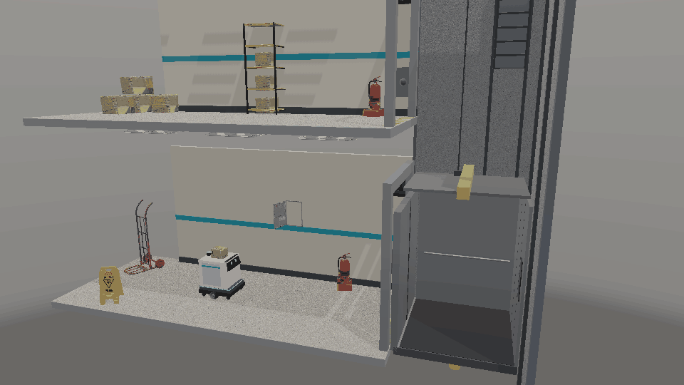
      <br><b>Calling and riding a lift</b><br>
      <sub>The call button reads solved contact force from the robot's own body, the car and doors are <code>rne_nav::Elevator</code> state, and the car carries the robot by ordinary contact rather than by parenting it. <a href="examples/122_multi_floor_media/main.rs">source</a></sub>
    </td>
  </tr>
  <tr>
    <td colspan="2" align="center">
      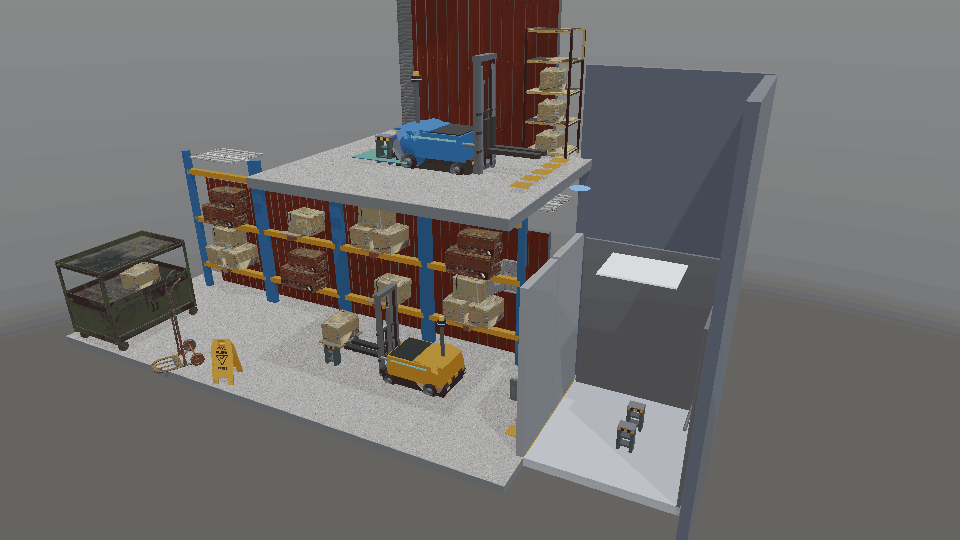
      <br><b>Two trucks, one lift</b><br>
      <sub>A truck on each floor and the lift as the conveyor between them. The ground-floor truck sets the case on a stand inside the car and backs out; the car goes up with only the case; the upper-floor truck forks it out and delivers it. A light-curtain check holds the doors while anything is in the doorway, and the case moves 6 mm and 1.5 mm on the two trucks' tines. Driving and turning are commanded; the wheels are not modelled. <a href="examples/125_warehouse_relay/main.rs">source</a></sub>
    </td>
  </tr>
</table>

## Go2 locomotion

<p align="center">
  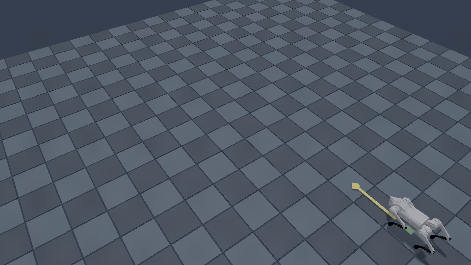
</p>

The official Go2 walks head first through an S on a model-based trot of the
kind Pinocchio-based quadruped stacks run: 500 Hz joint torques, foot
Jacobians from the link frames, stance legs pushing `tau = -J^T f` for weight,
height, speed and yaw rate, swing feet placed by the Raibert heuristic and
tracked by Cartesian PD. A heading loop steers it; held headings stay within
0.04 rad RMS (0.15 rad worst) while it covers 8.5 m. This runs on
`unitree_go2_jump`, the Go2 with its feet attached: the older walking asset
leaves them on the floor ([#346](https://github.com/rsasaki0109/RoboSim/issues/346)),
and the results measured on it are marked as such in
[docs/GO2_LOCOMOTION.md](docs/GO2_LOCOMOTION.md).
[source](examples/126_go2_heading_steer/main.rs)

## G1 locomotion

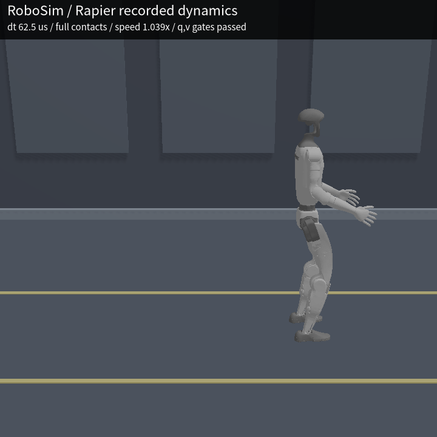

*A full backflip in native RoboSim/Rapier: 62.5 µs step, 21 convex body colliders with self-collision, bounded joint effort and gravity only — no imposed base trajectory, no root wrench, no RL. It lands on its feet and is still standing 15 s later. Peak joint speed is 1.039x the URDF rating, under the unchanged 1.05 gate.*

The GIF replays a recorded native rollout — the renderer applies the recorded
poses and takes zero physics ticks, and the model and recording hashes are
checked before the first frame. The controller comes from a parameter search,
not a learned policy. This is a simulator result; hardware is unvalidated.
Details and the full evidence trail:
[docs/G1_CONTACT_BACKFLIP.md](docs/G1_CONTACT_BACKFLIP.md).

Walking is a separate and much weaker claim. Example 68 holds the [v0.3
sustained envelope](docs/media/unitree-g1-sustained-walk.gif) upright for 3000
ticks / 50 s, turning the commanded way the whole time (+1.6 / −2.2 rad)
without holding its heading target, but **that walk goes backwards**: the knees
bend toward the way the robot faces while the body travels the other way,
because the search that found its torque overlay scored distance without a
direction. Measured along the facing, its 8 s windows are -0.16 m and -0.22 m.

[`UnitreeG1TorqueOverlay::FORWARD_STRIDE`](examples/124_g1_forward_stride/main.rs)
walks forwards, straight and without turning: +0.14 to +0.16 m per window,
travel within a mean 0.20 rad of the facing. It holds only under the exact
conditions it was trained in. A constant 1e-6 N·m of extra hip-yaw torque
tips it over, so it cannot yet be steered or stopped. This is a
stability-and-direction claim, not a navigation one. Details:
[docs/G1_LOCOMOTION.md](docs/G1_LOCOMOTION.md).

## Quickstart

```bash
git clone https://github.com/rsasaki0109/RoboSim.git
cd RoboSim
cargo run -p hello_world --example 00_hello_world
cargo run -p falling_cube --example 01_falling_cube
```

For a complete local validation, run `cargo run -p xtask -- ci` (the long
smoke gate splits into `manipulator`/`locomotion`/`assets`/`media`
partitions, e.g. `cargo run -p xtask -- ci-smoke media`). The headless asset
CLI, replay, and determinism-check commands, and the full example index, are
in [examples/README.md](examples/README.md).

## Independent integrations

The native release archive includes a one-command installed product proof:

```bash
./bin/rne-flagship-proof flagship-proof --cross-backend \
  --measure-on "lab-workstation-a" --verify-installed-bundle .
```

It runs the same indoor TaskSpec through Rapier and bundled MuJoCo, verifies
both replays plus the Failure Capsule against `SHA256SUMS`, and writes a
SHA-256-bound report with no source checkout, renderer, or network needed.
Details: [flagship validation](docs/FLAGSHIP_VALIDATION_WORKFLOW.md).

Third-party plugins, physics backends, adapters, and external task
reproductions go through the fixed
[external evidence intake](docs/EXTERNAL_EVIDENCE_INTAKE.md); submission
never implies acceptance.

## Architecture

The workspace is split by responsibility:

- `rne_core`/`rne_math`/`rne_ecs`/`rne_world`/`rne_robot`/`rne_sensor`/`rne_ai`/`rne_data`: schedules, ECS, spatial math, entity/robot control, sensors, learning interfaces, typed data streams.
- `rne_planning`/`rne_dynamics`/`rne_legged`/`rne_wbc`: backend-neutral joint-space planning, articulated dynamics, legged templates, whole-body control.
- `rne_physics`/`rne_physics_rapier` and `rne_render`/`rne_render_wgpu`: backend-neutral traits plus the Rapier and wgpu implementations.
- `rne_asset`/`rne_plugin`/`rne_traffic`: assets, plugin interfaces, backend-neutral traffic.
- `adapters/ros2`: ROS 2 integration; core crates remain ROS 2-free.

## Determinism and testing

Simulation uses `SimClock`, explicit seeds, stable entity ordering, and
replay digests; headless examples/tests never initialize a renderer; public
APIs use explicit units (`_m`, `_rad`, `_s`, `_hz`); physics backends never
leak engine-specific handles through core traits.

Standard checks:

```bash
cargo fmt --all
cargo clippy --workspace --all-targets -- -D warnings
cargo test --workspace
cargo run -p xtask -- ci-headless
cargo run --locked -p xtask -- flagship
cargo run -p xtask -- ci
```

## Python and ROS 2 adapters

The Python adapter exposes native environments for policy experiments:

```bash
python3 -m venv .venv
.venv/bin/pip install maturin
.venv/bin/maturin develop -m crates/rne_py/Cargo.toml
.venv/bin/python examples/04_python_policy/run.py
```

ROS 2 is optional, isolated under [adapters/ros2](adapters/ros2); see the
[bridge README](adapters/ros2/rne_ros2_bridge/README.md) for setup.

## Documentation

- [Architecture](docs/architecture/000_overview.md) · [Roadmap](docs/ROADMAP.md) · [OSS parity](docs/OSS_PARITY.md) · [Plugin SDK](docs/PLUGIN_SDK.md) · [Browser viewer](web/rne_web_viewer/README.md)
- Conformance/readiness: [physics](docs/EXTERNAL_PHYSICS_BACKEND_CONFORMANCE.md) · [hardware](docs/HARDWARE_ADAPTER_CONFORMANCE.md) · [simulator](docs/EXTERNAL_SIMULATOR_ADAPTER_CONFORMANCE.md) · [OpenArm cross-sim](docs/OPENARM_CROSS_SIM_PROOF.md) · [compat corpus](docs/COMPATIBILITY_CORPUS.md) · [support](docs/SUPPORT.md) · [1.0 readiness](docs/ONE_ZERO_READINESS.md) · [flagship validation](docs/FLAGSHIP_VALIDATION_WORKFLOW.md)
- Indoor autonomy: [multi-floor navigation](docs/MULTI_FLOOR_NAVIGATION.md)
- Physics: [height field terrain](docs/HEIGHT_FIELD_TERRAIN.md) · [collision bake](docs/COLLISION_BAKE.md) · [arm position control](docs/ARM_POSITION_CONTROL.md)
- Locomotion: [G1](docs/G1_LOCOMOTION.md)/[workbench](docs/G1_WORKBENCH_MISSION.md)/[splat bg](docs/G1_HEAD_SPLAT_BACKGROUND.md) · [Go2](docs/GO2_LOCOMOTION.md) · [frontier plan](docs/PLAN_LEGGED_LOCOMOTION_FRONTIER.md) · [sensors](docs/IMU_SIMULATION.md)
- Case studies: [Tsukuba](docs/TSUKUBA_CONFIRMATION_RUN.md)/[full](docs/TSUKUBA_FULL_RUN.md)/[3DGS bg](docs/TSUKUBA_3DGS_BACKGROUND.md) · [SSL 2v2](docs/SSL_SMALL_PITCH.md)/[adapter](docs/SSL_ADAPTER.md)
- [More demos](docs/DEMOS.md) · [Examples](examples/README.md) · [Changelog](CHANGELOG.md)

## License

Licensed under either the [Apache License 2.0](LICENSE-APACHE) or the [MIT license](LICENSE-MIT), at your option.
