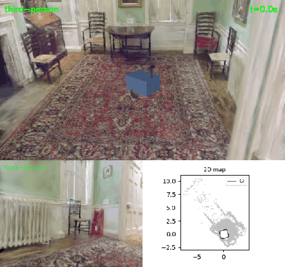
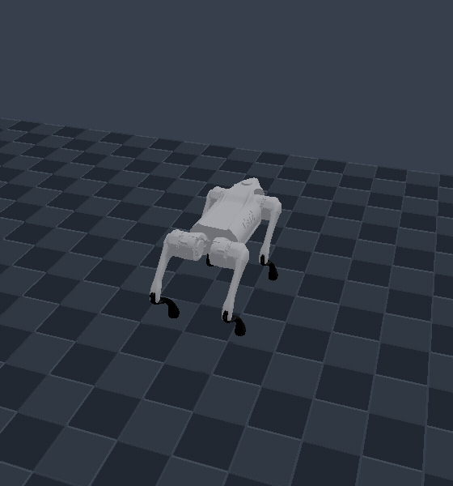

# More demos

The README front page keeps the flagship showcase and the vehicle
dynamics / navigation / G1 locomotion highlights. This page holds the rest of
the demo write-ups: full captions, GIFs, and commands for the pieces that
used to live under the README's "Selected demos" section.

## Camera-based localization with visloc-rs

<p align="center">
  <picture>
    <source media="(prefers-reduced-motion: reduce)" srcset="media/triple_demo.png">
    
  </picture>
  <br>
  <sub>A URDF mobile base with a stereo camera drives a U-shaped route through the real-capture Dr Johnson 3DGS interior. Top: third-person view. Bottom-left: first-person (the exported cameras). Bottom-right: the prebuilt COLMAP map, ground truth (black), and the localized trail (red). Stereo + IMU VIO reaches 0.029 m ATE; map matching relocalizes 377/400 frames at 0.058 m.</sub>
</p>

Example 113 runs a deterministic diff-drive episode in a photo-derived 3DGS
interior and exports an EuRoC-format stereo + IMU dataset (cameras at 20 Hz,
IMU at 60 Hz, ground truth, Double-Sphere calibration). The RNE side owns the
scene, the robot, and the sensors; [visloc-rs](https://github.com/rsasaki0109/visloc-rs)
consumes the export for VIO and map-matching relocalization against a map built
from a separate episode.

```bash
cargo run -p drjohnson_euroc_export --example 113_drjohnson_euroc_export -- target/drjohnson_euroc
```

Details: [navigation integration plan](VISLOC_NAVIGATION_PLAN.md),
[source](../examples/113_drjohnson_euroc_export/main.rs).

## PLATEAU city and sensors

<p align="center">
  <picture>
    <source media="(prefers-reduced-motion: reduce)" srcset="media/plateau-car.png">
    
  </picture>
  <br>
  <sub>PLATEAU city import: official tile, traffic signals, kinematic vehicles, and sensor overlay.</sub>
</p>

Example 46 imports a bounded official PLATEAU Sanjo City tile once, then renders
both the deterministic 100-actor traffic capture and a bounded, controlled
quadrotor flight through the same detailed streetscape. Example 47 replays the
traffic runtime headlessly. The hero vehicle carries physics-aware LiDAR and
RGB-D sensors with seeded noise, material response, timing, and replayable output.

```bash
cargo run -p plateau_drone_gif --example 46_plateau_drone_gif
cargo run -p traffic_city_replay --example 47_traffic_city_replay
```

Details: [PLATEAU import](PLATEAU_IMPORT.md),
[traffic runtime](TRAFFIC_RUNTIME.md),
[LiDAR](LIDAR_SIMULATION.md), and [camera](CAMERA_SIMULATION.md).

## Go2 learning boundary

The shared `LocomotionPolicy` contract supports seeded Go2/G1 batches,
checkpoints, replay digests, CEM smoke tests, and a Python PPO smoke path.

```bash
cargo run --release -p go2_pure_torque --example 64_go2_pure_torque
cargo run --release -p go2_velocity_terrain --example 65_go2_velocity_terrain
cargo run --release -p locomotion_vectorized --example 66_locomotion_vectorized
```

See [GO2_LOCOMOTION.md](GO2_LOCOMOTION.md) and [ROADMAP.md](ROADMAP.md).

## G1 manipulation and deformables

<p align="center">
  <picture>
    <source media="(prefers-reduced-motion: reduce)" srcset="media/unitree-g1-dex3.png">
    
  </picture>
  <picture>
    <source media="(prefers-reduced-motion: reduce)" srcset="media/unitree-g1-cloth.png">
    
  </picture>
</p>

```bash
# Two-contact Dex3 grasp, lift, carry, and release
cargo run -p unitree_g1_dex3_pick_place --example 42_unitree_g1_dex3_pick_place

# G1 hand handling live XPBD cloth
cargo run --release -p unitree_g1_cloth_handling --example 45_unitree_g1_cloth_handling

# Deterministic cable and cloth rollouts
cargo run -p deformable_cable --example 43_deformable_cable
cargo run -p deformable_cloth --example 44_deformable_cloth
```

## Native motion planning

`rne_planning` is a deterministic, MoveIt-inspired joint-space planning layer
built on the generic `rne_robot` kinematic model and collision checker: planning
scene and SRDF groups, goal and path constraints, a planner registry and
pipeline, PTP/LIN/CIRC motions, RRT-Connect, RRT*, informed RRT*, PRM,
BIT\*-style, CHOMP and STOMP trajectory optimization, hybrid planning, and
request adapters with velocity- and acceleration-limited time parameterization.
No MoveIt or ROS dependency is added to core.

<p align="center">
  <picture>
    <source media="(prefers-reduced-motion: reduce)" srcset="media/motion-planning.png">
    
  </picture>
  <br>
  <sub>The checked-in RNE-converted <b>OpenArm v2 left arm</b> (7-DOF, GLB meshes), planned by RRT-Connect and rendered by the real wgpu renderer. A collision object blocks straight joint interpolation; the cyan trail traces the collision-free end-effector detour. <a href="../examples/102_motion_planning_media/main.rs">capture source</a> · <a href="architecture/011_joint_motion_planning.md">architecture</a></sub>
</p>

```bash
cargo run -p motion_planning --example 101_motion_planning
cargo run --release -p motion_planning_media --example 102_motion_planning_media
cargo run -p motion_planning_media --example 102_motion_planning_media -- --smoke
```

See [joint-space motion planning](architecture/011_joint_motion_planning.md).

## Native articulated dynamics

`rne_dynamics` is the backend-neutral, deterministic articulated-body dynamics
layer that model-based legged and mobile-manipulation control builds on: spatial
algebra, the composite-rigid-body mass matrix, recursive Newton-Euler inverse
dynamics with gravity and velocity bias, deterministic forward dynamics, the
center of mass, and the center-of-mass Jacobian. Fixed- and floating-base trees
are supported, and the Go2 diagnostics example checks the equation of motion on
a real 18-DoF quadruped.

```bash
cargo run -p dynamics_diagnostics --example 103_dynamics_diagnostics
```

See [articulated-body dynamics](architecture/012_dynamics.md).

## Native legged walking templates

`rne_legged` is the deterministic, backend-free template layer for legged
walking: the Linear Inverted Pendulum Model, Divergent Component of Motion and
capture point, closed-form capture-point foot placement, Kajita-style ZMP
preview control, footstep plans with smooth double-support transitions, and a
full center-of-mass walking pattern. It turns a footstep request into a
replayable trajectory without a physics backend or renderer.

```bash
cargo run -p legged_pattern --example 104_legged_pattern
```

See [legged walking templates](architecture/013_legged_templates.md).

The same crate adds a classical **centroidal layer** for dynamic maneuvers: a
single-rigid-body contact-force distribution with a Coulomb friction cone,
Raibert foot placement, and a minimal-jerk swing trajectory, following the
open-source `cajun` and `go2-convex-mpc` centroidal controllers. This is the
reduced-order abstraction a push-off / flight / landing controller needs.

## Native whole-body control

`rne_wbc` realizes task-space objectives as joint torques on a floating-base
articulated model: a deterministic weighted inverse-dynamics solve over joint
accelerations and contact wrenches, with the floating-base equations of motion
and contact no-slip rows, friction-cone projection, and torque recovery from
`rne_dynamics`. The Go2 example supports the exact body weight through four foot
contacts with a base-residual below `1e-8`.

```bash
cargo run -p whole_body_control --example 105_whole_body_control
```

See [whole-body control](architecture/014_whole_body_control.md).

## Native optimal control

`rne_oc` is the native Crocoddyl-style layer for generating agile maneuvers:
a discrete shooting problem solved by **DDP** with Levenberg-Marquardt
regularization and a backtracking line search, central-difference dynamics
derivatives, quadratic running/terminal costs, and an `ArticulatedDynamics`
adapter that integrates `rne_dynamics` forward dynamics. A pendulum swings up
from hanging to upright under the solver, deterministically and without any
external optimal-control library.

See [native optimal control](architecture/015_native_optimal_control.md).

Example 109 plans a Go2 **crouch–push–flight jump** with the FDDP solver and
executes it with the whole-body controller.

<p align="center">
    <source media="(prefers-reduced-motion: reduce)" srcset="media/go2-jump.png">
    
  <br>
  <sub>Crouch–push–flight jump planned by the native FDDP solver, executed by the whole-body controller with torque feed-forward and low-gain tracking. The body rises 0.107 m, the feet clear 44 mm, and the peak lean is 0.33 rad (0.73 rad before the feed-forward). <a href="../examples/109_go2_jump_sim/main.rs">source</a></sub>
</p>

```bash
cargo run --release -p go2_jump_sim --example 109_go2_jump_sim -- --wbc-stance
```
