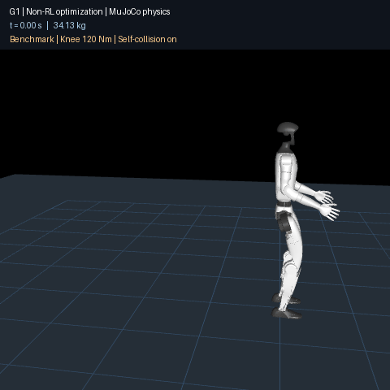
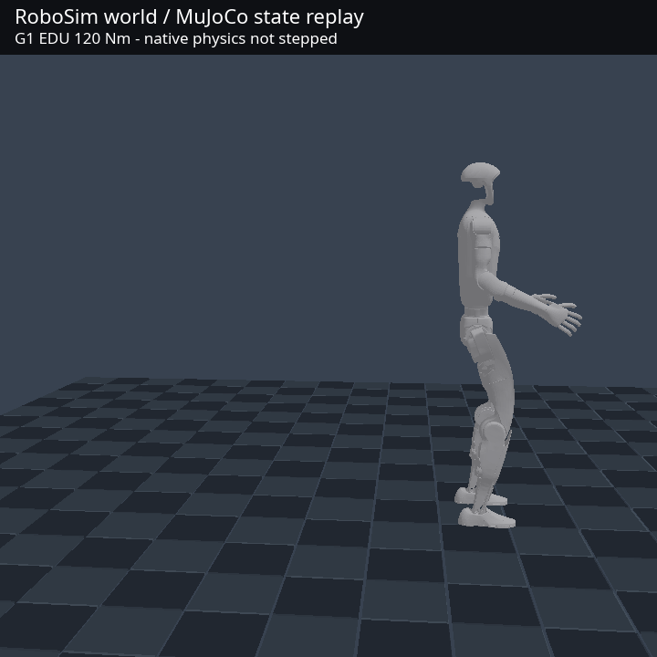
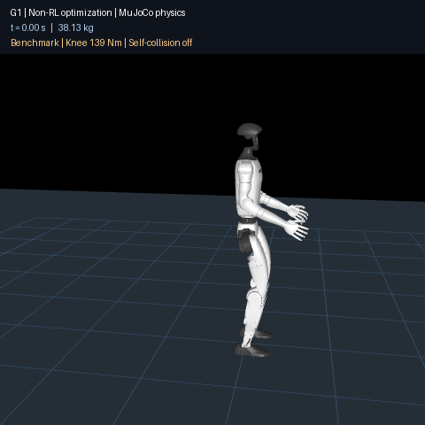

# G1 backflip with optimization and contact simulation

This optional Python benchmark searches a finite set of maneuver parameters
using differential evolution and bounded local sweeps. It uses no RL training,
learned policy, external base wrench, or imposed floating-base trajectory.
MuJoCo integrates the complete free-base robot and ground contacts; the motors
receive joint targets and bounded effort.

The robot is RNE's existing 23-joint G1 URDF. This is an external contact-plant
benchmark, not yet a demonstration of the RNE/Rapier backend or real hardware.
The Python benchmark remains independent of the Rust engine. Example 114
provides the RoboSim playback and a separate native transfer probe.

## EDU partial-specification result

The optimized **34.13 kg EDU screening model now passes at both 0.125 ms and
0.0625 ms** with a 120 N m knee ceiling, self-collision enabled, 2 ms target/gain
updates and an assumed 2 ms transport delay. Both five-second rollouts complete
a backward revolution, contact the ground only with the feet, and remain
standing throughout the final second. This is success in the declared model;
it does not establish hardware readiness.



| Measurement | 0.125 ms | 0.0625 ms |
|---|---:|---:|
| Final backward rotation | 360.022° | 360.022° |
| Continuous flight | 0.41325 s | 0.41325 s |
| Root rise above initial standing height | 0.16432 m | 0.16114 m |
| Maximum motor torque | 120 N m | 120 N m |
| Maximum joint-position excess | 0 rad | 0 rad |
| Maximum joint-speed / URDF rating | 1.03323 | 1.03322 |
| Minimum upright cosine in final second | 0.99999992 | 0.99999992 |
| Self-contact / non-foot ground contact | none / none | none / none |

The success gate still permits less than 0.02 rad joint-position excess and
speed below 1.05 times the URDF rating; neither threshold was relaxed. Coordinated
opening/landing arm motion and joint optimization of the flight/landing pose
were needed. The final candidate uses zero additional hip-extension delay.
A prior candidate stood successfully but exceeded knee speed; another passed
at 0.5 ms and fell when refined. Both rejected results are retained.

[EDU candidate, recordings, rejected candidates and reproduction](evidence/g1-contact-backflip/edu/README.md)
include a golden replay hash. Applying the same controller to the standard
**90 N m G1 screen fails** on knee–ground contact; this is not a claim that no
other 90 N m trajectory is feasible. Public knee ceilings alone do not identify
the other motors, power limits, mass/COM, contact geometry or hardware latency.

## View the successful motion in RoboSim



Example 114 now projects the **recorded physical states** into RoboSim's G1
world and renders them with its wgpu backend. It verifies both the recording
and URDF SHA-256 hashes, maps all 23 joints by name, and converts the complete
base quaternion from source Z-up to RoboSim Y-up. It does not synthesize a
ballistic arc or interpolate an invented flip. The native simulation clock
must remain at zero throughout playback. The GIF explicitly labels this as
**MuJoCo state replay, not a Rapier physics result**.

```bash
# Headless: validate all 500 frames, joint mapping, and base projection.
cargo run --release -p g1_backflip_gif --example 114_g1_backflip_gif -- \
  --recording docs/evidence/g1-contact-backflip/edu/step-125us --smoke

# RoboSim/wgpu rendering; ffmpeg with drawtext is needed for the visible label.
cargo run --release -p g1_backflip_gif --example 114_g1_backflip_gif -- \
  --recording docs/evidence/g1-contact-backflip/edu/step-125us --gif
```

Frames are encoded incrementally, avoiding a directory of uncompressed frame
images. Only the final GIF and one temporary GIF used for labeling are written.
The original `--smoke` and `--gif` without `--recording` still select the older
synthetic reference animation; those modes are not physical evidence.

### Native physics transfer probe

```bash
cargo run --release -p g1_backflip_gif --example 114_g1_backflip_gif -- \
  --native-probe --native-dt-us 125
cargo run --release -p g1_backflip_gif --example 114_g1_backflip_gif -- \
  --native-probe --native-dt-us 500 --native-implicit
```

This separate experiment uses the live `UrdfSceneSim`/Rapier world, one second
of motor-driven standing preparation, then the optimized maneuver parameters.
It never writes base positions or velocities after scene loading. Commands
use a 2 ms sample/hold and one-period delay; the direct-effort variant applies
the source motor-speed taper. The implicit diagnostic variant uses native
force-based position motors with torque ceilings but no speed taper.

**Native backflip is not achieved.** In the legacy G1 scene, direct PD effort
becomes unstable during standing preparation. Implicit position motors keep the
initial standing pose, but the maneuver becomes unstable after takeoff. The probe stops on excessive
joint speed, nonfinite state, a base outside scene bounds, or a backend panic,
and writes a failure recording under `target/research/g1-native-probe-*.json`.
Incomplete final-second metrics are null, and `qualified_backflip` is always
false: this diagnostic has no full contact/self-collision qualification gate.

The native scene uses primitive collisions, disables self-collision, and has
different imported mass/inertia and contact settings. The declared-inertia probe now uses mass-weighted link COM velocity for
landing feedback; the legacy diagnostic retains base-origin velocity.
The remaining model differences need reconciliation before transferring or
reoptimizing the motion. The current evidence does not justify a native-physics or hardware
success claim.

### Joint-frame and inertial-model correction

The native transfer exposed a backend defect: generalized effort used the
parent body rotation but omitted the authored joint-origin rotation. The joint
constraint already included that rotation. A 90-degree-origin regression
produced no motion with direct effort before the fix; revolute and prismatic
coordinates now match the corresponding identity-origin experiment. The same
axis conversion also applies to regularized Coulomb friction.

A separate `unitree_g1_backflip_probe` scene opts into declared URDF inertial
properties, joint-origin rotations, and fixed-child welding. The legacy walking
scene is preserved. This probe has **38.13385728 kg**, including the importer's
1 kg defaults for four links without declared mass; it is not the 34.13 kg
external screening model. Only primitive collision shapes are active and
self-collision remains disabled. It is a numerical/controller diagnostic,
not yet a complete physical backflip qualification model.

```bash
# Direct joint effort with sampled ankle pitch/rate feedback during preparation.
cargo run --release -p g1_backflip_gif --example 114_g1_backflip_gif -- \
  --native-probe --native-declared --native-stand --native-dt-us 125

# Apply the candidate in the same native physical model.
cargo run --release -p g1_backflip_gif --example 114_g1_backflip_gif -- \
  --native-probe --native-declared --native-dt-us 125
```

`--native-stand` keeps the standing target for six simulated seconds (one
preparation second plus five evaluation seconds). `standing_passed` requires
completion, final-second upright cosine above 0.99, speed below 0.1 m/s,
continuous foot contact in that interval, and final base height above 0.65 m.
The threshold is not relaxed when the coarser integration oscillates.
The `--native-implicit` diagnostic uses force-based native position motors
instead of explicitly sampled PD effort; it still has no motor-speed taper.

The 0.5 ms implicit-position-motor **standing test passes**: minimum final-second
upright cosine 0.99999515 and maximum base speed 0.05280 m/s, with continuous
foot contact. The 0.5 ms explicit-effort standing test remains upright but
fails the speed gate (0.45443 m/s); it is not relabeled a pass. The transferred
backflip still fails to land, even when it reaches a full backward revolution.

[Native model correction and diagnostic recordings](evidence/g1-contact-backflip/native-transfer/declared-inertia/README.md)
retain these outcomes separately from the successful external-model backflip.


### Native landing feedback and velocity-limited commands

The native diagnostic accepts `--native-candidate candidate.json`, containing
16 `parameters` and optional `recovery_s`, `roll_balance`, and
`landing_stance_rad` (0–0.2 rad), and `contact_friction` (0–1.5; default 0.5).
The friction value is applied explicitly to the ground and both feet; 0.7
matches the source screening model's sliding coefficient, but does not make
the two contact solvers equivalent. Unsupported nonzero hip-extension delay,
malformed optional fields, and nonpositive phase/recovery durations are rejected.
`--native-output path.json` refuses to overwrite an existing recording;
`--native-stop-on-fall` ends a collapsed landing early. A completed probe alone
is not a successful backflip.

Landing feedback now retains pitch-rate damping during recovery and blends to
whole-robot COM velocity afterward. COM velocity is calculated from each link's
physical COM velocity and mass; internal limb motion therefore does not appear
as whole-body translation. Optional lateral ankle feedback uses body-frame
gravity and angular velocity rather than an Euler roll angle near vertical
pitch. Landing stance width is configurable and targets stay within URDF limits.

An implicit-position candidate approached upright recovery but fell sideways.
Its 10 ms recording already establishes knee speed at least **1.928 times the
URDF rating**, so it cannot qualify even if landing is improved.
`--native-velocity-servo` instead uses a force-based implicit velocity motor:
its desired velocity is `clamp(kp / kd * position_error, ±0.9 * rated_speed)`
and its effort ceiling remains the selected joint torque limit. The outer
position target and gains retain their 2 ms sample/hold and 2 ms delay; the
inner velocity command is calculated every physics step. This is a diagnostic
servo model, not an identified hardware controller or the source torque-speed
curve. It cannot be combined with `--native-implicit`.

Bounding the **command** does not bound velocity caused by impact or other
joints. Every completed physics step now contributes to measured maximum
speed/rating and joint-position excess; the peak speed's joint and time are
recorded too. Neither mode changes `qualified_backflip: false`. Native landing
and complete collision/actuator qualification remain unresolved.
[Twenty rejected velocity-servo candidates and source hashes](evidence/g1-contact-backflip/native-transfer/velocity-servo/README.md)
retain the measured failures.

```bash
cargo run --release -p g1_backflip_gif --example 114_g1_backflip_gif -- \
  --native-probe --native-declared --native-velocity-servo \
  --native-dt-us 500 --native-stop-on-fall \
  --native-candidate candidate.json --native-output rollout.json
```


### Declared-mass comparison and native automatic search

`scripts/g1_native_model.py` prepares a separate, generated comparison scene.
It removes only four empty fixed leaf frames (`imu_in_torso`, `imu_in_pelvis`,
`d435_link`, `mid360_link`); their parent bodies already carry physical inertia.
All physical link inertia and 23 movable joints are preserved. Both the URDF
audit and the live native model report **34.13385728 kg**. The canonical robot
asset and importer defaults are unchanged. A non-inertial physical link or
branch is rejected rather than silently removed.

```bash
# Each output directory must be new; generated files are small and ignored by git.
python3 scripts/g1_native_model.py --output target/research/native-mass-model
cargo run --release -p g1_backflip_gif --example 114_g1_backflip_gif -- \
  --native-probe --native-declared \
  --native-scene target/research/native-mass-model/scene.rne.scene.toml \
  --native-model-check

# Optional second profile: match source sole positions and 2 mm radii.
python3 scripts/g1_native_model.py --source-soles \
  --output target/research/native-sole-model
```

**Equal mass is not an equivalent contact plant.** The current native importer
merges the four URDF foot spheres into one AABB. The original footprint is
0.18 m by 0.07 m; the source sole profile's bounding footprint is 0.144 m by
0.054 m. `--source-soles` matches the input points and radii, but the native
importer still creates a box. Twenty-one mesh collision elements remain
inactive; enabling mesh collision currently creates AABBs, not source convex
mesh collision. Source joint armature (0.01), damping (0.05) and Coulomb loss
(0.2) are additional unmatched dynamics. The generated audit explicitly sets
`qualification_ready: false` and lists these differences.

The mass-only comparison passes six seconds of velocity-servo standing at
0.5 ms (final-second maximum base speed 0.06914 m/s), but the source maneuver
still collapses. A bounded native coordinate-pattern search then evaluates
launch, tuck, opening and landing parameters directly in live Rapier physics.
The first campaign has 13 evaluations; all fail landing. Its minimum-loss
candidate still reaches 1.59451 times rated joint speed. A lower objective
value is never promoted to a qualified backflip.

```bash
python3 scripts/g1_native_search.py \
  --binary target/release/examples/114_g1_backflip_gif \
  --scene target/research/native-mass-model/scene.rne.scene.toml \
  --candidate docs/evidence/g1-contact-backflip/native-transfer/model-alignment/candidate.json \
  --output target/research/native-search --rounds 1 --workers 4
```

The optimizer uses no RL or extra Python dependencies. It evaluates ordered
coordinate batches, breaks ties by candidate index, retains every candidate
and rollout, and publishes a checkpoint after each completed batch. Both
preparation and search require a 30 GiB disk reserve and refuse existing
output directories. Generated URDF mesh paths are absolute; regenerate the
scene after moving the checkout. `--native-model-check` inspects the constructed
model without advancing simulation time.

[Model audits, standing/failed-flip recordings, and search evidence](evidence/g1-contact-backflip/native-transfer/model-alignment/README.md)
keep this intermediate result separate from physical backflip qualification.


### Independent native sole contacts

URDF assets can now opt into `preserve_collision_parts = true`. Instead of
filling the space between multiple collision elements with one box, the
importer retains each primitive in a backend-neutral `CompoundCollider`.
Rapier creates a compound shape on the same link body, retaining the link's
material, collision groups and sensor behavior. Declared mass and inertia are
not augmented by the additional shapes. The default remains the legacy AABB.
Mesh elements still use their existing box approximation.

```bash
python3 scripts/g1_native_model.py --source-soles --independent-soles \
  --output target/research/native-compound-model
cargo run --release -p g1_backflip_gif --example 114_g1_backflip_gif -- \
  --native-probe --native-declared \
  --native-scene target/research/native-compound-model/scene.rne.scene.toml \
  --native-model-check
```

The constructed model reports `compound_part_counts: [4, 4]`, mass
34.13385728 kg, and 23 movable joints. The four sphere positions/radii match
the source sole profile. This resolves the filled-space sole approximation;
body mesh/self-contact, source armature/losses and controller/contact-solver
differences remain unqualified. `qualified_backflip` stays false.

[Compound primitive contract](adr/029-compound-contact-primitives.md) documents
creation-time geometry and backend support. Unit tests check a ray passing
through the gap, rays hitting the individual spheres, declared mass retention,
invalid geometry rejection, primitive origins/order and explicit opt-in.

The original maneuver still collapses at both 0.5 ms and 0.125 ms. Maximum
joint speed/rating is 2.31648 and 2.18477 respectively. Standing stays upright
but fails continuous foot contact at both steps; the finer-step final-second
maximum base speed improves to 0.04400 m/s. No gate is relaxed. The 0.5 ms
compound flip repeats byte-for-byte, and the disabled-option box trajectory
matches every frame of its earlier recording.

[Compound-contact recordings and checks](evidence/g1-contact-backflip/native-transfer/compound-soles/README.md)
preserve these failures separately from the successful external-model motion.


## Original-candidate screening (not hardware validation)

The original benchmark GIF uses a **139 N m knee ceiling and disables self-collision**.
Unitree lists maximum knee torque of **90 N m for G1 and 120 N m for G1 EDU**
on its [official specification page](https://www.unitree.com/g1/).
The saved motion therefore does not demonstrate feasibility on either machine.

Two optional profiles, `scripts/fixtures/g1_backflip_screen.json` and
`g1_edu_backflip_screen.json`, enable robot self-collision, cap knee effort at
90/120 N m, select the URDF-declared mass (34.133858 kg), and sample joint target
and gain commands every 2 ms. The period follows the
[official low-level Python example](https://github.com/unitreerobotics/unitree_sdk2_python/blob/master/example/g1/low_level/g1_low_level_example.py).
One additional 2 ms command delay is an explicit test assumption, **not a measured
hardware latency**. Targets and gains are held between updates; flight/contact
state transitions are sampled on that clock. The implicit motor PD and idealized
speed envelope remain part of the continuously integrated plant.

Self-collision uses the URDF collision meshes (MuJoCo convex mesh collision),
including the foot mesh; the four sole points still handle ground contact.
MuJoCo's normal same-body/parent filtering remains. Any penetrating self-contact
fails the rollout immediately. Mesh approximations and this conservative gate
need comparison with the real geometry before interpreting contacts as measured
hardware interference.

Replaying the existing candidate at 0.125 ms gives:

| Change from the saved benchmark | Result |
|---|---|
| Only knee ceiling 120 N m | Fails; non-foot ground contact at 1.703 s |
| Only 2 ms command period, no delay | Passes the full five-second gate |
| Only self-collision enabled | Fails; hand–hand contact at 0.658 s |
| Combined G1 screen | Fails; hand–hand contact at 0.645 s |
| Combined G1 EDU screen | Fails; hand–hand contact at 0.652 s |

[Screen summaries](evidence/g1-contact-backflip/screening/) record each exact
profile and motion parameter set. These are dynamic rollouts, not geometric
replays of the GIF. Each summary can be reproduced using `--parameters` with
that file; the embedded profile is restored automatically. An explicit
`--profile` replaces the embedded profile.

```bash
# Exit 2 is expected for the current candidate under the stricter screen.
target/research/backflip-env/bin/python -I scripts/g1_backflip_search.py --generations 0 --parameters docs/evidence/g1-contact-backflip/candidate.json --profile scripts/fixtures/g1_edu_backflip_screen.json --output target/research/g1-edu-screen
```

A bounded EDU search improved takeoff upward speed to about 1.98 m/s, but
the full maneuver still failed on knee–torso contact. A candidate with optimized
arm spread avoided self-contact but hit the floor with its hands.
[Search evidence and termination status](evidence/g1-contact-backflip/README.md#bounded-edu-search-results)
are recorded. The later joint/arm search above produced the passing EDU candidate.

Other joint torque/speed ceilings remain URDF assumptions; mass/COM, motor
power/current/thermal limits, gain limits, elastic transmission, state-estimation
errors and actual transport latency are not identified. Standard G1 development
access must not be inferred from this numerical profile. Neither profile is a
hardware controller or permission to execute the maneuver on a robot.

## Measured benchmark result



The saved controller passes at **0.125 ms and 0.0625 ms** integration steps.
Both five-second rollouts complete one backward revolution, land without any
non-foot ground contact, and remain upright for the final second. A replay
regression compares the complete recorded-state SHA-256 at 0.125 ms.

| Measurement | 0.125 ms | 0.0625 ms |
|---|---:|---:|
| Backward rotation | 360.040° | 360.040° |
| Continuous flight | 0.49875 s | 0.49713 s |
| Root rise above initial standing height | 0.18226 m | 0.18072 m |
| Maximum motor torque | 139 N m | 139 N m |
| Maximum joint-position excess | 0.01745 rad | 0.01751 rad |
| Maximum joint-speed / URDF rating | 1.03820 | 1.03826 |
| Minimum upright cosine in final second | 0.99999975 | 0.99999975 |

[Candidate, measurements and recordings](evidence/g1-contact-backflip/README.md)
include a rejected earlier controller: its coarse-step success did not survive
refinement. The final result is a benchmark demonstration under the model below;
two successful fine steps do not prove general robustness or hardware readiness.

## Reproduce

Keep at least 30 GiB free. The scripts refuse evaluations/rendering below this
reserve, save only the best search candidate and final recording, and do not
install packages themselves. A Python 3.12 environment can be prepared with:

```bash
python3 -m venv target/research/backflip-env
target/research/backflip-env/bin/python -I -m pip install --no-cache-dir -r scripts/g1-backflip-requirements.txt
target/research/backflip-env/bin/python -I -m unittest discover -s scripts -p test_g1_backflip_plant.py
```

Replay and render the pinned result (exit 0 means the complete gate passed):

```bash
target/research/backflip-env/bin/python -I scripts/g1_backflip_search.py --generations 0 --parameters docs/evidence/g1-contact-backflip/candidate.json --output target/research/g1-backflip
target/research/backflip-env/bin/python -I scripts/g1_backflip_search.py --generations 0 --dt-s .0000625 --parameters docs/evidence/g1-contact-backflip/candidate.json --output target/research/g1-backflip-fine
MUJOCO_GL=egl target/research/backflip-env/bin/python -I scripts/g1_backflip_render.py target/research/g1-backflip --output target/research/g1-backflip.gif
```

A headless OpenGL/EGL implementation is required only for GIF generation.
The simulation and tests require no renderer. Search can be restarted with
`--generations 15 --stage flip`; `--stage launch` freezes flight parameters and
`--stage flight` freezes launch timing and sagittal targets. Arm spread is
shared across phases and remains variable in both searches.
`--balance-kp` / `--balance-kd` support
bounded landing-gain sweeps. Optimization output always records failures too;
exit 2 means the complete backflip gate failed, including launch-only runs.
The pinned fine integration rates are offline numerical checks, not demonstrated
hardware control frequencies.

## Joint launch/flight search

`scripts/g1_backflip_joint_search.py` optimizes all 16 motion variables together,
using seeded SciPy differential evolution with deferred population updates.
Each worker evaluates an ordered batch in its own MuJoCo plant. The parent
collects results in candidate order, writes the best result, and checkpoints
each completed generation. A regression compares parallel and serial results.
No additional package is required. The fifteenth variable delays hip extension
relative to knee/ankle extension during takeoff (0–0.16 s). It does not change
transport latency or relax any motor/contact gate. The sixteenth variable sets the shoulder pitch target during opening/landing
(−1.5–2.5 rad), so arm motion can help compensate torso rotation caused by
unfolding the legs. Historical candidates retain zero for these additions.
Loading a 14/15-column population pads zero columns; supply varied values in
the added columns to search them. Opening angle may reach 7 rad, allowing
extra torso rotation before unfolding. Success still requires one completed
rotation and stable standing; these are trajectory variables, not relaxed gates.

```bash
OPENBLAS_NUM_THREADS=1 target/research/backflip-env/bin/python -I scripts/g1_backflip_joint_search.py --parameters docs/evidence/g1-contact-backflip/screening/optimized-launch.json --generations 5 --workers 4 --output target/research/g1-joint-search
# Warm-start a new, explicitly seeded search from the saved population.
OPENBLAS_NUM_THREADS=1 target/research/backflip-env/bin/python -I scripts/g1_backflip_joint_search.py --parameters docs/evidence/g1-contact-backflip/screening/optimized-launch.json --population target/research/g1-joint-search/population.json --generations 5 --seed 20260923 --output target/research/g1-joint-continued
```

`search.json` records the initial population, random seed, requested/completed
generations and evaluation count. `population.json` contains the last completed
generation. A warm start begins a new RNG sequence; it is not bit-for-bit
continuation of an interrupted optimizer. The completed flag means the search
returned normally, not that the maneuver passed. Exit 2 means no passing
candidate was found. `passing.json` preserves any passing candidate even when a
failed candidate has a lower scalar loss; success always uses the independent
physical gates. Evidence is written atomically by the parent only.

The default 0.5 ms search integration step reduces evaluation cost. Candidates
must subsequently be replayed at 0.125 ms and 0.0625 ms using the original
`g1_backflip_search.py --generations 0 --dt-s ...` command before being treated
as fine-step successes. `maximum_backward_rotation_rad` measures the largest
backward torso excursion separately from terminal `signed_rotation_rad`; a
near-complete airborne rotation followed by a fall is still a failure. Search itself does not generate a GIF. The disk reserve
is checked before each batch, and only small JSON checkpoints are written.

## Model and controller contract

- The checked manifest pins the URDF SHA-256, joint ordering, torque ceilings,
  initial pose, and four points per sole. The free base has no actuator. Gravity
  is 9.81 m/s²; the floor friction coefficient is 0.7.
- The `rne` mass policy reproduces the legacy 1 kg fallback for each of four
  inertial-less fixed sensor frames. MuJoCo's XML serialization rounds the total
  to 38.133858 kg. `declared` omits those added masses (34.133858 kg); results
  always identify the selected policy.
- Joint rotor inertia 0.01 kg m², damping 0.05 N m s/rad, and friction loss
  0.2 N m follow [Unitree's G1 23-DoF MJCF](https://github.com/unitreerobotics/unitree_mujoco/blob/ab03eec53238487c4a7c7f61dd8e29a2f66abc04/unitree_robots/g1/g1_23dof.xml).
  These quantities are absent from the URDF and are explicit additions.
- Motor effort never exceeds the manifest's constant ceilings (peak knee torque
  139 N m). Motoring effort tapers from 90% to 100% of the URDF velocity rating;
  overspeed requests braking within the same torque ceiling. This is a declared
  idealized actuator envelope, not an identified electrical motor model.
- Contacts use a 4 ms solver time constant. The final joint stops use 2 ms
  and activate 0.005 rad inside the URDF limits as a conservative margin.
  Both use MuJoCo's soft constraint solver. Position-limit
  excess must remain below 0.02 rad and speed below 1.05 times the rating. The
  numerical tolerances are checked at every integration step, including impact.
- In the original benchmark, only robot-ground collisions are enabled. Self-collision, gear elasticity,
  actuator latency, terrain variation, and hardware uncertainty are not covered.
- A deterministic state machine performs crouch, extension, tuck, opening,
  landing, and recovery. Touchdown and takeoff use measured foot contacts.
  Root pitch and velocity feedback adjust the ankle targets after landing.
  The integrator uses simulation steps, never wall-clock time.

The original 13 motion parameters are crouch knee, crouch lean, extension duration,
extension hip, extension ankle, tuck duration, tuck hip, tuck knee, landing knee,
extension shoulder, landing hip bias, opening angle, and crouch hip bias.
New searches also optimize a fourteenth parameter, symmetric shoulder roll
(arm spread), to allow avoiding hand–hand and arm–leg collisions. Saved 13-value
candidates retain their original arm posture.
Angles are radians and durations seconds. Landing feedback gains are recorded
separately. The random seed is fixed to 20260921. A feasible candidate is not
proof of globally optimal motion.

Success requires approximately one backward revolution, an airborne interval,
feet-only ground contact, finite states without solver resets/warnings, bounded
joint position/speed, and stable standing throughout the final second of a
five-second episode. GIF rendering refuses failed rollouts and renders the
recorded simulated configurations; it does not invent or interpolate a flip.

## Literature and OSS basis

- [Chignoli and Kim, Online Trajectory Optimization for Dynamic Aerial Motions
  of a Quadruped Robot](https://arxiv.org/abs/2110.06330) demonstrates optimized
  aerial maneuvers including flips. It supports the non-RL direction; it is not
  evidence that the same controller transfers to G1.
- [Crocoddyl paper](https://arxiv.org/abs/1909.04947) and
  [implementation](https://github.com/loco-3d/crocoddyl) provide a multi-contact
  optimal-control reference. No Crocoddyl dependency or implementation is added
  to RNE core by this benchmark.
- [Unitree's MuJoCo repository](https://github.com/unitreerobotics/unitree_mujoco)
  supplies the explicit motor-model convention above. Geometry and inertias
  come from the URDF already in this repository.

The search here evaluates low-dimensional trajectory/controller parameters in
the contact plant directly. It is distinct from solving a whole-body NLP and
assuming that a small transcription residual guarantees a trackable landing.

### Contact and passive-loss diagnostics

The native probe records `final_second_contact_diagnostics` at every physics
step: zero-impulse count, missing active ground-pair count, longest consecutive
zero-impulse interval, and extrema of the lowest sole-sphere world y coordinate.
Sphere heights are measured after integration; contact pairs come from Rapier's
latest step. They are separate diagnostics, not equivalent manifold distances.
Heights are null unless both feet have sphere-only compound geometry. The
existing positive-impulse standing gate is unchanged.

`--native-solver-iterations 16|32|64` selects the solver iteration count (default
16). To prepare a separate passive-loss comparison, add `--source-passive-loss`
to the model-generation command above and choose a fresh output directory.
It sets all 23 revolute joints to viscous damping 0.05 Nm·s/rad and regularized
Coulomb loss `0.2 * tanh(velocity / 0.1)` Nm. This replaces Rapier's default
angular damping 0.1. Source MuJoCo constraint friction and joint armature 0.01
remain unmatched; the option does not establish model equivalence.

[Contact and passive-loss comparison recordings](evidence/g1-contact-backflip/native-transfer/contact-diagnostics/README.md)
show that all three standing cases retain active ground pairs but fail the
strict positive-impulse gate. Passive-loss flips reduce measured overspeed to
1.70405/1.73428 at 0.5/0.125 ms, yet both collapse at 1.2 s.

### Revolute motor armature

Native candidate JSON may specify `joint_armature_kg_m2` (default 0, range
0..=1). The probe attaches `RevoluteJointArmature` to all 23 movable joint child
links before stepping. Use 0.01 with the passive-loss scene to compare the
source's reflected motor inertia without changing physical link masses.
The output records the requested coefficient; `--native-model-check` only
checks scene structure and does not exercise these candidate overrides.

[ADR 030](adr/030-revolute-joint-armature.md) describes the local Rapier patch,
analytic tests, invalid-input behavior and repository-build limitation.

[Native armature comparison](evidence/g1-contact-backflip/native-transfer/armature/README.md)
records exact zero-armature regression, improved standing motion, failed
velocity/direct-torque flips, and two earlier-opening probes. Opening at
5.0 rad reduces peak measured speed to 1.02955x, but still under-rotates and
falls. No native landing or hardware qualification is claimed.

### Native optimization with direct torque

The native search accepts `--motor-mode effort --dt-us 125` to evaluate the
same armature-enabled direct-torque probe as the fine-step transfer tests.
Defaults remain velocity motors at 500 µs. `--axes launch-tuck-open` searches
launch hip target, tucked knee target and opening angle; `--axes all` retains
the original six coordinates. Every round evaluates its fixed batch, then
updates the best candidate and checkpoint in deterministic candidate order.
Search scores never constitute backflip qualification.

The driver verifies the returned step, motor mode and armature coefficient,
and rejects binary replacement during a campaign. Fine-step trials have a
1200-second execution timeout; coarse trials retain 600 seconds. The 30 GiB
free-space check runs before the campaign and before each evaluation.

### Native rotation conversion regression

Rapier stores rotations in f32. Casting their components to f64 without
normalization leaves a non-unit quaternion, while RNE hierarchical transforms
use a conjugate-based inverse that assumes unit length. The Rapier conversion
now normalizes the promoted rotation. This intentionally changes numerical
state hashes; recordings made before this fix retain their original provenance.

A headless, torque-excited G1 test checks authored joint-frame closure and unit
world rotations for 100 steps. It also supports optional
`RNE_BACKFLIP_KINEMATIC_SCENE` and a fresh `RNE_BACKFLIP_KINEMATIC_AUDIT` JSON
path for inspecting the passive-loss scene. The latter scene's maximum
translation residual fell from 21.6 µm to 0.67 µm. Quaternion norm error and
normalized orientation agreement are checked separately. This regression does
not establish a successful backflip or prove why landing fails.

[The direct-torque search archive](evidence/g1-contact-backflip/native-transfer/effort-search/README.md)
contains 13 failed pre-fix evaluations. The best score improved by 3.48%, but
all trials collapsed. [The rotation-normalized comparison](evidence/g1-contact-backflip/native-transfer/rotation-normalization/README.md)
also failed landing for the baseline and best candidate.

A separate free-root integration defect was then reproduced: nonzero local
COM rotated around the body origin despite zero reported COM linear velocity.
[ADR 031](adr/031-multibody-free-root-com.md) explains the correction and the
zero-gravity regression. Native transfer must be re-evaluated with this fix;
prior failures do not characterize the corrected plant.
