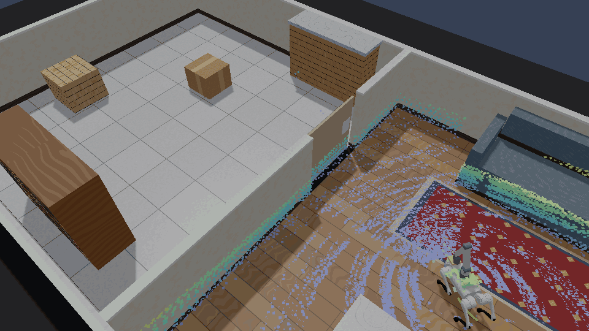

# Go2 opens and shuts a door with its arm

Example 132 (`examples/132_go2_door`) walks the arm-carrying Go2 through a swing
door and shuts it behind itself. The door is moved only by contact with the
pad on the arm: nothing welds, drives, or holds it, and no other part of the
robot touches it.



```text
cargo run --release -p go2_door --example 132_go2_door -- --smoke
cargo run --release -p go2_door --example 132_go2_door -- --capture
```

`--capture` renders the README showcase (`docs/media/showcase-go2-door.*`, 48
frames at 960 x 540, one every 2.4 s) after checking that the rendered run
replays the headless run's final state digest exactly.

## Assets

| Asset | What it is |
| --- | --- |
| `assets/robots/unitree_go2_arm.rne.robot.toml` | The welded Go2 (`unitree_go2_jump`) with a generic 4-DOF arm on its back: yaw, shoulder, elbow and wrist pitch, 0.28 m links, a 0.10 m square push pad, 1.3 kg in all, effort limits 10 / 20 / 12 / 5 N·m. It is not a specific product. |
| `assets/robots/swing_door.rne.robot.toml` | A 0.96 m x 0.90 m, 6 kg leaf on a vertical hinge: closed at the joint's lower limit, opening to 100°, hinge damping 1 N·m·s/rad and friction 0.2 N·m, so a pushed door keeps swinging for a while as a real one does. |
| `assets/scenes/unitree_go2_door.rne.scene.toml` | Example 131's two rooms with the door hinged on the doorway's north jamb, 2 cm proud of the partition face so the leaf clears the wall at every angle. |

`UnitreeGo2ModelTrot::with_total_mass_kg` gives the trot the arm's extra weight.

## How the door moves

- **Opening.** The Go2 walks the doorway's centre line with the pad turned
  0.35 m to its left, toward the hinge. The pad meets the leaf near the hinge,
  and as the robot advances the contact slides outward along the leaf, so the
  leaf swings ahead of the body.
- **Closing.** From the far room the Go2 walks around the open leaf and back
  along a line 0.52 m east of the hinge, heading south with the pad on its
  right. That pushes the leaf to within about 7° of shut, where the pad runs
  off its end.
- **Final nudge.** Standing beside the nearly shut leaf, the robot sweeps the
  pad from 0.30 m to 0.62 m out to its right, pressing the leaf against its
  stop.

Every command comes from the robot's own estimate: Mid-360 returns in the
sensor frame at their emission times, levelled by IMU attitude, de-skewed by
drifting leg odometry, and matched by `rne_slam::Slam2d`, as in example 131.
The door's position is given, as a map annotation would give it; its angle is
read only to score the run.

## Measured

| Measure | Result | Gate |
| --- | --- | --- |
| Door opened to | 1.509 rad (86°) | > 1.4 rad |
| Door left at | 0.000 rad (against its stop) | < 0.02 rad |
| Pad in contact with the door | 16.7 s | > 0 |
| Any other robot link in contact with the door | never | never |
| Localization error | 0.059 m RMS, 0.113 m worst | RMS < 0.15 m |
| Clearance to walls and furniture | at least 0.49 m | > 0.3 m |
| Lowest body height | 0.260 m | > 0.2 m |
| Whole sequence | 116.4 s | finishes |

With the robot steered by the simulation's true pose instead, the straight
closing push alone left the door at 0.031 rad; under the ~0.06 m localization
error it left it at 0.060–0.078 rad, which is why the final nudge exists.

## Known limitations

- **Collision groups across URDF robots.** A URDF spawned with
  `self_collisions = false` puts every link in collision group 1 with group 1
  filtered out (`rne_urdf_import`, `CollisionGroups::without_self_collision(1)`).
  Two such robots in one scene therefore never touch each other. The example
  moves the door leaf to its own group; a per-robot group in the importer would
  fix it generally, but would also change existing multi-robot scenes such as
  the OpenArm pair.
- **The arm and the Mid-360.** The rig occlusion table was measured without an
  arm, and the scene's raycasts skip the robot's own links, so the arm does not
  shadow the scan.
- **No latch.** The door has no latch or closer; "shut" means against its stop.
