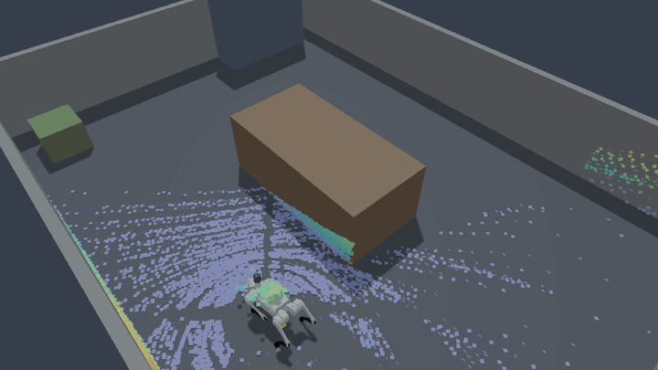
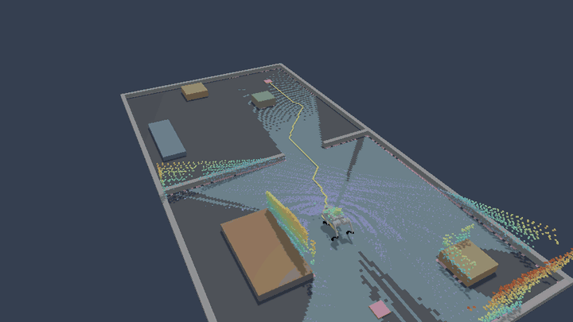

# Livox Mid-360 on the Unitree Go2

`rne_sensor::livox` models the Livox Mid-360 from real recordings rather than
from a guessed scan pattern. Livox does not publish the pattern, so it was
recovered from `livox_ros_driver2` output of a Go2-mounted unit and checked
against a second recording the fit never saw.

```rust
let spec = livox_mid360_spec();
let rig: LidarRigOcclusion = serde_json::from_str(&std::fs::read_to_string(
    "assets/sensors/livox_mid360/go2_rig_occlusion.json",
)?)?;
let cloud = sample_livox_mid360(
    &backend, physics_world, &world, &sweep, &spec,
    &LivoxMid360Pattern::new(), frame_index, Some(&rig), noise_key,
);
```

## Source recordings

Two ROS 2 bags from the same Go2, `EIL_Box` (107 s) and `EIL_Mask2` (34 s),
each with `/livox/lidar` (`sensor_msgs/PointCloud2`, xfer format 0:
`x y z intensity t`), `/livox/imu`, and `/leg_twist`. The model uses the first
400 and 300 frames. The recordings are private lab data and are not
redistributed; `tools/prepare_livox_mid360_model.py` regenerates every derived
file from them.

## What the recordings establish

| Property | Measured | How |
| --- | --- | --- |
| Emission order | message order; `t` is not | azimuth advances +1.32° per firing across every packet and frame boundary, while `t` jumps −270 to +795 µs at packet boundaries with zero correlation (r = 0.006) |
| Lines | 4, fired in turn | point `n` belongs to line `n % 4`; the four points of a firing sit about 1.8° apart |
| Firing period | 20.00 µs (19.997 and 20.002 µs in the two bags) | stamp span over point count |
| Packets | 96 points; frames of 207–210 packets | driver output |
| Rotor | 1.303185° per firing = 181.0 rev/s | coherence maximum of line-0 azimuth |
| Elevation nod | period 5100.66 firings = 0.1020 s | coherence maximum of line-0 elevation |
| Frame period | 99.97 ms; `header.stamp` ≈ first point `t` + 50 ms | header stamps |
| No-return slots | 38–43 % of each frame, kept as `(0, 0, 0)` | driver output |
| Mount | upside down, floor 0.440–0.454 m along sensor `+z`, tilt 0.9–2.4° | floor plane fit, 8.4 mm RMS, three windows |
| Self returns | 5.49 % / 5.48 % of all slots within 0.35 m | both bags; per-bin range agrees to 1 mm (median) |
| Mount posts | four, at −136°, −46°, +44°, +134° | 100 % no-return, 6° wide at low elevation, 16° near 45°, in both bags |
| Floor range spread | 8–11 mm robust σ within 2 m | per-frame plane fit; includes floor roughness and gait motion |
| Floor intensity | median 0–3 of 255 | the floor in these rooms is dark |

The elevation nod takes 2 % longer than a frame, so each frame starts at a
different nod phase. That is the non-repetitive behavior: in the model, 1°×1°
coverage of the field of view is 61.9 % after one frame and 97.6 % after ten.

## The pattern model

Each line's direction is a function of two phases, rotor `a = 0.0227449 n` and
nod `p = 0.0012318 n` for global firing `n`. In the rotor-aligned frame the
direction is a 2D Fourier series with rotor harmonics up to 3 and nod
harmonics up to 6 (91 terms per component). The fit alternates between the
shape and a per-frame phase offset:

| Evaluation | Median | p90 | p99 |
| --- | --- | --- | --- |
| EIL_Box, frames 0–299 (fit) | 0.095° | 0.283° | 0.582° |
| EIL_Box, frames 300–399 (held out) | 0.108° | 0.304° | 0.560° |
| EIL_Mask2, frames 150–299 (other recording, fixture) | 0.128° | 0.353° | 2.37° |

The Livox datasheet quotes an angular precision below 0.15°. The test
`pattern_matches_held_out_real_returns` checks the Rust evaluation against the
EIL_Mask2 fixture.

The per-frame phase offsets wander by about 1° (1σ) and stay within about ±2°
over 40 s. That moves points along the scan path without changing coverage, so
`LivoxMid360Pattern` leaves them at zero by default;
`with_phase_offsets_rad` reproduces a recorded frame exactly.

## Rig occlusion

`assets/sensors/livox_mid360/go2_rig_occlusion.json` holds 2°×2° bins in
Livox-frame azimuth and elevation, each with a probability of no return, a
probability of a self return, and the self-return range.

Per bin, a slot is blocked, returns from the robot (within 0.35 m), or reaches
a surface. Near-range blanking (below) hides some surface returns, so the
fraction reaching a surface is recovered from the observed surface-return
fraction `R` and the bin's mean blanking probability `p` as `R / (1 − p R)`;
the rest is the block probability. Two regions are then treated differently:

- **Floor zone (≥ 22° Livox elevation).** Upside down at 0.447 m, the sensor
  sees the floor within 1.2 m here, so the whole row is fixed to the mount:
  mount posts, legs, and the dark floor losing returns at steep angles all
  stay in the table. Bins neither recording sampled take the row median.
- **Elsewhere.** The room can leave directions empty, so each row's
  20th-percentile block level is removed first.

Each bin takes the lower of the two recordings; the self-return part is their
mean. Across ten simulated frames, 5.42 % of slots return from the rig; the
recordings show 5.48–5.49 %.

## Near-range blanking

A line that returns from a surface closer than about 0.8 m loses its next
firing. Below 0.55 m the alternation is unbroken: along a close surface a line
returns on every other firing, and consecutive near returns are 2 firings
apart 100,606 times against 1,404 for 1 and 212 for 3 (EIL_Box, line 0). The
probability that a return at range `r` blanks the next firing, measured where
the surface continues on both sides:

| r (m) | 0.51 | 0.56 | 0.61 | 0.66 | 0.69 | 0.71 | 0.76 | 0.81 | 0.89 |
| --- | --- | --- | --- | --- | --- | --- | --- | --- | --- |
| EIL_Box | 0.997 | 0.961 | 0.754 | 0.432 | 0.258 | 0.140 | 0.058 | 0.009 | 0.002 |
| EIL_Mask2 | 0.997 | 0.953 | 0.716 | 0.425 | 0.271 | 0.162 | 0.061 | 0.010 | 0.003 |

`livox_mid360_near_blanking_probability` interpolates the mean of the two.
Blanking can remove at most half of a close surface's returns; the rest of the
steep-angle loss is in the rig table.

## Floor check

Upside down 0.447 m above a flat floor, every ray from 24° to 52° lands on the
floor within 1.1 m or on the robot, so these bands compare with the
recordings without modelling the rooms (`steep_floor_bands_match_the_recordings`,
ten frames):

| Livox elevation | 24° | 28° | 32° | 36° | 40° | 44° | 48° |
| --- | --- | --- | --- | --- | --- | --- | --- |
| no return, model | 0.314 | 0.311 | 0.380 | 0.503 | 0.650 | 0.776 | 0.987 |
| no return, EIL_Box | 0.338 | 0.343 | 0.410 | 0.533 | 0.673 | 0.772 | 0.991 |
| no return, EIL_Mask2 | 0.489 | 0.521 | 0.553 | 0.594 | 0.709 | 0.794 | 0.995 |
| self return, model | 0.065 | 0.085 | 0.124 | 0.135 | 0.105 | 0.057 | 0.000 |
| self return, recordings | 0.065 | 0.088 | 0.127 | 0.139 | 0.111 | 0.060 | 0.001 |

EIL_Mask2 loses more below 40° because its room leaves more of those
directions empty; the table keeps the lower recording.

## Sensor settings

`livox_mid360_spec()` uses the datasheet where it has a figure: 905 nm, 0.1 m
blind zone, 70 m maximum range at 80 % reflectivity, and first returns only.
The detection threshold puts a 10 % Lambertian target at 40 m at the 50 %
detection point. Range noise (1 cm) and pointing jitter (0.09°) are the
measured floor spread and pattern residual, so both are upper bounds.

Timestamps, latency, and noise follow [`LIDAR_SIMULATION.md`](LIDAR_SIMULATION.md):
point `n` of a frame is stamped `n × 5 µs` after the frame's first firing, frame
latency is the owning sensor's `latency_ticks`, and rig and blanking draws use
keyed streams disjoint from the other noise, so a frame replays exactly.

## On the Go2 in simulation

<p align="center">
  
</p>

`UrdfSceneSim::sample_livox_mid360` scans a URDF scene with every raycast
skipping the robot's own links, whose returns come from the rig table instead;
`unitree_go2_mid360_mount()` places the sensor upside down 0.147 m above and
0.20 m ahead of the `base` link (the height puts it 0.447 m above the floor in
the trot; the forward offset is estimated from the extent of the self returns).
Standing on a flat floor, every cast return lands on the floor and none on the
robot (`standing_go2_mid360_sees_the_floor_and_not_itself`).

Example 130 walks the Go2 on `UnitreeGo2ModelTrot` around a table in a
7 m x 5 m room, steering to five waypoints, and sweeps each frame over the
0.1 s the robot moved during it:

| Measure | Model, walking | Recordings, walking |
| --- | --- | --- |
| Returns per frame | 12,258 | about 11,800 (EIL_Box) |
| No return, 24° / 32° / 40° / 44° / 48° | 0.336 / 0.486 / 0.698 / 0.789 / 0.987 | 0.338–0.489 / 0.410–0.553 / 0.673–0.709 / 0.772–0.794 / 0.991–0.995 |

The walk takes 74.4 s, keeps at least 0.88 m from walls and furniture, and the
body never drops below 0.263 m.

## Navigating on the Mid-360

<p align="center">
  
</p>

Example 131 gives the Go2 no map. Two rooms are joined by a 1.0 m doorway, and
the robot must reach the far corner of the second room and come back. Per
0.1 s frame it uses only what a real Go2 has:

- each return in the sensor frame at its own emission time, as the driver
  publishes it;
- roll and pitch from the IMU to level the points (heading is never read from
  the simulation);
- leg odometry: body velocity and yaw rate integrated with a 4 % scale error
  and a 0.02 rad/s yaw-rate bias (chosen, not measured), also used to de-skew
  each frame to the pose at its end;
- a 720-beam 2D scan of the returns 0.15–0.65 m above the floor.

`Slam2d` processes a keyframe every 0.15 m or 0.15 rad, matching all 360 scan
beams on a finer search grid than its default (7 samples per axis, 4 levels); A* plans on the map
inflated to keep the base centre 0.30 m from obstacles, treats unexplored cells
as traversable, and replans every second.

| Measure | Result |
| --- | --- |
| Goals reached | 2 / 2 in 85.2 s, 0.25 m and 0.28 m from them |
| Localization error | 0.042 m RMS, 0.060 m worst |
| Leg odometry alone | 7.1 m worst |

The rooms carry furniture (a sofa, plants, a counter) whose colliders are the
envelopes the dressed render draws inside; see [GO2_DOOR.md](GO2_DOOR.md#dressed-interior).
| Clearance | at least 0.41 m |
| Occupied map cells within 10 cm of a real obstacle | 100 % of 1,065 |

## What is not established

- **Timestamp jitter.** Real `t` values carry packet-level host jitter (−270
  to +795 µs). The model emits ideal emission times; reproducing the jitter
  only matters for de-skew studies and is not modeled.
- **No-return slots in the output.** The driver keeps no-return slots as zero
  points; `PointCloud` holds returns only. A Livox-format ROS 2 publisher
  would have to re-insert them.
- **Floor material versus sensor.** Steep-angle loss beyond blanking is in the
  rig table because both recordings were made on floors that return very
  little (intensity median 0–3 of 255). Whether it comes from the floors or
  from reduced near-range sensitivity is not separated, so on a bright floor
  the model probably loses too much there.
- **Mount-specific floor zone.** The floor-zone rows assume this mount height
  and orientation; another mount needs its own table.
- **Other units.** Both recordings come from one Mid-360 on one Go2. The rotor
  and nod rates agree to 0.03 % between them, but a different unit or firmware
  may differ.
